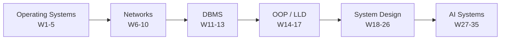

# Theory

CS fundamentals and design, with diagrams. GitHub renders the Mermaid blocks natively.

| Track | Weeks | Files |
|---|---|---|
| [Operating Systems](os/) | 1–5 | 5 |
| [Computer Networks](networks/) | 6–10 | 5 |
| [DBMS](dbms/) | 11–13 | 1 |
| [OOP & Low Level Design](lld/) | 14–17 | 1 |
| [System Design](system-design/) | 18–26 | 1 |
| [AI / LLM Systems](ai/) | 27–35 | 1 |

## How the tracks connect

The order is deliberate. Networking ends with DNS, HTTP, TLS and proxies — which is exactly where system design begins.

## Cross-links worth making out loud in interviews

| From | To |
|---|---|
| OS: LRU page replacement | [LRU Cache pattern](../patterns/design/lru-lfu-cache.md), LeetCode 146 |
| OS: recursion stack depth | [Tree DFS](../patterns/recursion-trees/tree-dfs.md) — why deep DFS overflows |
| OS: `fsync` | DBMS — the **D** in ACID, write-ahead logging |
| OS: SIGTERM vs SIGKILL | System Design — graceful shutdown in Kubernetes |
| OS: epoll / C10K | System Design — how one server holds 100k connections |
| Networks: OSPF | [Dijkstra](../patterns/graphs/dijkstra.md) — the same algorithm, in production |
| Networks: latency is physics | System Design — why CDNs exist |
| DBMS: B+ tree vs LSM | System Design — read- vs write-optimised stores |
