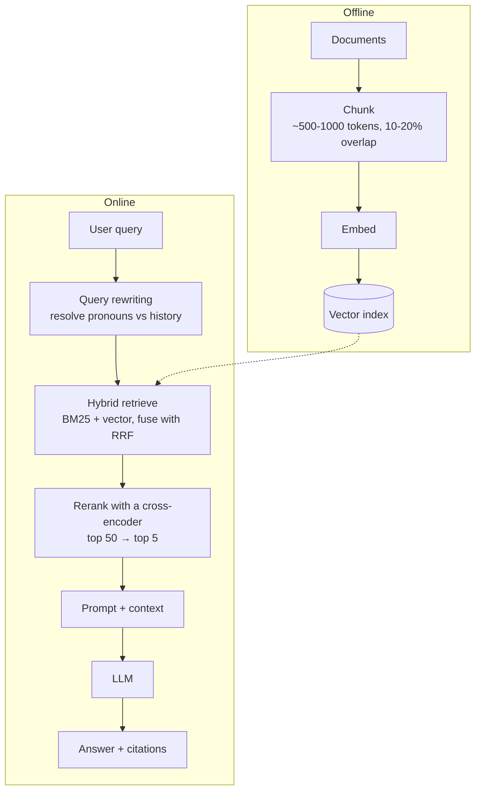
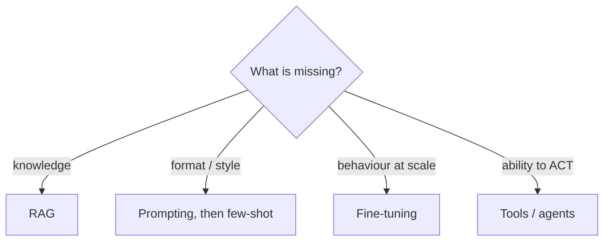
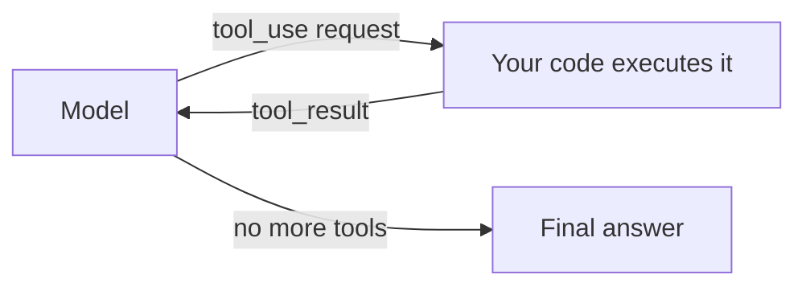
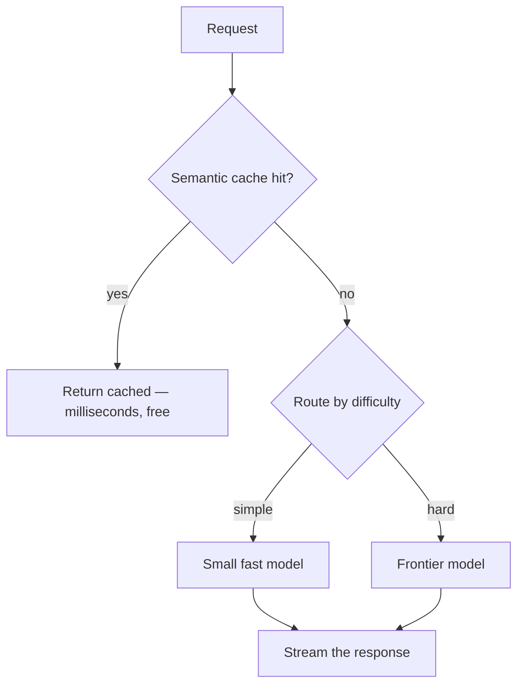
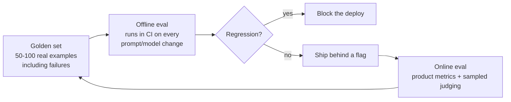
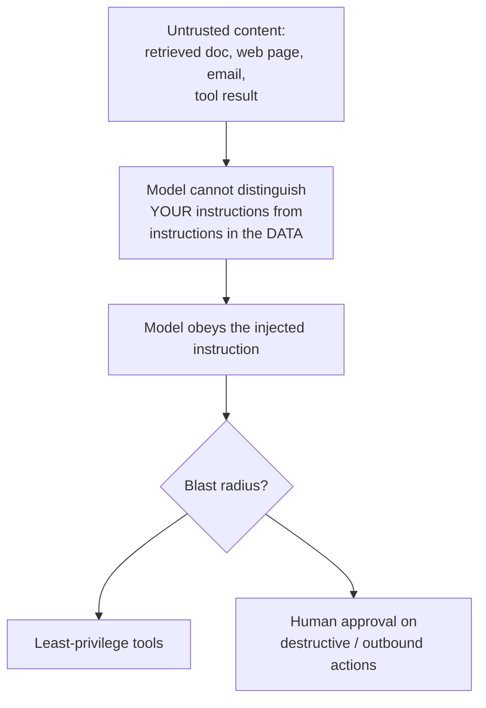

# AI / LLM System Design

`Weeks 27–35` · AI Systems

AI system design rounds are now common at product companies. This is the shape of those questions.

## The framing that wins

> **An LLM is a reasoning engine, not a knowledge store.**

That one sentence explains why RAG exists, why tool use exists, and why evals are mandatory.

## RAG



**The three-stage pipeline — hybrid retrieve ~50, rerank to ~5, generate — is the current production standard.**

```
  ╔══════════════════════════════════════════════════════════╗
  ║ DEBUG RETRIEVAL BEFORE THE MODEL.                        ║
  ║                                                          ║
  ║ Measure recall@k separately from answer quality.         ║
  ║ If recall@10 is 60%, no prompt engineering will save you ║
  ║ — the right chunk was never retrieved.                   ║
  ║                                                          ║
  ║ Nearly all real RAG failures are retrieval failures that ║
  ║ teams misdiagnose as model failures.                     ║
  ╚══════════════════════════════════════════════════════════╝
```

**Why hybrid, not pure vector:** embeddings are bad at exact IDs, product codes and **negation** — "not covered by warranty" embeds close to "covered by warranty". BM25 catches what vectors miss.

## Prompt vs RAG vs fine-tune



> **Fine-tuning teaches the model HOW to behave. RAG teaches it WHAT it knows.**

Fine-tuning does **not** reliably add knowledge — using it to teach facts produces confident hallucination. Climb the ladder in order: prompt → few-shot → RAG → fine-tune.

## Agents — and when not to build one



**Before building an agent, check all four:**

1. **Complexity** — genuinely multi-step and hard to specify upfront?
2. **Value** — does the outcome justify the cost and latency?
3. **Viability** — is the model actually good at this?
4. **Cost of error** — can mistakes be caught and recovered?

If any answer is no → use a **workflow** (code-controlled steps with LLM calls at each). Deterministic, cheaper, far easier to debug.

> **"Most of what people call agents should be workflows."** Interviewers actively screen for candidates who do not reach for agents reflexively.

Always bound an agent: iteration caps, token budgets, approval gates on destructive actions.

## Serving and cost



| Lever | Effect |
|---|---|
| **Prompt caching** | large discount on repeated prefixes — **do this first**, it costs no quality |
| Effort / reasoning level | trades thoroughness for tokens, tune **per route** |
| Model routing | cheap model for easy traffic |
| Batch API | ~50% off for non-urgent work — **use it for evals** |

**Latency:** report **TTFT** (time to first token, scales with *input* length) and **TPOT** (per-token rate) separately, at p50 and p99. Stream by default.

```
  Prompt caching is PREFIX-based and byte-exact.
  Order: tools → system → messages.
  Stable content FIRST, volatile content (timestamps, IDs) LAST.
  A datetime in the system prompt silently destroys your hit rate.
  Verify with the cache-read token count in the response.
```

## Evals — say this first

> **"The first thing I'd build is the eval set."**

Highest-signal opening in an AI design round. Most candidates jump to architecture.



| Check | Use when |
|---|---|
| Exact match / F1 / schema validation | a correct answer exists — **cheap, deterministic, prefer this** |
| Execution tests | generated code |
| **LLM-as-judge** | open-ended output only |

**Validate the judge against human labels** and report the agreement rate. An unvalidated judge is just a second opinion with no accountability. Prefer **pairwise** comparison over absolute scoring — far more consistent. Watch for position bias (randomise order) and verbosity bias.

**The RAG triad:** context relevance · faithfulness (groundedness) · answer relevance.

## Safety — prompt injection



```
  ╔══════════════════════════════════════════════════════════╗
  ║ THERE IS NO COMPLETE DEFENCE at the prompt layer.        ║
  ║ Every prompt-level mitigation has been bypassed.         ║
  ║                                                          ║
  ║ So you CONTAIN it architecturally:                       ║
  ║   - least-privilege tools                                ║
  ║   - no unattended destructive or exfiltrating actions    ║
  ║   - human approval on anything irreversible              ║
  ║                                                          ║
  ║ THE LETHAL TRIFECTA:                                     ║
  ║   private data + untrusted content + external comms      ║
  ╚══════════════════════════════════════════════════════════╝
```

Naming **indirect** injection (poisoned retrieved documents, not just a user typing "ignore previous instructions") is what marks real understanding.

**Hallucination is mitigated, not solved.** Ground in retrieved context, require citations, give an explicit escape hatch ("if the context does not contain the answer, say so"), and design assuming some outputs are wrong.

## Not everything needs an LLM

For high-volume narrow prediction with labels available — ranking, fraud, churn — a small **trained model** wins on cost, latency and evaluability.

Good move: **use an LLM to bootstrap labels, then train a cheap model on them.**

## Interview checklist

- [ ] "Reasoning engine, not a knowledge store"
- [ ] The three-stage RAG pipeline; debug retrieval first
- [ ] Why hybrid beats pure vector (exact IDs, negation)
- [ ] Fine-tune vs RAG — behaviour vs knowledge
- [ ] The four-criteria agent test; most agents should be workflows
- [ ] Prompt caching is prefix-based — name a silent invalidator
- [ ] "First thing I'd build is the eval set"; validate the judge
- [ ] Prompt injection: contain, don't prevent; the lethal trifecta
