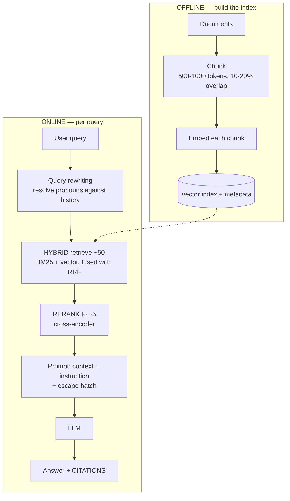
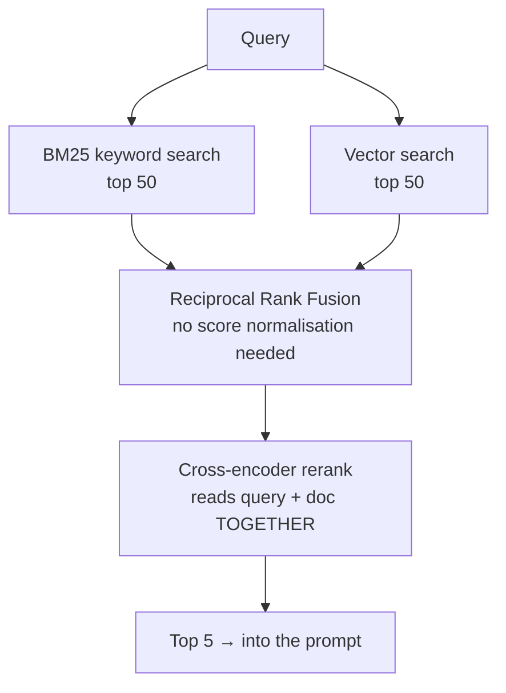
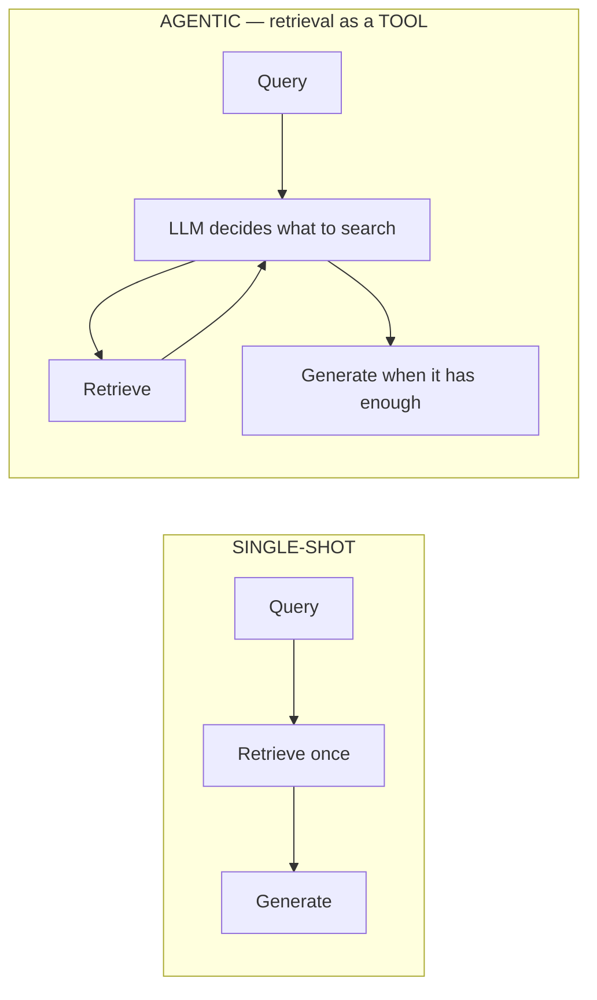

# RAG — Retrieval-Augmented Generation

`Weeks 27–30` · AI Systems

---

## Why RAG exists

**Problem it solves** — models have a training cutoff, no knowledge of your private data, and **hallucinate confidently** when asked about things they don't know.

> An LLM is a **reasoning engine, not a knowledge store**. RAG supplies the knowledge at query time.

---

## The full pipeline



**Hybrid retrieve ~50 → rerank to ~5 → generate.** That three-stage shape is the current production standard.

---

## Chunking

| Strategy | How | Trade-off |
|---|---|---|
| Fixed-size | every N tokens with **overlap** | simple; splits mid-sentence |
| Recursive | split on paragraph → sentence | preserves structure — good default |
| Semantic | split where embedding similarity drops | better boundaries, costs compute |
| Document-aware | respect headings, tables, code blocks | necessary for structured docs |
| **Contextual** | prepend a doc-level summary to each chunk | **big retrieval win**, costs tokens to build |

```
  WHY OVERLAP MATTERS

  chunk 1: "...the refund policy allows returns within"
  chunk 2: "30 days of purchase provided the item is unused..."
                    ▲
  A query about "refund within 30 days" matches NEITHER well.
  10-20% overlap keeps the idea intact in at least one chunk.
```

```
  WHY CONTEXTUAL CHUNKING HELPS

  raw chunk:  "It must be returned unused."
                ▲ "it"? which product? which policy?

  contextual: "[From: Refund Policy, Electronics]
               It must be returned unused."
              → now the chunk is self-contained and retrievable
```

**There is no universal best chunk size.** Start ~500–1000 tokens with overlap and **tune against a retrieval eval set**. Re-chunking means reindexing everything.

---

## Vector search

**How it works** — an embedding model maps text to a dense vector where semantic similarity becomes geometric closeness. **Cosine similarity** is the standard metric.

```
  ANN INDEXES — exact search is O(n), hopeless at scale

  HNSW    multi-layer proximity graph, greedy walk
          ✓ fast + accurate    ✗ memory hungry
  IVF     cluster the vectors, search only the nearest few clusters
          ✓ lower memory       ✗ recall depends on cluster count
  PQ      compress vectors     ✓ tiny memory  ✗ accuracy loss
```

### Disadvantages of pure vector search

```
  ╔════════════════════════════════════════════════════════════╗
  ║ EMBEDDINGS ARE BAD AT:                                     ║
  ║                                                            ║
  ║   EXACT IDENTIFIERS   "error code E-4021"                  ║
  ║                       "part number XJ-9"                   ║
  ║                                                            ║
  ║   NEGATION            "not covered by warranty" embeds     ║
  ║                       CLOSE TO "covered by warranty"       ║
  ║                                                            ║
  ║   RARE JARGON         domain terms it never saw in training║
  ║                                                            ║
  ║ → this is exactly why HYBRID search beats pure vector.     ║
  ╚════════════════════════════════════════════════════════════╝
```

**Changing embedding model = reindexing everything.** Budget for that.

> **You may not need a dedicated vector DB.** `pgvector` handles millions of vectors comfortably in the Postgres you already run. Move to a specialised store when scale or latency demands it.

---

## Hybrid search + reranking



```
  BI-ENCODER (retrieval)              CROSS-ENCODER (reranking)
  ────────────────────────────        ──────────────────────────────
  embed query and doc SEPARATELY      feed query AND doc together
  compare vectors                     through the model
  ✓ precompute doc embeddings         ✗ cannot precompute
  ✓ fast over millions                ✗ one model call per candidate
  ✗ less accurate                     ✓ MUCH more accurate

  → retrieve 50 cheaply, rerank those 50 accurately
```

**Reranking is typically the single largest quality gain available in a RAG pipeline.**

### Disadvantages
- Two retrieval systems to operate and keep in sync
- Reranking adds latency and cost
- **Reranking cannot rescue you if retrieval never surfaced the right doc**

---

## Query transformation

| Technique | What it does | When |
|---|---|---|
| **Query rewriting** | turn *"what about the second one?"* into a standalone query using history | **multi-turn RAG is broken without it** |
| Multi-query | generate several phrasings, union the results | improves recall |
| HyDE | write a *hypothetical answer*, embed that instead | answers embed closer to answer-shaped docs |
| Decomposition | split a complex question into sub-questions | multi-hop questions |

> **Query rewriting is the one to mention first.** Most candidates forget that follow-up questions must be resolved against conversation history *before* retrieval — and that is why their multi-turn demo falls apart.

Each transformation costs an extra LLM call before retrieval even starts.

---

## Evaluating RAG — measure the halves separately

```mermaid
graph LR
    A[End-to-end answer is wrong] --> B{Which half?}
    B -->|recall@k is low| C[FIX THE RETRIEVER<br/>chunking, hybrid, reranking]
    B -->|recall is fine| D[FIX THE GENERATION<br/>prompt, model, context order]
```

```
  ╔════════════════════════════════════════════════════════════╗
  ║ DEBUG RETRIEVAL BEFORE THE MODEL.                          ║
  ║                                                            ║
  ║ If recall@10 is 60%, no prompt engineering will save you.  ║
  ║ The right chunk was never in the context.                  ║
  ║                                                            ║
  ║ Nearly all real RAG failures are RETRIEVAL failures that   ║
  ║ teams misdiagnose as model failures.                       ║
  ╚════════════════════════════════════════════════════════════╝
```

**Retrieval metrics:** recall@k (**the most important**), precision@k, MRR, NDCG.

**The RAG triad:**

| Metric | Question |
|---|---|
| Context relevance | is the retrieved context relevant to the query? |
| **Faithfulness / groundedness** | is the answer **supported by** the context? (hallucination check) |
| Answer relevance | does it actually answer the question? |

---

## Advanced: agentic and graph RAG



**Agentic RAG** handles multi-hop questions single-shot cannot — *"which of our EU customers use the feature that shipped last quarter?"*

**Disadvantages:** several LLM calls per answer → much higher latency and cost; loops can wander without a hard iteration cap.

**Graph RAG** builds an entity-relationship graph and traverses relationships rather than matching text. Answers relationship and aggregation questions embeddings fundamentally cannot — but graph construction is expensive, error-prone and needs maintenance.

> **Start with single-shot hybrid RAG. Measure where it fails. Add agentic retrieval only for the multi-hop subset, with a hard cap.** Reaching straight for graph RAG is over-engineering.

---

## Interview checklist

- [ ] The three-stage pipeline: hybrid 50 → rerank 5 → generate
- [ ] Why overlap, and what contextual chunking fixes
- [ ] Why pure vector fails: exact IDs, negation, rare jargon
- [ ] Bi-encoder vs cross-encoder — why you can't rerank everything
- [ ] Query rewriting for multi-turn
- [ ] **Debug retrieval before the model**; recall@k
- [ ] The RAG triad
- [ ] When agentic/graph RAG earns its cost
