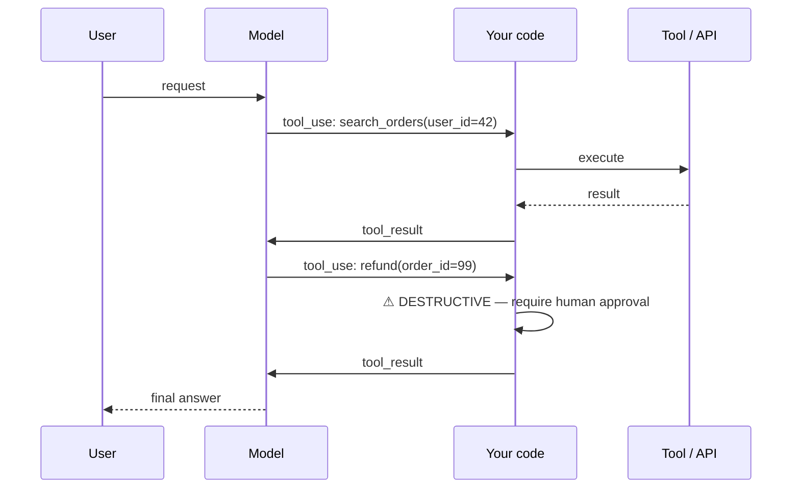
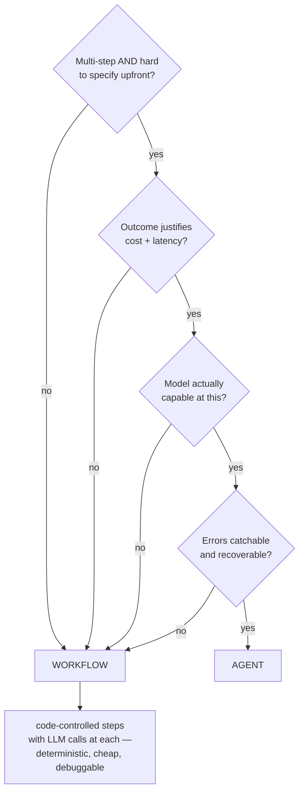
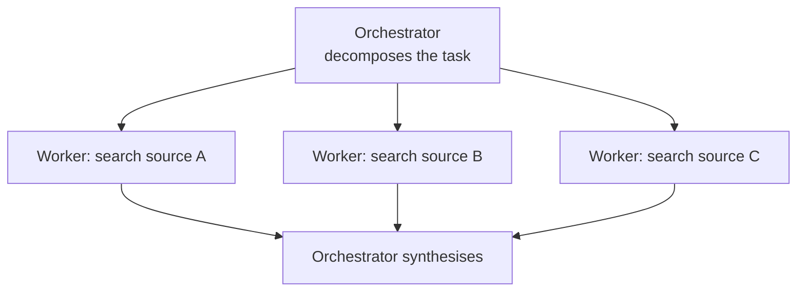
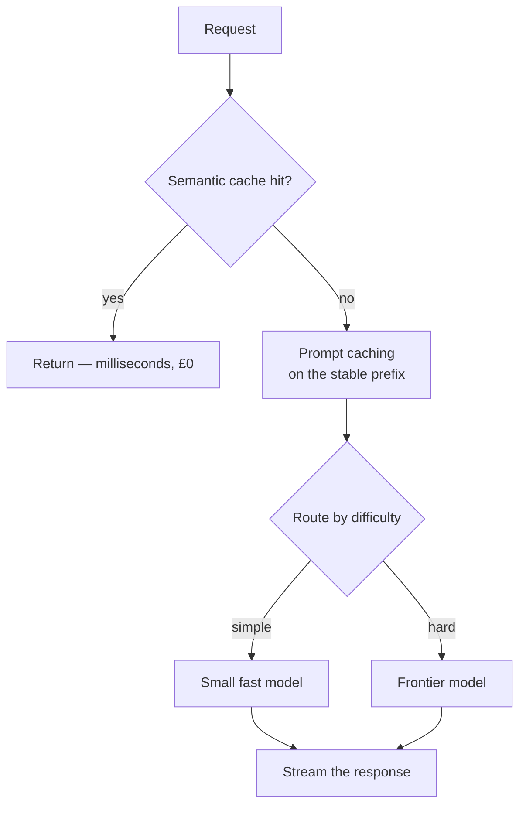

# Agents, Tools & Serving

`Weeks 31–33` · AI Systems

---

## The agent loop



**Tool definitions are prompt.** Poor descriptions are the main cause of wrong tool selection — treat them with the same care as the system prompt.

---

## Should you build an agent at all?



```
  ╔════════════════════════════════════════════════════════════╗
  ║ "MOST OF WHAT PEOPLE CALL AGENTS SHOULD BE WORKFLOWS."     ║
  ║                                                            ║
  ║ Interviewers actively screen for candidates who do NOT     ║
  ║ reach for agents reflexively. Saying this, then giving     ║
  ║ the four-criteria test, is a strong signal.                ║
  ╚════════════════════════════════════════════════════════════╝
```

### Agent failure modes

| Failure | Mitigation |
|---|---|
| **Unbounded cost** — a looping agent burns budget with nothing to show | hard iteration cap + token budget |
| **Compounding errors** — a wrong step early poisons everything after | checkpoints, validation between steps |
| **Non-determinism** — cannot reproduce a bug | log every step; trace IDs |
| **Destructive actions** | human approval gate on anything irreversible |

---

## Multi-agent



### Advantages
- Each subagent gets a **fresh context window** → total work isn't bounded by one window
- Parallelism cuts wall-clock time on fan-out tasks
- Specialisation improves per-step quality

### Disadvantages
- **Token cost multiplies** — several times a single agent
- Coordination overhead and information loss between agents
- Failures are much harder to trace
- Often **slower end-to-end** for anything not genuinely parallel

### When to use
Work that genuinely **fans out** (research across many sources, per-file processing), or when one context cannot hold the task. Use a cheap model for reading-heavy subagents.

---

## Memory

| Type | Where | Use for |
|---|---|---|
| Short-term | the context window, compacted as it grows | the current conversation |
| Long-term | external store the agent reads/writes via tools | user preferences, past decisions |

**Disadvantages:** deciding *what* is worth remembering usually needs its own model call; stale memories persist and actively mislead; stored user memories are **personal data subject to deletion requests**.

---

## Serving — the cost levers, in order



| Lever | Saving | Quality cost |
|---|---|---|
| **1. Prompt caching** | large | **none** — do this first |
| 2. Input-token hygiene | moderate | none |
| 3. Batch API for offline work | ~50% | none (just latency) |
| 4. Effort / reasoning level | large | tune per route |
| 5. Model routing | large | needs eval coverage |

### Prompt caching — how it actually works

```
  PREFIX-based and BYTE-EXACT.  Render order: tools → system → messages

  ┌──────────── CACHED PREFIX ────────────┬──── VOLATILE ────┐
  │ tool definitions                       │ user's question  │
  │ system prompt                          │ timestamp        │
  │ few-shot examples                      │ request ID       │
  └────────────────────────────────────────┴──────────────────┘
                                           ▲
                                    cache breakpoint

  ╔════════════════════════════════════════════════════════════╗
  ║ ANY byte change in the prefix invalidates EVERYTHING after ║
  ║ it. Silent invalidators:                                   ║
  ║   - datetime.now() in the system prompt                    ║
  ║   - non-deterministic JSON key order                       ║
  ║   - a tool list built from an unordered set                ║
  ║                                                            ║
  ║ DEBUG: check the cache-read token count in the response.   ║
  ║ Zero across repeated calls → hunt the invalidator.         ║
  ╚════════════════════════════════════════════════════════════╝
```

### Semantic caching — and its danger

```
  embed the query → if similarity > threshold, return the cached answer

  ✓ hits cost nothing and return in milliseconds
  ✗ SIMILAR IS NOT IDENTICAL

     "how do I cancel my subscription?"
     "how do I cancel my order?"
     → high similarity, COMPLETELY different answers

  A too-loose threshold silently serves WRONG answers.
  That is a correctness bug, not a cache miss.
  Also: never cache personalised responses across users.
```

---

## Latency

```
  total = TTFT  +  (TPOT × output tokens)
          ▲                ▲
   time to first token   time per output token
   scales with INPUT     the generation rate
   length + queueing

  STREAMING doesn't make it faster — it makes the user
  start reading at TTFT instead of waiting for the whole response.
```

Report **TTFT and TPOT separately, at p50 and p99**. Prompt caching is the main lever on TTFT.

---

## Model selection

| Route | Model tier |
|---|---|
| Classification, routing, extraction, summarising | small / fast |
| General application work | mid |
| Hard reasoning, coding, long agentic runs | frontier |

### Disadvantages of a cascade
- Every extra model is another prompt to maintain and another eval suite
- **Caches are model-scoped** — a cascade forfeits cache reuse across models
- Escalation adds latency

> **Before building a cascade, test the frontier model at LOWER effort.** It often matches a weaker model at high effort, and keeps one cache namespace and one prompt. Judge **cost per completed task**, not per request — a cheap model needing three retries isn't cheap.

---

## Interview checklist

- [ ] The agent loop; tool descriptions are prompt
- [ ] The four-criteria test; "most agents should be workflows"
- [ ] Agent failure modes and their bounds
- [ ] When multi-agent earns its token multiple
- [ ] Prompt caching is prefix-based — name a silent invalidator
- [ ] Semantic caching's correctness danger
- [ ] TTFT vs TPOT
- [ ] Try lower effort before building a cascade
