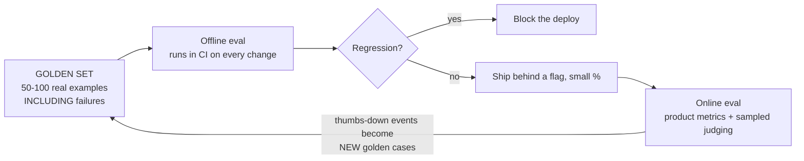
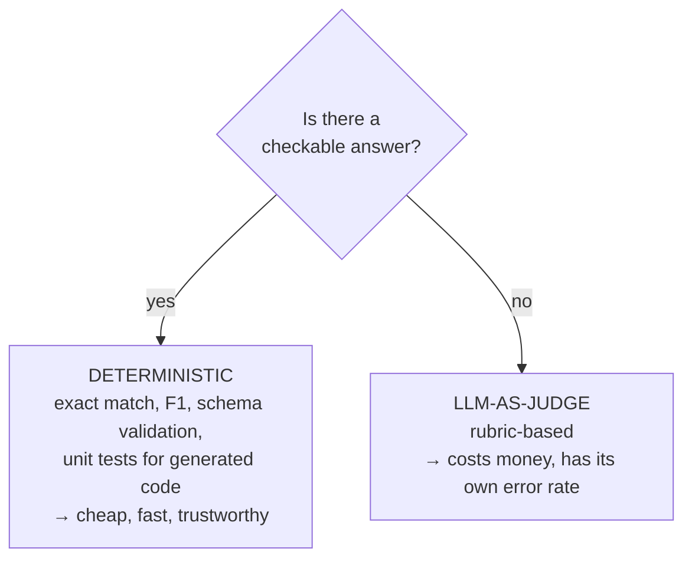
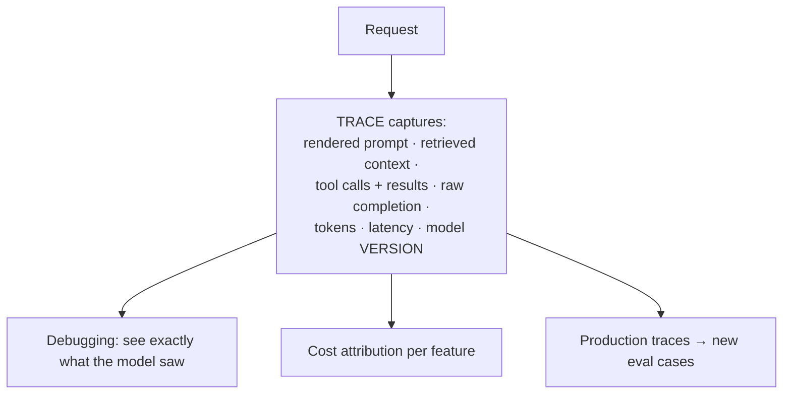
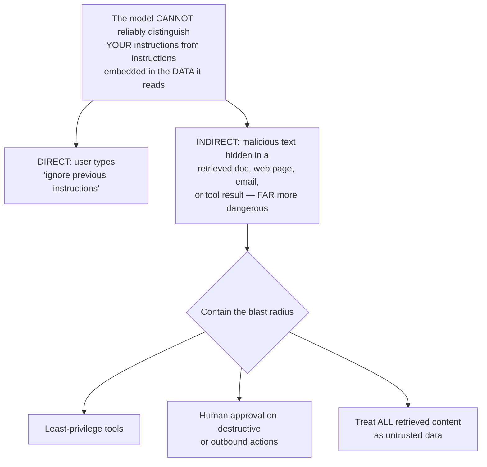
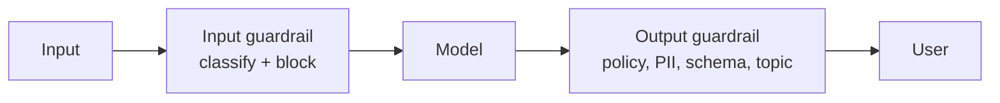
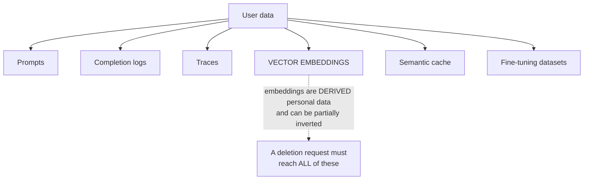

# Evals, Observability & Safety

`Weeks 34–35` · AI Systems

---

## Evals — say this first

> **"The first thing I'd build is the eval set."**

The highest-signal opening in an AI design round. Most candidates jump straight to architecture.

**Problem it solves** — with a non-deterministic system, *"it looks better"* is not evidence. Without evals, every prompt change is a gamble and you cannot safely upgrade models.



**That feedback loop is what separates a mature system.** User thumbs-down events are the best source of new eval cases.

### Choose the cheapest check that works



**Deterministic wherever the task allows.** Reserve LLM-as-judge for genuinely open-ended output.

### LLM-as-judge — and its biases

| Bias | Effect | Mitigation |
|---|---|---|
| **Position** | favours whichever option came first | randomise order |
| **Verbosity** | favours longer answers | state length expectations in the rubric |
| **Self-preference** | favours its own model family | use a different judge model |

```
  ╔════════════════════════════════════════════════════════════╗
  ║ VALIDATE THE JUDGE against human labels on a sample and    ║
  ║ report the AGREEMENT RATE.                                 ║
  ║                                                            ║
  ║ An unvalidated judge is just a second opinion with no      ║
  ║ accountability. Saying this shows real rigour.             ║
  ╚════════════════════════════════════════════════════════════╝
```

**Prefer pairwise comparison** ("which of these two is better?") over absolute scoring — relative judgements are far more consistent.

### Treat prompts as code

Version controlled · reviewed · **CI evals gate the merge**. Treating prompts as untested config is the mistake interviewers probe for.

> **Use the Batch API for eval runs** — high volume, latency-insensitive, ~50% cheaper. Most teams overlook this.

---

## Observability



**When an agent gives a wrong answer, the cause could be retrieval, the prompt, a tool result, or the model.** Without the rendered prompt in a trace, you cannot tell which.

```
  ╔════════════════════════════════════════════════════════════╗
  ║ PROMPTS AND COMPLETIONS CONTAIN USER DATA.                 ║
  ║                                                            ║
  ║ Your traces inherit full PII and retention obligations.    ║
  ║ This is a compliance surface, not just an ops concern.     ║
  ║ Redact, access-control, and set retention limits.          ║
  ║                                                            ║
  ║ Raising BOTH sides together — "I need the rendered prompt  ║
  ║ to debug, AND that log is personal data" — is the mature   ║
  ║ answer.                                                    ║
  ╚════════════════════════════════════════════════════════════╝
```

### Drift — your system can get worse with no deploy

```
  - the provider updated the model         ← PIN MODEL VERSIONS
  - your corpus changed
  - user behaviour shifted

  Monitor: input distribution, output length, refusal rate,
           format-failure rate, quality scores over time
```

**Cost monitoring:** track input / output / cached tokens tagged by feature and tenant. Alert on anomalies. Enforce per-tenant budget caps as abuse protection — a runaway loop can generate a very large bill very quickly.

---

## Hallucination

**Mitigations, roughly in order of effectiveness:**

1. **Ground** in retrieved context; instruct the model to use only that
2. **Citations** to specific chunk IDs so claims are checkable
3. **Escape hatch** — *"if the context does not contain the answer, say you do not know"* (the highest-value single line)
4. **Verification pass** — check the answer against the sources
5. **Constrain output** with a schema where possible

```
  ╔════════════════════════════════════════════════════════════╗
  ║ HALLUCINATION IS MITIGATED, NOT SOLVED.                    ║
  ║                                                            ║
  ║ Design assuming some outputs are wrong:                    ║
  ║   - human review for high-stakes output                    ║
  ║   - citations so users can verify                          ║
  ║   - confidence-based escalation to a human                 ║
  ║                                                            ║
  ║ Claiming you can eliminate it is a red flag.               ║
  ╚════════════════════════════════════════════════════════════╝
```

**Validate citations against real chunk IDs** — otherwise the model can fabricate those too.

---

## Prompt injection — the defining security problem



```
  ╔════════════════════════════════════════════════════════════╗
  ║ THERE IS NO COMPLETE DEFENCE at the prompt layer.          ║
  ║ Every prompt-level mitigation has been bypassed.           ║
  ║                                                            ║
  ║ So you CONTAIN it architecturally.                         ║
  ║                                                            ║
  ║ THE LETHAL TRIFECTA — never combine all three unattended:  ║
  ║                                                            ║
  ║      private data  +  untrusted content  +  external comms ║
  ║                                                            ║
  ║ An agent with all three can be made to exfiltrate data.    ║
  ╚════════════════════════════════════════════════════════════╝
```

> **Naming INDIRECT injection specifically** — poisoned retrieved documents, not just a user typing a jailbreak — is what marks real understanding.

---

## Guardrails



### Disadvantages
- **False positives block legitimate users** — a real product cost
- Every guardrail adds latency
- Determined attackers bypass classifiers
- **Conflicts with streaming** — you cannot validate a response you have already streamed

> The streaming conflict is a detail most candidates miss entirely. Either buffer (losing the streaming benefit) or check incrementally and retract.

---

## PII & data governance



**Two points that land:**

1. **Permission filtering must happen at RETRIEVAL time**, not by asking the model to be discreet. Retrieving a document the user cannot access is a genuine data leak.
2. **A deletion request must reach the vector index and caches**, not just the source database. Deleting the document does not delete its embeddings.

---

## Not everything needs an LLM

For **high-volume, narrow prediction with labels available** — ranking, fraud, churn, recommendations — a small **trained model** wins on cost, latency, determinism and evaluability.

> **Good move:** use an LLM to **bootstrap labels**, then train a cheap model on them.

Showing you know when *not* to use an LLM is a strong senior signal in an AI round.

---

## Interview checklist

- [ ] "The first thing I'd build is the eval set"
- [ ] Deterministic checks before LLM-as-judge
- [ ] Judge biases; **validate the judge** and report agreement
- [ ] Prompts as code, CI-gated; batch API for evals
- [ ] Traces need the rendered prompt — **and are PII**
- [ ] Drift: your system degrades with no deploy; pin model versions
- [ ] Hallucination is mitigated not solved; the escape hatch
- [ ] Indirect prompt injection; the lethal trifecta; contain, don't prevent
- [ ] Guardrails conflict with streaming
- [ ] Permission filtering at retrieval; deletion must reach embeddings
- [ ] When a trained model beats an LLM
