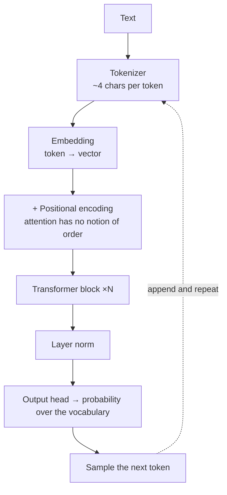
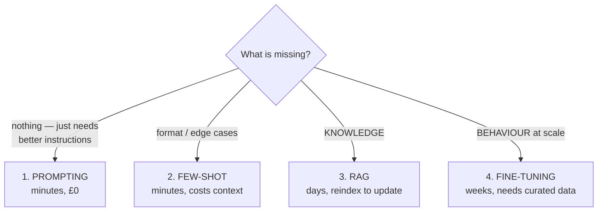
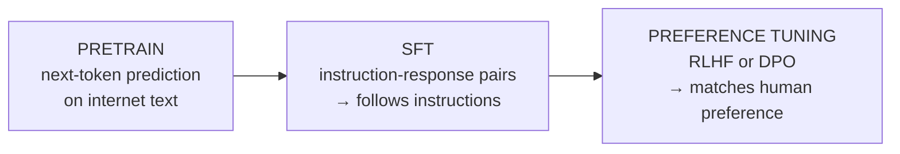
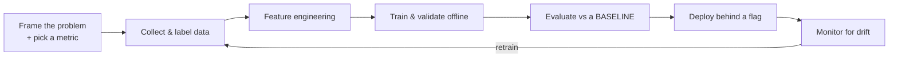
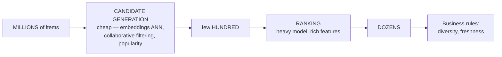

# LLM Foundations & Fine-Tuning

`Weeks 27–29` · AI Systems

---

## How a transformer actually works



Each **transformer block** is:

```
  ┌──────────────────────────────────────┐
  │  Multi-head SELF-ATTENTION           │  ← tokens look at each other
  │  + residual connection, layer norm   │
  ├──────────────────────────────────────┤
  │  Feed-forward network                │  ← per-token processing
  │  + residual connection, layer norm   │
  └──────────────────────────────────────┘
```

### Attention in one idea

```
  For each token, compute three vectors:

     Q (query)  "what am I looking for?"
     K (key)    "what do I offer?"
     V (value)  "what do I actually contribute?"

  attention(Q,K,V) = softmax( Q·Kᵀ / √d ) · V
                     └────────┬────────┘
              how much each token should attend to every other

  "The cat sat on the mat because it was tired"
                                   ▲
                    "it" attends strongly to "cat" — that
                    weighting IS what attention computes
```

**Why O(n²):** every token attends to every other token. Doubling the context **quadruples** the attention cost — which is why long context is expensive and why techniques like sliding-window and flash attention exist.

---

## Tokens, context and cost

```
  ~4 characters ≈ 1 token ≈ 0.75 English words

  CONTEXT WINDOW holds:
  ┌────────────┬─────────────┬────────────┬──────────┬──────────┐
  │ system     │ conversation│ retrieved  │  tools   │ response │
  │ prompt     │ history     │ documents  │          │          │
  └────────────┴─────────────┴────────────┴──────────┴──────────┘
                  ALL of it counts toward the limit
```

**Cost arithmetic — do it out loud in interviews:**

```
  10K input + 1K output  at  $5 / $25 per million tokens
    = (10,000 × 5 + 1,000 × 25) / 1,000,000
    = $0.075 per call

  × 1M calls/day  =  $75,000/day  =  $27M/year

  → that single number reframes the entire architecture
```

```
  ╔════════════════════════════════════════════════════════════╗
  ║ "LOST IN THE MIDDLE"                                       ║
  ║                                                            ║
  ║ Models attend most reliably to the START and END of a long ║
  ║ context, least reliably to the middle.                     ║
  ║                                                            ║
  ║ → MORE CONTEXT IS NOT BETTER CONTEXT.                      ║
  ║   Put the most important material first or last.           ║
  ╚════════════════════════════════════════════════════════════╝
```

---

## Embeddings

**What they are** — a model maps text to a dense vector (384–3072 dims) where semantic similarity becomes geometric closeness.

```
  cosine similarity = (A · B) / (|A| × |B|)     → the ANGLE, not the distance

  "king"   - "man"   + "woman"   ≈  "queen"
     the classic demonstration that these vectors encode meaning
```

| Metric | Use |
|---|---|
| **Cosine** | the standard for text — magnitude-independent |
| Dot product | when vectors are already normalised |
| Euclidean (L2) | when magnitude carries meaning |

**Disadvantages:** opaque (you cannot inspect *why* two things matched); bad at exact identifiers and **negation**; domain jargon embeds poorly without fine-tuning; **changing the model means reindexing everything**.

---

## The adaptation ladder



> **Climb in order.** Fine-tuning is the most expensive, slowest and least reversible — and it usually solves the wrong problem.

```
  ╔════════════════════════════════════════════════════════════╗
  ║ FINE-TUNING TEACHES THE MODEL **HOW TO BEHAVE**.           ║
  ║ RAG TEACHES IT **WHAT IT KNOWS**.                          ║
  ║                                                            ║
  ║ Using fine-tuning to teach FACTS produces confident        ║
  ║ hallucination — the model learns the SHAPE of your data    ║
  ║ without reliably learning its CONTENT.                     ║
  ╚════════════════════════════════════════════════════════════╝
```

---

## LoRA & QLoRA

**Problem:** full fine-tuning of a large model needs enormous GPU memory and produces a full-size copy per task.

```
  FULL FINE-TUNING              LoRA
  ─────────────────────         ──────────────────────────────────
  update ALL weights W          FREEZE W, train two small matrices

       W  (d × d)                   W frozen
                                     +
                                   B·A   where A is (r × d), B is (d × r)
                                         and r ≈ 8-64  ← the RANK

  billions of parameters        often <1% of parameters
  a full model copy per task    a few MB adapter per task

  KEY INSIGHT: the weight UPDATE is low-rank, even though
               the weights themselves are not.
```

**QLoRA** additionally quantises the frozen base to 4-bit, so large models fine-tune on a single GPU.

### Advantages
- Orders of magnitude cheaper and faster
- Adapters are megabytes — **hot-swap them per tenant or task**
- Base model frozen → much lower risk of catastrophic forgetting

### Disadvantages
- Slightly below full fine-tuning on the hardest tasks
- Rank and target-module choice need tuning
- QLoRA's quantisation costs a little quality
- **You still need curated data and an eval suite** — usually the real bottleneck

---

## Post-training: SFT → preference optimisation



| | RLHF | DPO |
|---|---|---|
| How | train a **reward model** on human preference pairs, then optimise the policy with RL | optimise **directly** on preference pairs with a classification-style loss |
| Complexity | high — separate reward model + unstable RL loop | **much simpler, more stable** |
| Performance | strong | comparable |

> **DPO has largely displaced classic RLHF** for most teams because it removes both the reward model and the RL loop. Knowing that is a currency signal.

**RLHF's failure mode: reward hacking** — the policy optimises the *proxy* (the reward model) rather than the actual goal.

---

## Distillation & quantization

```
  DISTILLATION                       QUANTIZATION
  ─────────────────────────────      ──────────────────────────────
  big TEACHER runs over YOUR         store weights in fewer bits
  task distribution                  FP16 → INT8  ≈ lossless, ½ memory
  small STUDENT trains on its        FP16 → INT4  smaller, quality drop
  outputs

  ✓ near-teacher quality on the      ✓ large models on a single GPU
    narrow task                      ✗ degradation is REAL and often
  ✗ generalises poorly OUTSIDE        invisible in casual testing —
    that distribution                  ALWAYS re-run your evals
  ✗ may violate the teacher's ToS
```

**Distil once your prompt and task are STABLE and you have the volume to justify it.**

---

## Prompt engineering that actually moves the needle

| Technique | Why |
|---|---|
| **Be specific about the output format** | ambiguity is the main cause of bad output |
| **XML tags to separate instructions from data** | also a mild injection mitigation |
| **The escape hatch** | *"if the context doesn't contain the answer, say so"* — **the single highest-value line for reducing hallucination** |
| Few-shot examples | demonstrate format and edge cases |
| Say what TO do, not what to avoid | negations are followed less reliably |
| Structured output / schema | eliminates parsing failures entirely |

```
  ╔════════════════════════════════════════════════════════════╗
  ║ PROMPT CRUFT — patterns written for OLDER models that      ║
  ║ now HURT on modern reasoning models:                       ║
  ║                                                            ║
  ║   ✗ "think step by step"    reasoning is now native        ║
  ║   ✗ "you are an expert…"    marginal, wastes tokens        ║
  ║   ✗ over-prescriptive step lists   constrains the model    ║
  ║   ✗ "do not think"          makes tag leakage WORSE        ║
  ║                                                            ║
  ║ Prompts need auditing when you upgrade models, the same    ║
  ║ way code needs updating.                                   ║
  ╚════════════════════════════════════════════════════════════╝
```

---

## Classic ML — still asked alongside



**Two failure modes you must be able to name:**

```
  TRAINING-SERVING SKEW
     a feature computed one way in training, another way in serving
     → the model sees inputs it was never trained on
     FIX: a feature store — define each feature ONCE

  DATA LEAKAGE
     training used information not available at prediction time
     → impossibly good offline scores that COLLAPSE in production
     FIX: point-in-time correct joins

  ╔══════════════════════════════════════════════════════════╗
  ║ Offline metrics that look TOO GOOD are almost always     ║
  ║ leakage. Saying this shows real experience.              ║
  ╚══════════════════════════════════════════════════════════╝
```

### Recommendation systems — the two-stage architecture



Never score the full catalogue — that's why it's two stages.

**Problems to raise unprompted:** cold start (new users/items), **feedback loops** (recommending what was clicked reinforces itself and narrows diversity), popularity bias, and that offline metrics correlate weakly with engagement so online testing is mandatory.

> **Note the parallel:** candidate generation + reranking is *exactly* the RAG pipeline shape. Same problem, same solution.

**When a trained model beats an LLM:** high-volume, narrow prediction with labels available. Cheaper, faster, deterministic, easier to evaluate. **Good move: use an LLM to bootstrap labels, then train the cheap model on them.**

---

## Interview checklist

- [ ] Attention: Q/K/V in one sentence; why it's O(n²)
- [ ] Token cost arithmetic, out loud
- [ ] Lost in the middle — more context isn't better
- [ ] The adaptation ladder, in order
- [ ] "Fine-tuning = how to behave, RAG = what it knows"
- [ ] LoRA: the weight *update* is low-rank
- [ ] DPO has largely replaced RLHF
- [ ] Always re-run evals after quantizing
- [ ] Prompt cruft on modern models
- [ ] Training-serving skew and data leakage
- [ ] Two-stage recommenders; the RAG parallel
