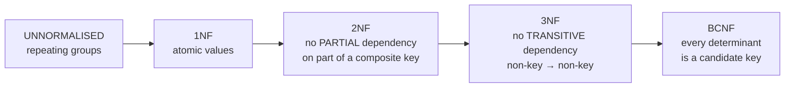
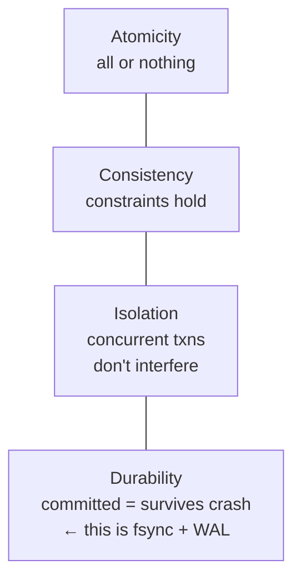
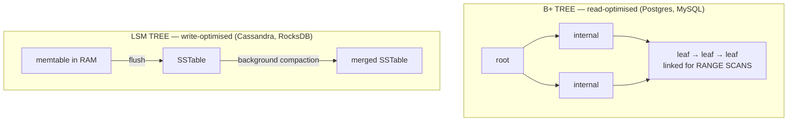

# DBMS Fundamentals, SQL & Normalisation

`Weeks 11–12` · Databases

## Keys

```
  SUPER KEY      any set of attributes that uniquely identifies a row
      └─ CANDIDATE KEY   a MINIMAL super key
             └─ PRIMARY KEY   the candidate key you chose
                 others become ALTERNATE keys

  FOREIGN KEY    references a primary key in another table
                 → enforces REFERENTIAL INTEGRITY
```

## Joins — draw them

```
     A ∩ B              A                 A ∪ B
  ┌──────────┐    ┌──────────┐      ┌──────────┐
  │  ███     │    │ ████     │      │ ████████ │
  │ █████    │    │ █████    │      │ ████████ │
  └──────────┘    └──────────┘      └──────────┘
   INNER JOIN      LEFT JOIN         FULL OUTER
   matches only    all of A +        everything,
                   matches of B      NULLs where absent
```

```sql
-- customers with no orders: LEFT JOIN + IS NULL
SELECT c.name
FROM customers c
LEFT JOIN orders o ON o.customer_id = c.id
WHERE o.id IS NULL;

-- second highest salary (window function)
SELECT DISTINCT salary
FROM (SELECT salary, DENSE_RANK() OVER (ORDER BY salary DESC) AS rnk
      FROM employees) t
WHERE rnk = 2;
```

`WHERE` filters **rows before** grouping; `HAVING` filters **groups after**. That distinction is asked constantly.

## Normalisation



```
  NOT 2NF:  (student_id, course_id) → grade, student_name
                                              ▲
                              depends on student_id ALONE = partial

  NOT 3NF:  emp_id → dept_id → dept_name
                               ▲
                     non-key determines non-key = transitive
```

**Denormalise deliberately** when reads dominate — you trade write complexity for read speed. Say it is a deliberate trade, not an accident.

## ACID and isolation levels



| Isolation level | Dirty read | Non-repeatable read | Phantom |
|---|---|---|---|
| Read Uncommitted | ✅ possible | ✅ | ✅ |
| Read Committed | ❌ | ✅ | ✅ |
| Repeatable Read | ❌ | ❌ | ✅ |
| **Serializable** | ❌ | ❌ | ❌ |

```
  DIRTY READ            read data another txn wrote but hasn't committed
  NON-REPEATABLE READ   same row read twice, different values
  PHANTOM READ          same QUERY twice, different ROW COUNT
```

**MVCC** (Postgres) gives each transaction a consistent snapshot, so readers never block writers and vice versa.

## Indexing — B+ tree vs LSM tree



| | B+ tree | LSM tree |
|---|---|---|
| Writes | in place, slower | **append-only, fast** |
| Reads | O(log n), one path | may check several SSTables (bloom filters help) |
| Range scans | **excellent** (linked leaves) | good within a partition |

### Leftmost prefix rule — the one people get wrong

```
  INDEX ON (a, b, c)

  serves:     WHERE a = ?
              WHERE a = ? AND b = ?
              WHERE a = ? AND b = ? AND c = ?

  does NOT:   WHERE b = ?          ← no leading column
              WHERE c = ?
```

**Every index slows down writes** (each insert updates every index). Over-indexing is a real production mistake.

## SQL vs NoSQL

| Need | Choose |
|---|---|
| Transactions, relationships, ad-hoc queries | **Relational** — the default |
| Exact-key lookups, sessions, cache | Key-value |
| Varying shape, whole-entity reads | Document |
| Massive writes, known query pattern | Wide-column |
| Deep relationship traversal | Graph |

*"Postgres until it hurts"* is a defensible and mature answer.

## Interview checklist

- [ ] Key types; WHERE vs HAVING
- [ ] Draw the joins; write "customers with no orders"
- [ ] 2NF vs 3NF with an example of each violation
- [ ] The isolation-level table and the three anomalies
- [ ] B+ tree vs LSM tree, and why each suits its workload
- [ ] Leftmost prefix rule
- [ ] Why `fsync` is the D in ACID (links to [OS](../os/05-storage-io-and-linux.md))
