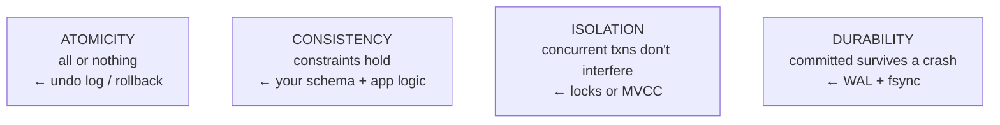
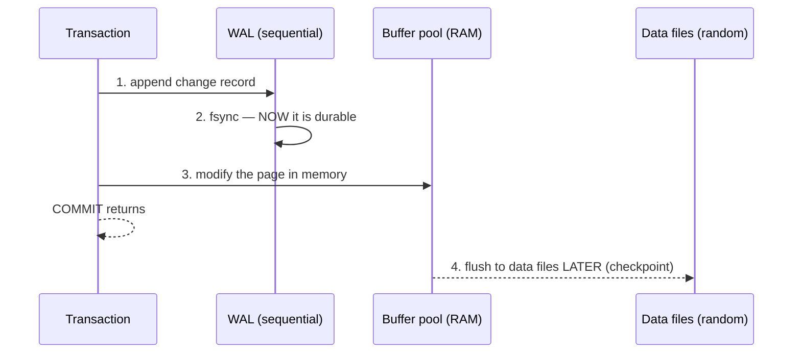
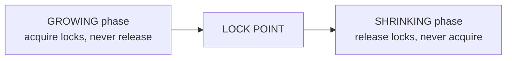
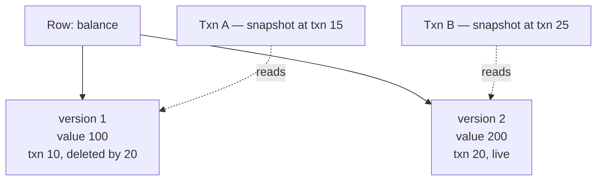

# Transactions, Isolation & Concurrency Control

`Week 13` · Databases

---

## ACID



**Durability is the one with an OS connection:** committed means written to a **write-ahead log** and `fsync`'d. A successful `write()` alone is *not* durable — see [OS: page cache](../os/05-storage-io-and-linux.md).

---

## Write-Ahead Logging — how durability actually works



**Why a log first?** Data pages are scattered — random writes. The log is **sequential**, which is dramatically faster. Commit only needs the sequential write to be durable; the random writes happen lazily.

**On crash recovery:** replay the WAL — redo committed transactions, undo uncommitted ones.

> **Group commit** batches many transactions into one `fsync` to amortise its cost. That is why databases can commit thousands of transactions per second despite `fsync` taking milliseconds.

---

## Isolation levels and the anomalies

```
  DIRTY READ           read data another txn wrote but hasn't committed
                       T1: UPDATE balance = 200  (not committed)
                       T2: SELECT balance → 200
                       T1: ROLLBACK              → T2 read a value that never existed

  NON-REPEATABLE READ  same ROW read twice, different values
                       T1: SELECT balance → 100
                       T2: UPDATE balance = 200; COMMIT
                       T1: SELECT balance → 200   ← changed mid-transaction

  PHANTOM READ         same QUERY twice, different ROW COUNT
                       T1: SELECT count(*) WHERE age > 30 → 5
                       T2: INSERT a row with age 35; COMMIT
                       T1: SELECT count(*) WHERE age > 30 → 6   ← a new row appeared
```

| Level | Dirty | Non-repeatable | Phantom |
|---|---|---|---|
| Read Uncommitted | ✅ | ✅ | ✅ |
| **Read Committed** ← Postgres default | ❌ | ✅ | ✅ |
| **Repeatable Read** ← MySQL default | ❌ | ❌ | ✅* |
| Serializable | ❌ | ❌ | ❌ |

\* MySQL's InnoDB prevents phantoms at Repeatable Read using next-key locks — a common trick question.

**Higher isolation costs throughput.** Serializable is correct but slow; most systems run Read Committed and handle the rest in application logic.

---

## Locking — 2PL



**Two-phase locking** guarantees serialisability. **Strict 2PL** holds all locks until commit — which is what real databases do, because it also prevents cascading aborts.

| Lock | Compatible with |
|---|---|
| **Shared (S)** — read | other S locks |
| **Exclusive (X)** — write | nothing |

### Deadlock in databases

```
  T1: UPDATE accounts WHERE id=1   (holds X on row 1)
  T2: UPDATE accounts WHERE id=2   (holds X on row 2)
  T1: UPDATE accounts WHERE id=2   → waits for T2
  T2: UPDATE accounts WHERE id=1   → waits for T1
                                     CIRCULAR WAIT

  Databases DETECT this (wait-for graph) and kill a VICTIM.
  Your application must be prepared to RETRY.

  Prevention: acquire rows in a CONSISTENT ORDER
              (e.g. always ascending by primary key)
```

Same four Coffman conditions as [OS deadlock](../os/03-concurrency.md) — same fix, lock ordering.

---

## MVCC — why readers don't block writers



Each transaction sees a **consistent snapshot** as of its start. Writers create new versions instead of overwriting.

### Advantages
- **Readers never block writers, writers never block readers** — huge throughput win
- Every transaction sees a consistent point-in-time view

### Disadvantages
- Old versions accumulate → **Postgres needs `VACUUM`**; neglecting it causes table bloat
- **Long-running transactions prevent cleanup** of versions newer than their snapshot — a classic production problem
- More storage

---

## Optimistic vs pessimistic concurrency

```
  PESSIMISTIC — lock first                OPTIMISTIC — check at write
  ──────────────────────────────────      ──────────────────────────────
  SELECT ... FOR UPDATE                   SELECT balance, version
  -- row is locked, others wait           -- no lock held
  UPDATE ...                              UPDATE ... WHERE version = :v
  COMMIT                                  -- 0 rows updated? someone else won
                                          -- → retry

  good for HIGH contention                good for LOW contention
  (a seat everyone wants)                 (most updates don't collide)
```

> **Prefer optimistic concurrency over distributed locks** where you can — it needs no coordination service and fails safely. See [Coordination](../system-design/07-coordination-and-consistency.md).

---

## Interview checklist

- [ ] ACID, and that D means WAL + fsync
- [ ] Why write-ahead (sequential vs random); group commit
- [ ] The three anomalies, with a concrete interleaving for each
- [ ] The isolation-level table and the defaults
- [ ] 2PL; DB deadlock detection and victim retry
- [ ] MVCC: readers don't block writers; the VACUUM / long-transaction problem
- [ ] Optimistic vs pessimistic, and when each fits
