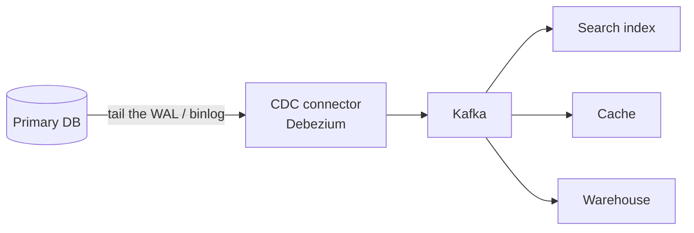

# Indexing & Query Performance

`Week 13` · Databases

---

## Why an index exists

```
  WITHOUT an index          WITH a B+ tree index
  ─────────────────         ──────────────────────
  full table scan           O(log n) descent
  O(n) — 10M rows           ~3-4 disk reads
  = 10M row reads           regardless of table size
```

---

## B+ tree structure

```
                    ┌──────────────┐
                    │   50   |  90 │        ROOT (internal)
                    └───┬────┬───┬─┘
              ┌─────────┘    │   └──────────┐
        ┌─────▼────┐   ┌─────▼────┐   ┌─────▼────┐
        │ 10 | 30  │   │ 60 | 75  │   │ 95 | 99  │   INTERNAL
        └──┬───┬───┘   └──┬───┬───┘   └──┬───┬───┘
           ▼   ▼          ▼   ▼          ▼   ▼
        ┌────┐┌────┐   ┌────┐┌────┐   ┌────┐┌────┐
        │data││data│──▶│data││data│──▶│data││data│   LEAVES
        └────┘└────┘   └────┘└────┘   └────┘└────┘
              └──────── linked ────────┘
                  → RANGE SCANS are cheap
```

**Only leaves hold data**, and they're **linked** — which is why `WHERE age BETWEEN 20 AND 30` is fast: descend once, then walk sideways.

Fanout is high (hundreds of keys per node), so even a billion rows is 4–5 levels deep.

---

## Clustered vs non-clustered

```
  CLUSTERED (one per table)        NON-CLUSTERED (many)
  ────────────────────────────     ──────────────────────────────
  the table IS the index —         a separate structure pointing
  rows stored in key order         back to the row

  ✓ range scans extremely fast     ✓ many per table
  ✓ no extra lookup                ✗ extra hop to fetch the row
  ✗ only one per table               (unless the index COVERS the query)
  ✗ random inserts fragment it
```

> This is why a **random UUIDv4 primary key hurts**: inserts land at random positions in the clustered index, causing page splits and fragmentation. A time-ordered ID (Snowflake, UUIDv7) appends at the end instead.

---

## Composite indexes — the leftmost prefix rule

```
  INDEX ON (country, city, age)

  the index is sorted by country, THEN city, THEN age:

     (IN, Bangalore, 25)
     (IN, Bangalore, 30)
     (IN, Delhi,     22)
     (UK, London,    40)

  ✓ WHERE country = 'IN'
  ✓ WHERE country = 'IN' AND city = 'Delhi'
  ✓ WHERE country = 'IN' AND city = 'Delhi' AND age = 22

  ✗ WHERE city = 'Delhi'            ← no leading column, cannot use it
  ✗ WHERE age = 25
  ✗ WHERE country = 'IN' AND age = 25   ← uses only the country part

  Like a phone book sorted by (surname, firstname):
  you cannot look someone up by firstname alone.
```

**Column order matters.** Put the most selective, most-frequently-filtered column first — or the one used in every query.

---

## Covering index

```sql
-- query
SELECT city FROM users WHERE country = 'IN';

-- index (country, city)  ← city is IN the index
-- → the DB answers entirely from the index, never touching the table
--   "index-only scan" in EXPLAIN
```

A large win on hot queries — and free if you're already indexing `country`.

---

## Reading a query plan

```
  EXPLAIN ANALYZE SELECT * FROM orders WHERE user_id = 42;

  BAD                                 GOOD
  ──────────────────────────          ──────────────────────────
  Seq Scan on orders                  Index Scan using idx_user
    rows=1000000                        rows=12
    cost=0..18334                       cost=0..8.3
    ▲                                   ▲
  reading EVERY row                   went straight there
```

**Red flags in a plan:**

| Sign | Means |
|---|---|
| `Seq Scan` on a large table | missing or unusable index |
| Estimated rows ≫ actual rows | **stale statistics** — run `ANALYZE` |
| Nested Loop over a big set | often a missing join index |
| `Sort` with high cost | an index could provide the order for free |

---

## Why an index might be ignored

```
  1. LOW SELECTIVITY
     WHERE active = true, and 90% of rows are active
     → a seq scan is genuinely cheaper than random index lookups

  2. FUNCTION ON THE COLUMN
     WHERE YEAR(created_at) = 2026        ✗ index unusable
     WHERE created_at >= '2026-01-01'     ✓ index used
        AND created_at <  '2027-01-01'

  3. TYPE MISMATCH
     WHERE user_id = '42'    (string vs integer column)

  4. LEADING WILDCARD
     WHERE name LIKE '%smith'    ✗   'smith%'  ✓

  5. STALE STATISTICS
     the planner's estimates are wrong → run ANALYZE
```

These five are the standard "why is my query slow" answers.

---

## The cost of indexes

```
  EVERY index slows writes:

     INSERT → must update the table AND every index
     5 indexes = 6 structures written per insert

  Also: disk space, memory in the buffer pool, longer VACUUM
```

**Over-indexing is a real production mistake.** Index what you actually filter, join and sort on — then measure.

---

## Denormalisation & materialised views


### Advantages
- Dramatically faster reads; avoids expensive joins
- **Essential once data is sharded** — cross-shard joins are impossible
- Predictable query cost

### Disadvantages
- Data duplicated → one logical update touches many places
- **Risk of copies drifting out of sync**
- More storage; the write path gets slower and more complex

### When to use
Read-heavy systems where read latency matters more than write simplicity — feeds, dashboards, product listings.

**The classic trade: pay on write to save on read.**

---

## Change Data Capture



**Problem it solves** — search indexes, caches and warehouses all need to know when data changes. **Dual-writing from the application is unreliable and drifts.**

### Advantages
- The database stays the single source of truth
- No dual-write inconsistency
- Consumers are decoupled and can be added later
- Gives a replayable history

### Disadvantages
- A pipeline to operate
- Consumers are eventually consistent
- Schema changes ripple downstream
- Initial snapshot + catch-up is fiddly

> **The correct answer to "how do you keep your search index up to date": CDC, not dual writes.**

---

## Interview checklist

- [ ] B+ tree: data in leaves, leaves linked → range scans
- [ ] Clustered vs non-clustered; why random UUID PKs hurt
- [ ] Leftmost prefix rule, with the phone book analogy
- [ ] Covering index / index-only scan
- [ ] Read a plan; spot `Seq Scan` and stale statistics
- [ ] Five reasons an index gets ignored
- [ ] Every index slows writes
- [ ] Denormalisation as a deliberate trade
- [ ] CDC over dual writes
