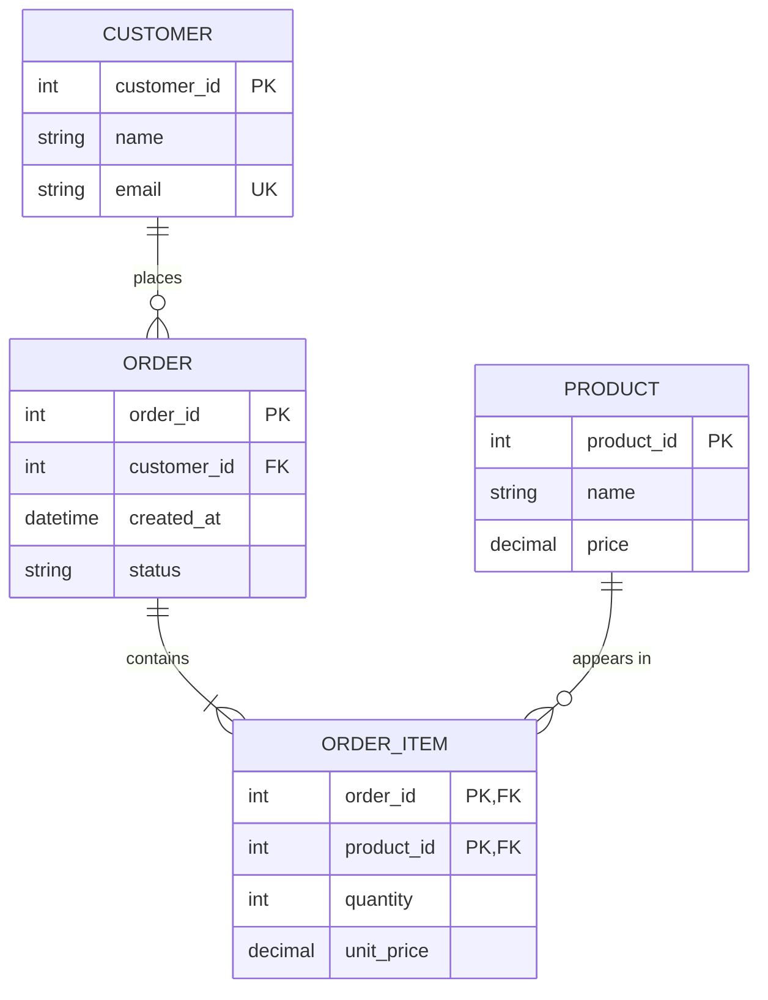

# ER Modelling & Schema Design

`Week 11` · Databases

---

## ER diagram notation



### Cardinality notation

```
  ||──||   one to one          exactly one on both sides
  ||──o{   one to many         one on the left, zero-or-many on the right
  }o──o{   many to many        needs a JUNCTION TABLE
  ||──|{   one to one-or-many  at least one required

     ||  exactly one      o|  zero or one
     |{  one or many      o{  zero or many
```

---

## Entity types

| Type | Meaning | Example |
|---|---|---|
| **Strong** | has its own primary key | `Customer` |
| **Weak** | cannot exist without a parent; identified by the parent + a partial key | `OrderItem` (needs an `Order`) |
| **Associative** | resolves a many-to-many, and has its own attributes | `Enrollment(student, course, grade)` |

```
  MANY-TO-MANY ALWAYS BECOMES A JUNCTION TABLE

  Student }o──o{ Course          ✗ cannot be represented directly

  becomes:

  Student ||──o{ Enrollment }o──|| Course
                    │
            composite PK (student_id, course_id)
            + any attributes of the relationship (grade, enrolled_on)
```

---

## Attribute types

| Type | Example | Storage rule |
|---|---|---|
| Simple | `age` | one column |
| **Composite** | `address` → street, city, zip | **split into columns** (1NF) |
| **Multi-valued** | `phone_numbers` | **separate table** (1NF) |
| Derived | `age` from `date_of_birth` | usually **don't store** — compute it |
| Key | `email` | unique constraint |

```
  ✗ VIOLATES 1NF                    ✓ 1NF
  ──────────────────────────        ──────────────────────────────
  customer                          customer
  ┌────┬──────┬──────────────┐      ┌────┬──────┐
  │ id │ name │ phones       │      │ id │ name │
  ├────┼──────┼──────────────┤      └────┴──────┘
  │ 1  │ Amit │ 111,222,333  │      customer_phone
  └────┴──────┴──────────────┘      ┌─────────────┬────────┐
         multi-valued in one cell   │ customer_id │ phone  │
                                    ├─────────────┼────────┤
                                    │      1      │ 111    │
                                    │      1      │ 222    │
                                    └─────────────┴────────┘
```

---

## ER → relational mapping rules

| ER construct | Becomes |
|---|---|
| Strong entity | a table; its key becomes the PK |
| Weak entity | a table with the parent's PK **plus** its partial key as a composite PK |
| **1:1** | foreign key on **either** side (put it on the optional side) |
| **1:N** | FK on the **"many"** side |
| **M:N** | **a new junction table** with both FKs as a composite PK |
| Multi-valued attribute | a separate table |
| Composite attribute | one column per component |

---

## Schema design decisions that matter

### Natural vs surrogate keys

```
  NATURAL KEY                      SURROGATE KEY
  ──────────────────────────       ─────────────────────────────
  email, ISBN, national ID         auto-increment id, UUID, Snowflake

  ✓ meaningful, no extra column    ✓ never changes
  ✗ CAN CHANGE (people change      ✓ compact, index-friendly
    email) → cascading updates     ✗ an extra column
  ✗ often wide (strings)           ✗ meaningless to humans
```

> **Prefer a surrogate PK**, with a unique constraint on the natural key. Keys that can change are a recurring source of production pain.

### Which surrogate?

| | Sortable | Index-friendly | Size |
|---|---|---|---|
| Auto-increment | ✅ | ✅ best | 8 bytes |
| **UUIDv4** | ❌ | ❌ **fragments B-trees** | 16 bytes |
| **Snowflake / UUIDv7** | ✅ | ✅ | 8 / 16 bytes |

Auto-increment breaks under sharding — that is when you move to Snowflake or UUIDv7, **not** UUIDv4.

### NULL semantics — the trap

```sql
  NULL = NULL       →  NULL   (not TRUE!)
  NULL <> 5         →  NULL
  WHERE x = NULL    →  never matches anything

  ✓  WHERE x IS NULL

  COUNT(*)          counts every row
  COUNT(col)        SKIPS NULLs               ← common bug
  SUM / AVG         ignore NULLs

  a UNIQUE constraint allows MULTIPLE NULLs in most databases
```

### Choosing column types

| Need | Use | Not |
|---|---|---|
| **Money** | `DECIMAL(19,4)` or integer minor units | ❌ `FLOAT` — rounding errors |
| Timestamps | `TIMESTAMPTZ` (with timezone), store **UTC** | ❌ naive local time |
| Enums | a lookup table or a native `ENUM` | ❌ free-text strings |
| Booleans | `BOOLEAN` | ❌ `VARCHAR('Y'/'N')` |

```
  ╔════════════════════════════════════════════════════════════╗
  ║ NEVER STORE MONEY AS A FLOAT.                              ║
  ║   0.1 + 0.2 != 0.3 in binary floating point.               ║
  ║ Use DECIMAL, or store integer pence/cents.                 ║
  ║ Same trap as the Splitwise rounding problem in LLD.        ║
  ╚════════════════════════════════════════════════════════════╝
```

---

## Constraints

| Constraint | Enforces |
|---|---|
| `PRIMARY KEY` | unique + not null |
| `FOREIGN KEY` | referential integrity |
| `UNIQUE` | no duplicates (allows NULLs) |
| `NOT NULL` | presence |
| `CHECK` | a domain rule (`age >= 0`) |
| `DEFAULT` | a fallback value |

### Foreign key actions

```sql
  ON DELETE RESTRICT    -- block the delete (default, safest)
  ON DELETE CASCADE     -- delete the children too  ← DANGEROUS, use deliberately
  ON DELETE SET NULL    -- orphan them
```

> **Push constraints into the database.** Application-only validation fails the moment a second service, a script, or a manual query touches the table.

---

## Views, materialised views, triggers

| | What | Cost |
|---|---|---|
| **View** | a stored query, computed on every read | no storage; no speed gain |
| **Materialised view** | the result **stored** and refreshed | fast reads; can be stale |
| **Trigger** | code that fires on insert/update/delete | ⚠️ **hidden side effects** |
| **Stored procedure** | logic stored in the DB | fewer round trips; hard to version and test |

```
  ╔════════════════════════════════════════════════════════════╗
  ║ TRIGGERS: use sparingly.                                   ║
  ║ They execute invisibly — a developer reading the           ║
  ║ application code has NO indication anything else runs.     ║
  ║ Debugging "why did this row change?" becomes very hard.    ║
  ║                                                            ║
  ║ Acceptable uses: audit logging, maintaining a derived      ║
  ║ column. Not: business logic.                               ║
  ╚════════════════════════════════════════════════════════════╝
```

---

## Interview checklist

- [ ] Draw an ER diagram with correct cardinality notation
- [ ] Map M:N → junction table; weak entity → composite PK
- [ ] Natural vs surrogate keys; why UUIDv4 as a PK hurts
- [ ] `NULL = NULL` is NULL; `COUNT(col)` skips NULLs
- [ ] Never store money as a float
- [ ] Constraints belong in the database
- [ ] Why triggers are risky
