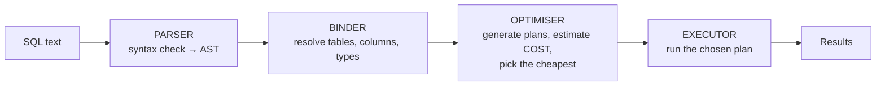

# Query Processing, Optimisation & NoSQL

`Weeks 12–13` · Databases

---

## How a query is executed



**The optimiser is cost-based:** it enumerates equivalent plans and estimates each using **table statistics** (row counts, value distribution, index selectivity). It picks the cheapest estimate — which is why **stale statistics produce terrible plans**.

---

## Join algorithms

```
  NESTED LOOP                     HASH JOIN                    MERGE JOIN
  ──────────────────────────      ────────────────────────     ──────────────────────
  for each row in A:              build a hash table on the    both inputs SORTED
     for each row in B:           smaller table, then probe    walk them together
         if match: emit           it with the larger

  O(n × m)                        O(n + m)                     O(n log n + m log m)
                                                               (free if already sorted)
  ✓ good when one side is TINY    ✓ best for large UNSORTED    ✓ best when an index
    or there's an index             equi-joins                   already provides order
  ✗ terrible on two big tables    ✗ needs memory for the       ✗ sorting is expensive
                                    hash table
```

Seeing `Nested Loop` over two large tables in a plan usually means **a missing index**.

---

## Reading `EXPLAIN ANALYZE`

```
  EXPLAIN ANALYZE
  SELECT o.id, c.name
    FROM orders o JOIN customers c ON c.id = o.customer_id
   WHERE o.created_at > '2026-01-01';

  Hash Join  (cost=250..8400 rows=12000 width=40)
              (actual time=3.2..95.1 rows=11800 loops=1)
    Hash Cond: (o.customer_id = c.id)
    ->  Seq Scan on orders o  (cost=0..6100 rows=12000)
          (actual rows=11800)
          Filter: (created_at > '2026-01-01')
          Rows Removed by Filter: 488000          ← ⚠ READ 500k TO KEEP 12k
    ->  Hash  (cost=180..180 rows=5000)
          ->  Seq Scan on customers c
```

**What to look for:**

| Signal | Means | Fix |
|---|---|---|
| `Seq Scan` + high "Rows Removed by Filter" | missing index on the filter column | add an index |
| estimated `rows` ≫ or ≪ actual | **stale statistics** | `ANALYZE` the table |
| `Nested Loop` over big inputs | missing join index | index the FK |
| `Sort` with high cost | an index could supply the order | index on the ORDER BY column |
| Actual time ≫ estimated cost | the plan is wrong for the real data | check statistics, consider a hint |

> **`cost` is an arbitrary unit** for comparing plans, not milliseconds. `actual time` is real.

---

## Why an index gets ignored

```
  1. LOW SELECTIVITY
     WHERE active = true  and 90% of rows are active
     → the optimiser correctly prefers a seq scan

  2. FUNCTION ON THE INDEXED COLUMN
     WHERE YEAR(created_at) = 2026           ✗ index unusable
     WHERE created_at >= '2026-01-01'        ✓ index used
       AND created_at <  '2027-01-01'
     (or create an EXPRESSION INDEX on YEAR(created_at))

  3. TYPE MISMATCH / IMPLICIT CAST
     WHERE user_id = '42'    (varchar literal vs integer column)

  4. LEADING WILDCARD
     WHERE name LIKE '%smith'    ✗
     WHERE name LIKE 'smith%'    ✓

  5. OR ACROSS DIFFERENT COLUMNS
     WHERE a = 1 OR b = 2        often can't use either index
     → rewrite as UNION of two indexed queries

  6. STALE STATISTICS
     → ANALYZE
```

These six are the standard "why is my query slow" answers. Learn them as a list.

---

## Query optimisation checklist

```sql
-- ✗ SELECT *  — fetches columns you discard, defeats covering indexes
SELECT id, name FROM users;

-- ✗ N+1: one query per row in a loop
-- ✓ one query with a JOIN or WHERE id IN (...)

-- ✗ correlated subquery executed per row
SELECT name FROM c WHERE (SELECT COUNT(*) FROM o WHERE o.cid = c.id) > 5;
-- ✓ aggregate once, then join
SELECT c.name FROM c
  JOIN (SELECT cid FROM o GROUP BY cid HAVING COUNT(*) > 5) t ON t.cid = c.id;

-- ✗ OFFSET on deep pages scans and discards
SELECT * FROM posts ORDER BY id LIMIT 20 OFFSET 100000;
-- ✓ keyset pagination
SELECT * FROM posts WHERE id > :last_id ORDER BY id LIMIT 20;

-- ✓ batch writes instead of row-by-row
INSERT INTO t (a,b) VALUES (1,2),(3,4),(5,6);
```

---

## Partitioning (within one database)

```
  RANGE — by date, the most common
  ┌──────────────┬──────────────┬──────────────┐
  │ orders_2024  │ orders_2025  │ orders_2026  │
  └──────────────┴──────────────┴──────────────┘
     WHERE created_at > '2026-01-01'
     → the planner scans ONLY the 2026 partition  (partition pruning)

  LIST  — by an explicit value set (region, tenant)
  HASH  — even spread when there's no natural range
```

### Advantages
- **Partition pruning** — queries touch only relevant partitions
- Dropping old data is `DROP PARTITION`, not a slow `DELETE`
- Smaller indexes per partition

### Disadvantages
- Queries that don't filter on the partition key scan **everything**
- More objects to manage; some constraints become harder
- Not the same as **sharding** — partitioning is within one database, sharding is across machines

---

## NoSQL data modelling

> **SQL: model the data, then write queries. NoSQL: know the queries, then model the data.**

### Wide-column (Cassandra / DynamoDB)

```
  PRIMARY KEY ((user_id), message_time)
               └partition┘ └clustering┘
                    │            │
           WHICH NODE holds it   SORT ORDER within the partition

  ✓ SELECT * FROM messages WHERE user_id=42 ORDER BY message_time DESC LIMIT 50
  ✗ SELECT * FROM messages WHERE message_time > ...        (no partition key!)
  ✗ SELECT * FROM messages WHERE body LIKE '%hello%'

  → NEED A SECOND ACCESS PATTERN? CREATE A SECOND TABLE.
    Duplication is normal and expected here.
```

### Document (MongoDB)

```
  EMBED when:                       REFERENCE when:
  ─────────────────────────         ──────────────────────────
  read together always              the child is queried alone
  child is bounded in size          unbounded growth (comments!)
  1:few relationship                many:many
  updated together                  updated independently

  {                                 {
    _id: 1,                           _id: 1,
    name: "Amit",                     name: "Amit",
    address: {          ← embed       order_ids: [9, 10, 11]   ← reference
      city: "Pune"                  }
    }
  }
  ⚠ 16 MB document limit in MongoDB — unbounded arrays WILL hit it
```

### Consistency tuning (quorum)

```
  N = replicas,  W = write acks required,  R = read replicas queried

  W + R > N   →  strong-ish consistency (read and write sets overlap)

  N=3, W=3, R=1   writes slow + fragile, reads fast
  N=3, W=1, R=1   fastest, EVENTUALLY consistent
  N=3, W=2, R=2   the usual balanced choice   (2+2 > 3 ✓)
```

---

## Backup & recovery

| Type | What | Recovery |
|---|---|---|
| **Full** | everything | slow to take, fast to restore |
| **Incremental** | changes since the last backup | fast to take, slow to restore (chain) |
| **PITR** | full backup + the WAL archive | restore to **any point in time** |

```
  RPO — Recovery Point Objective   how much DATA can you lose?
        (drives backup FREQUENCY)

  RTO — Recovery Time Objective    how long can you be DOWN?
        (drives backup STRATEGY and standby setup)
```

> **A backup you have never restored is not a backup.** Test the restore path on a schedule — this is the answer interviewers want, and it's what real incidents expose.

---

## Interview checklist

- [ ] The query execution pipeline; the optimiser is cost-based on statistics
- [ ] Three join algorithms and when each wins
- [ ] Read an `EXPLAIN` — spot `Seq Scan`, stale stats, bad row estimates
- [ ] The six reasons an index is ignored
- [ ] N+1, `SELECT *`, deep `OFFSET`
- [ ] Partitioning vs sharding
- [ ] NoSQL: know the queries first; embed vs reference
- [ ] Quorum: W + R > N
- [ ] RPO vs RTO; test your restores
