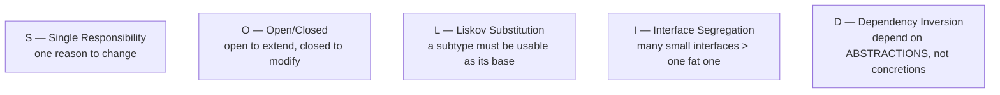
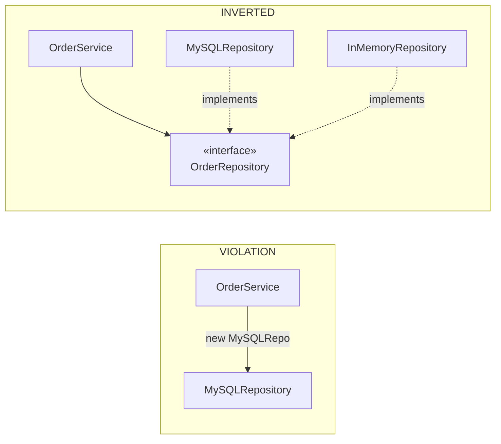
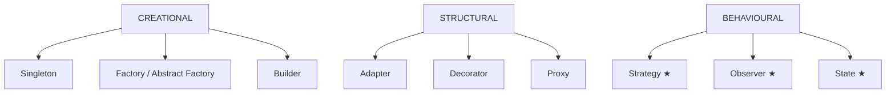
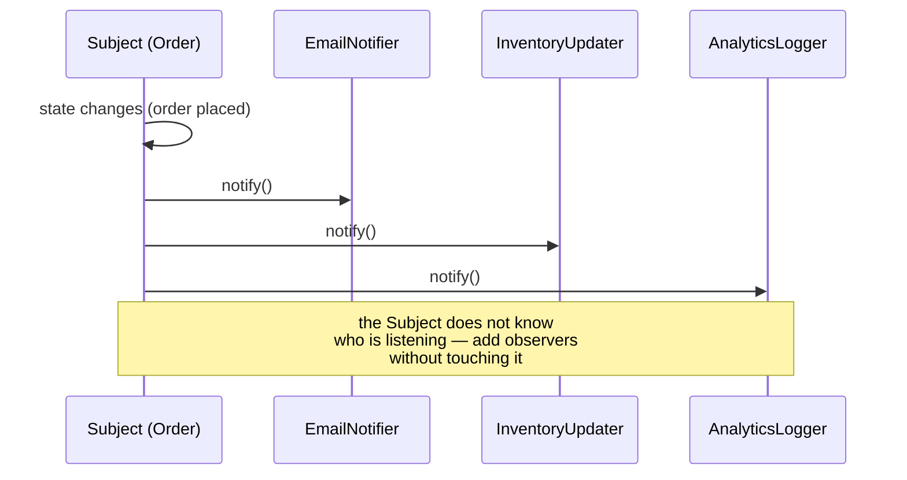
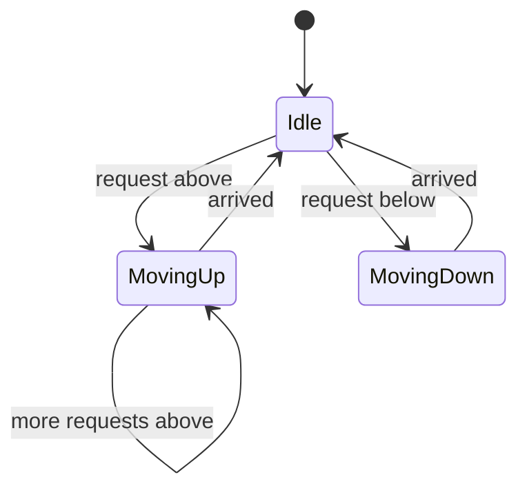
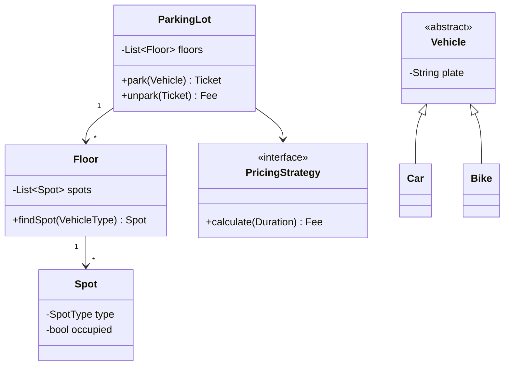

# OOP, SOLID & Design Patterns

`Weeks 14–17` · Low Level Design

## SOLID



### Liskov — the classic Rectangle/Square failure

```
  class Rectangle:  setWidth(w), setHeight(h)
  class Square(Rectangle):  setWidth also sets height  ← "a square IS a rectangle"

  def test(r: Rectangle):
      r.setWidth(5); r.setHeight(4)
      assert r.area() == 20        ✓ Rectangle
                                   ✗ Square gives 16

  → Square is NOT substitutable → inheritance was the wrong tool.
    Composition would have avoided it.
```

### Dependency Inversion in practice



The payoff is testability: inject the in-memory one in tests.

## The patterns that actually get asked



**Strategy, Observer and State** are the interview trio — know them cold.

### Strategy — swap the algorithm at runtime

```python
from abc import ABC, abstractmethod

class SplitStrategy(ABC):
    @abstractmethod
    def split(self, amount: float, users: list) -> dict: ...

class EqualSplit(SplitStrategy):
    def split(self, amount, users):
        share = amount / len(users)
        return {u: share for u in users}

class PercentSplit(SplitStrategy):
    def __init__(self, pct: dict): self.pct = pct
    def split(self, amount, users):
        return {u: amount * self.pct[u] / 100 for u in users}

class Expense:
    def __init__(self, amount, users, strategy: SplitStrategy):
        self.shares = strategy.split(amount, users)   # behaviour injected
```

Adding a new split type means **adding a class, not editing one** — that is Open/Closed in action.

### Observer — one change, many reactions



### State — behaviour depends on the current state



Replaces a sprawling `if/elif` on a state enum with one class per state.

## LLD case: Parking Lot



**Talk through it in this order:** requirements → entities → relationships → interfaces for anything that varies (pricing, allocation) → then code.

The patterns fall out naturally: **Strategy** for pricing, **Factory** for vehicle creation, **Singleton** for the lot itself.

## Interview checklist

- [ ] All five SOLID with a bad example and the refactor
- [ ] Liskov via Rectangle/Square
- [ ] Strategy, Observer, State — code each from memory
- [ ] Composition over inheritance, with a case where inheritance broke
- [ ] Parking lot: requirements → class diagram → code, in 45 minutes
