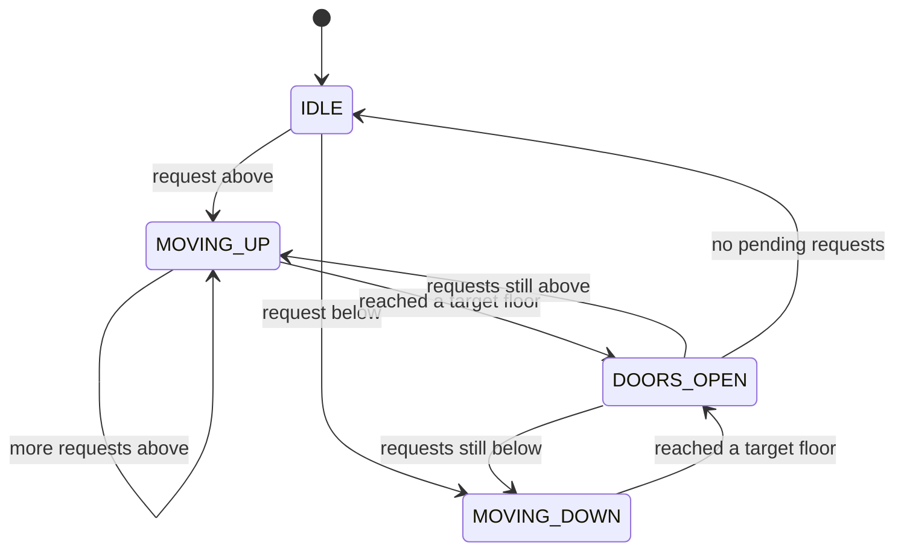
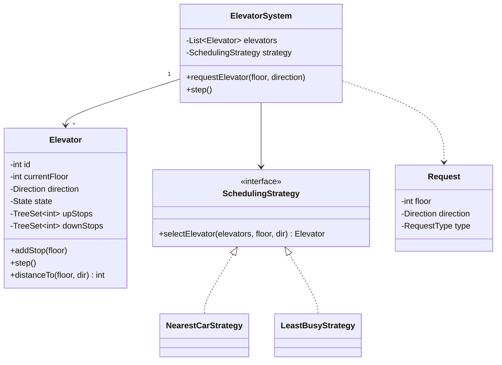

# LLD Case Study — Elevator System

`Week 17` · Low Level Design

One of the most common machine-coding problems. The scheduling is where candidates get lost.

---

## Requirements — ask these first

**Functional**
- N elevators, M floors
- **External** request: press up/down on a floor
- **Internal** request: press a floor button inside a car
- Elevator moves up/down, opens/closes doors

**Non-functional**
- Minimise average wait time
- No request is ever starved
- Thread-safe (multiple simultaneous requests)

**Clarifying questions worth asking:**
- Can an elevator change direction mid-journey? *(usually no — finish the current direction first)*
- Is there a capacity limit?
- Express elevators / restricted floors?

---

## State machine — draw this first



**The key rule:** an elevator moving up serves **all** requests above it before reversing. That is what prevents thrashing back and forth.

---

## Class diagram



**Patterns used:** **State** (elevator states), **Strategy** (which elevator to dispatch), Singleton (the system).

---

## The two sorted sets — the core data-structure choice

```
  Elevator at floor 5, moving UP

  upStops   = {7, 9, 12}    sorted ASCENDING  → serve 7, then 9, then 12
  downStops = {3, 1}        sorted DESCENDING → serve after reversing

  ┌──────────────────────────────────────────────┐
  │  1    3         5         7    9      12     │
  │  ●    ●         ▲         ○    ○      ○      │
  │ down down    current      up   up     up     │
  └──────────────────────────────────────────────┘
                     └─ finish all UP stops, THEN reverse
```

This is why two sorted sets beat one queue: it makes "serve everything in the current direction first" a single `min()` lookup.

---

## Code

```python
from enum import Enum
from sortedcontainers import SortedSet   # or use heapq / bisect
from abc import ABC, abstractmethod
import threading


class Direction(Enum):
    UP = 1
    DOWN = -1
    IDLE = 0


class State(Enum):
    IDLE = "IDLE"
    MOVING = "MOVING"
    DOORS_OPEN = "DOORS_OPEN"


class Elevator:
    def __init__(self, eid: int, max_floor: int):
        self.id = eid
        self.max_floor = max_floor
        self.current_floor = 0
        self.direction = Direction.IDLE
        self.state = State.IDLE
        self.up_stops = SortedSet()       # ascending
        self.down_stops = SortedSet()     # we read it in reverse
        self._lock = threading.Lock()

    def add_stop(self, floor: int) -> None:
        with self._lock:
            if floor > self.current_floor:
                self.up_stops.add(floor)
            elif floor < self.current_floor:
                self.down_stops.add(floor)
            else:
                self.state = State.DOORS_OPEN

    def distance_to(self, floor: int, direction: Direction) -> int:
        """Cost heuristic used by the scheduler. Lower is better."""
        d = abs(self.current_floor - floor)
        if self.direction == Direction.IDLE:
            return d
        # same direction AND the floor is on the way → cheap
        moving_toward = (
            (self.direction == Direction.UP and floor >= self.current_floor) or
            (self.direction == Direction.DOWN and floor <= self.current_floor)
        )
        if moving_toward and self.direction == direction:
            return d
        return d + self.max_floor        # penalty: must finish current sweep first

    def step(self) -> None:
        """Advance one tick."""
        with self._lock:
            if self.state == State.DOORS_OPEN:
                self.state = State.MOVING
                return

            if self.direction == Direction.UP or self.direction == Direction.IDLE:
                if self.up_stops:
                    self._move_toward(self.up_stops[0], Direction.UP)
                    return
            if self.down_stops:
                self._move_toward(self.down_stops[-1], Direction.DOWN)
                return

            self.direction = Direction.IDLE
            self.state = State.IDLE

    def _move_toward(self, target: int, direction: Direction) -> None:
        self.direction = direction
        self.state = State.MOVING
        self.current_floor += direction.value
        if self.current_floor == target:
            (self.up_stops if direction == Direction.UP else self.down_stops).discard(target)
            self.state = State.DOORS_OPEN


class SchedulingStrategy(ABC):
    @abstractmethod
    def select(self, elevators: list[Elevator], floor: int, direction: Direction) -> Elevator: ...


class NearestCarStrategy(SchedulingStrategy):
    def select(self, elevators, floor, direction):
        return min(elevators, key=lambda e: e.distance_to(floor, direction))


class ElevatorSystem:
    def __init__(self, n_elevators: int, max_floor: int,
                 strategy: SchedulingStrategy = None):
        self.elevators = [Elevator(i, max_floor) for i in range(n_elevators)]
        self.strategy = strategy or NearestCarStrategy()

    def request_elevator(self, floor: int, direction: Direction) -> Elevator:
        """External request — from a floor button."""
        elevator = self.strategy.select(self.elevators, floor, direction)
        elevator.add_stop(floor)
        return elevator

    def select_floor(self, elevator_id: int, floor: int) -> None:
        """Internal request — from inside the car."""
        self.elevators[elevator_id].add_stop(floor)

    def step(self) -> None:
        for e in self.elevators:
            e.step()
```

---

## Follow-ups they will ask

| Question | Answer |
|---|---|
| **How do you prevent starvation?** | Age requests — after N ticks, boost priority or force a direction change |
| **Thread safety?** | A lock per elevator (not one global lock — that serialises everything) |
| **Elevator breaks down** | Add a `MAINTENANCE` state; reassign its pending stops |
| **Rush hour optimisation** | Zone elevators to floor ranges; or park idle cars at the lobby |
| **How do you test this?** | Inject a clock — `step()` is deliberately deterministic, not time-based |

> **Making `step()` tick-based rather than sleeping on real time** is what makes this testable. Mention it.

---

## Interview checklist

- [ ] Draw the state machine before writing any code
- [ ] Two sorted sets, and why
- [ ] Strategy interface for dispatch (never hardcode the algorithm)
- [ ] Starvation prevention
- [ ] Lock granularity — per elevator, not global
