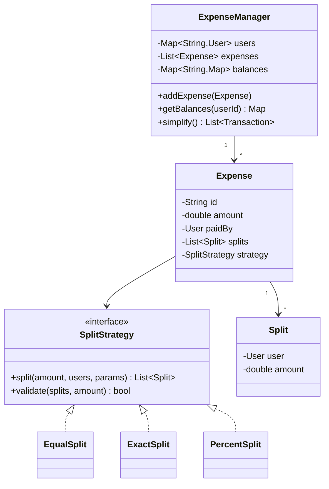

# LLD Case Study — Splitwise

`Week 17` · Low Level Design

Tests whether you can model money correctly and spot the graph problem hiding inside.

---

## Requirements

**Functional**
- Users, groups
- Add an expense paid by one (or more) people
- Split **equally**, by **exact amount**, or by **percentage**
- Show balances: who owes whom
- **Simplify debts** — minimise the number of transactions

**Non-functional**
- Balances must always sum to zero
- Money must never be lost to rounding

---

## Class diagram



**Pattern:** **Strategy** for the split types. Adding "split by shares" means adding a class, not editing one — Open/Closed.

---

## The balance sheet

```
  Alice pays £300 dinner, split equally among Alice, Bob, Carol

  each owes £100
  Alice already paid → Alice is owed £200

  balances[Bob][Alice]   = 100
  balances[Carol][Alice] = 100

  ┌─────────────────────────────────┐
  │  Bob   ──£100──►  Alice         │
  │  Carol ──£100──►  Alice         │
  └─────────────────────────────────┘

  net per person:  Alice +200,  Bob -100,  Carol -100
                   ─────────────────────────────────
                   SUM = 0   ← always. Assert it in tests.
```

---

## Debt simplification — the part that makes this interesting

```
  BEFORE                           AFTER
  ──────────────────────           ──────────────────────
  Bob   ──£100──► Alice            Bob   ──£100──► Alice
  Carol ──£100──► Bob              Carol ──£100──► Alice
  Alice ──£100──► Carol
                                   (3 transactions → 2)
  Net positions:
     Alice: +100 -100 = 0  →  wait, recompute properly:
     Alice receives 100 from Bob, pays 100 to Carol  → net 0
     Bob    pays 100, receives 100                   → net 0
     Carol  receives 100, pays 100                   → net 0
     → ALL SETTLE TO ZERO, zero transactions needed!
```

**The algorithm:** compute each person's **net balance**, then greedily match the largest creditor with the largest debtor.

```python
import heapq

def simplify(net: dict[str, float]) -> list[tuple[str, str, float]]:
    """net[user] > 0 means they are OWED money."""
    creditors = [(-amt, u) for u, amt in net.items() if amt > 0]   # max-heap
    debtors   = [(amt, u)  for u, amt in net.items() if amt < 0]   # min-heap
    heapq.heapify(creditors)
    heapq.heapify(debtors)

    txns = []
    while creditors and debtors:
        c_amt, c = heapq.heappop(creditors)
        d_amt, d = heapq.heappop(debtors)
        settled = min(-c_amt, -d_amt)          # both stored negated/negative

        txns.append((d, c, round(settled, 2)))

        c_rem = -c_amt - settled
        d_rem = -d_amt - settled
        if c_rem > 0.001:
            heapq.heappush(creditors, (-c_rem, c))
        if d_rem > 0.001:
            heapq.heappush(debtors, (-d_rem, d))
    return txns
```

> This is **greedy, not optimal** — minimising transactions exactly is NP-hard (it reduces to subset-sum). Say that out loud; it shows you recognised the complexity class rather than assuming greedy is provably best.

---

## Split strategies

```python
from abc import ABC, abstractmethod


class SplitStrategy(ABC):
    @abstractmethod
    def split(self, amount: float, users: list[str], params=None) -> dict[str, float]: ...


class EqualSplit(SplitStrategy):
    def split(self, amount, users, params=None):
        share = round(amount / len(users), 2)
        result = {u: share for u in users}
        # ROUNDING: give the remainder to the first user so the total is exact
        drift = round(amount - share * len(users), 2)
        result[users[0]] = round(result[users[0]] + drift, 2)
        return result


class ExactSplit(SplitStrategy):
    def split(self, amount, users, params=None):
        if round(sum(params.values()), 2) != round(amount, 2):
            raise ValueError("exact splits must sum to the total")
        return dict(params)


class PercentSplit(SplitStrategy):
    def split(self, amount, users, params=None):
        if round(sum(params.values()), 2) != 100.0:
            raise ValueError("percentages must sum to 100")
        return {u: round(amount * pct / 100, 2) for u, pct in params.items()}
```

```
  ╔════════════════════════════════════════════════════════════╗
  ║ THE ROUNDING TRAP                                          ║
  ║                                                            ║
  ║   £100 split 3 ways = £33.33 each = £99.99                 ║
  ║   ONE PENNY VANISHES.                                      ║
  ║                                                            ║
  ║ Fix: assign the remainder to one person deterministically. ║
  ║ Better: store money as INTEGER PENCE, never float.         ║
  ║                                                            ║
  ║ Raising this unprompted is a strong signal — it's the kind ║
  ║ of bug that reaches production and matters.                ║
  ╚════════════════════════════════════════════════════════════╝
```

---

## Follow-ups

| Question | Answer |
|---|---|
| **Multiple payers on one expense** | `paidBy` becomes a `Map<User, amount>`; net it against the splits |
| **Currencies** | store the currency + an exchange rate *at expense time*; never convert retroactively |
| **Concurrency** | balance updates need a transaction, or per-pair optimistic locking |
| **Scale to millions** | balances become a materialised view updated by CDC; don't recompute from all expenses |
| **Audit** | never mutate an expense — append a reversing entry (double-entry bookkeeping) |

---

## Interview checklist

- [ ] Strategy for split types
- [ ] Balances always sum to zero — assert it
- [ ] Debt simplification via net balances + greedy heap matching
- [ ] Say it's NP-hard to minimise exactly
- [ ] **Integer pence, not floats**; handle the rounding remainder
