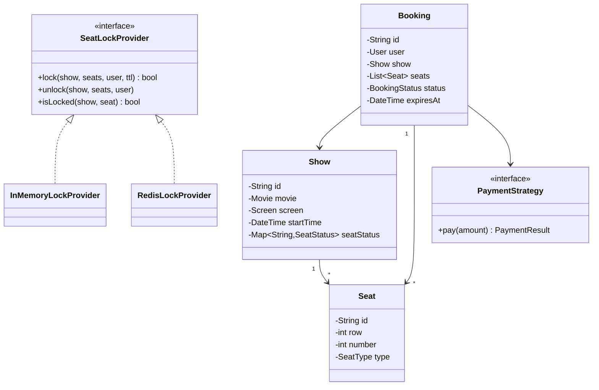
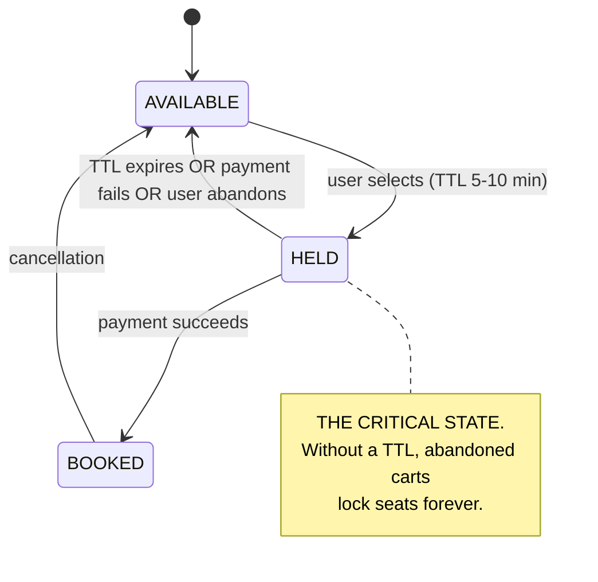
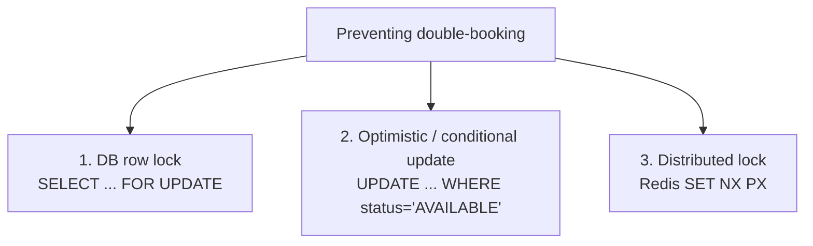
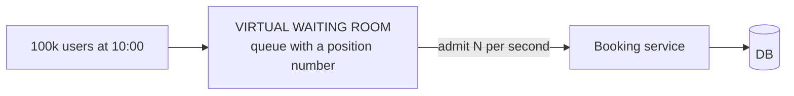

# LLD Case Study — BookMyShow / Ticketmaster

`Week 17` · Low Level Design

**The signature question is concurrency:** two users clicking the same seat at the same instant.

---

## Requirements

**Functional**
- Browse cities → cinemas → movies → shows
- View seat layout for a show
- **Select seats, hold them, pay, confirm**
- Cancel a booking

**Non-functional**
- **A seat must never be double-booked** — this is the whole problem
- Held seats must be released if payment doesn't complete
- Handle flash sales (a popular release at 10am)

---

## Class diagram



---

## Booking state machine



**The `HELD` state with a TTL is the entire answer** to "how do you stop double booking without locking seats forever?"

---

## The concurrency problem

```
  ╔════════════════════════════════════════════════════════════╗
  ║ THE RACE                                                   ║
  ║                                                            ║
  ║   t=0  User A: SELECT seat A1 → status = AVAILABLE  ✓      ║
  ║   t=0  User B: SELECT seat A1 → status = AVAILABLE  ✓      ║
  ║   t=1  User A: UPDATE status = HELD                        ║
  ║   t=1  User B: UPDATE status = HELD                        ║
  ║                                                            ║
  ║   → BOTH think they hold it. DOUBLE BOOKED.                ║
  ║                                                            ║
  ║ Read-then-write without atomicity is ALWAYS wrong here.    ║
  ╚════════════════════════════════════════════════════════════╝
```

### Three correct solutions — know all three and their trade-offs



**1. Pessimistic — `SELECT ... FOR UPDATE`**

```sql
BEGIN;
SELECT * FROM seats
 WHERE show_id = 1 AND seat_id IN ('A1','A2')
   FOR UPDATE;                       -- other transactions WAIT here
-- verify all are AVAILABLE
UPDATE seats SET status='HELD', held_by=:user, expires_at=now()+interval '10 min'
 WHERE show_id = 1 AND seat_id IN ('A1','A2');
COMMIT;
```
✅ Simple and correct · ❌ holds locks, hurts throughput under a flash sale

**2. Optimistic — conditional update (usually the best answer)**

```sql
UPDATE seats
   SET status = 'HELD', held_by = :user, expires_at = now() + interval '10 min'
 WHERE show_id = :show
   AND seat_id = ANY(:seats)
   AND status = 'AVAILABLE';         -- ← the condition IS the lock
-- rows_updated < len(seats)? someone beat you → roll back, tell the user
```
✅ No locks held, scales well · ✅ the database enforces it atomically · ❌ needs retry handling

**3. Distributed lock — Redis**

```python
def try_hold(show_id, seats, user_id, ttl=600):
    keys = [f"seat:{show_id}:{s}" for s in seats]
    acquired = []
    for k in keys:
        if redis.set(k, user_id, nx=True, ex=ttl):   # atomic
            acquired.append(k)
        else:
            for a in acquired:                       # roll back partial holds
                redis.delete(a)
            return False
    return True
```
✅ Works across services · ❌ the GC-pause failure mode ([see Coordination](../system-design/07-coordination-and-consistency.md)) · ❌ Redis becomes critical

> **Say option 2.** A conditional `UPDATE ... WHERE status='AVAILABLE'` lets the database do the work atomically, holds no locks, and needs no extra infrastructure. Then mention the others and why.

---

## Code

```python
from enum import Enum
from datetime import datetime, timedelta
import threading


class SeatStatus(Enum):
    AVAILABLE = "AVAILABLE"
    HELD = "HELD"
    BOOKED = "BOOKED"


class SeatLockProvider:
    """In-memory version. Production: Redis or a conditional DB update."""
    def __init__(self, ttl_seconds: int = 600):
        self.ttl = ttl_seconds
        self._locks: dict[tuple, tuple] = {}      # (show, seat) -> (user, expiry)
        self._mutex = threading.Lock()

    def _expired(self, entry) -> bool:
        return entry[1] < datetime.now()

    def lock(self, show_id: str, seats: list[str], user_id: str) -> bool:
        with self._mutex:                          # single critical section
            # 1. check ALL seats first — never partially acquire
            for s in seats:
                entry = self._locks.get((show_id, s))
                if entry and not self._expired(entry) and entry[0] != user_id:
                    return False
            # 2. only then acquire
            expiry = datetime.now() + timedelta(seconds=self.ttl)
            for s in seats:
                self._locks[(show_id, s)] = (user_id, expiry)
            return True

    def unlock(self, show_id: str, seats: list[str], user_id: str) -> None:
        with self._mutex:
            for s in seats:
                entry = self._locks.get((show_id, s))
                if entry and entry[0] == user_id:   # only release YOUR lock
                    del self._locks[(show_id, s)]


class BookingService:
    def __init__(self, lock_provider: SeatLockProvider):
        self.locks = lock_provider
        self.bookings: dict[str, "Booking"] = {}

    def create_booking(self, user_id: str, show_id: str, seats: list[str]):
        if not self.locks.lock(show_id, seats, user_id):
            raise SeatUnavailable("Those seats were just taken")

        booking = Booking(user_id, show_id, seats, status="PENDING")
        self.bookings[booking.id] = booking
        return booking

    def confirm(self, booking_id: str, payment_result) -> None:
        b = self.bookings[booking_id]
        if payment_result.success:
            b.status = "CONFIRMED"
            # seats move HELD → BOOKED; the lock is now permanent
        else:
            b.status = "FAILED"
            self.locks.unlock(b.show_id, b.seats, b.user_id)   # release
```

**Two details that matter:**
- **Check all seats before acquiring any** — otherwise you partially lock and have to unwind
- **Only release your own lock** — checking the owner prevents one user releasing another's hold

---

## Flash sale — the follow-up they always ask



| Technique | Why |
|---|---|
| **Virtual waiting room** | admit users at a controlled rate instead of letting 100k hit the DB |
| Cache the seat map | reads vastly outnumber writes; only the *hold* needs the DB |
| Shard by show | one popular show doesn't starve every other booking |
| Rate limit per user | stops bots grabbing everything |
| Short hold TTL under load | 2 minutes instead of 10 frees inventory faster |

---

## Follow-ups

| Question | Answer |
|---|---|
| **How are expired holds released?** | Lazy (check `expires_at` on read) **plus** a background sweeper. Lazy alone leaves stale rows; the sweeper alone is slow to react. |
| **Payment succeeds but the app crashes** | Idempotency key on the payment + a reconciliation job against the PSP |
| **Adjacent-seat allocation** | Greedy scan for the longest contiguous run in a row |
| **Why not just a queue per seat?** | Millions of seats × shows = millions of queues; it doesn't scale |

---

## Interview checklist

- [ ] Draw the state machine; the `HELD` state with a TTL is the answer
- [ ] Name the race explicitly (read-then-write)
- [ ] All three solutions, and why conditional `UPDATE` is usually best
- [ ] Check all seats before acquiring any; release only your own
- [ ] Expired holds: lazy + sweeper
- [ ] Flash sale: virtual waiting room
