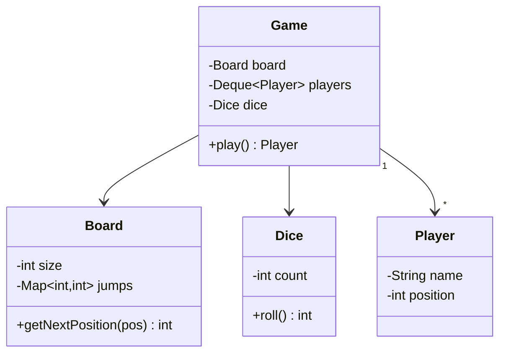
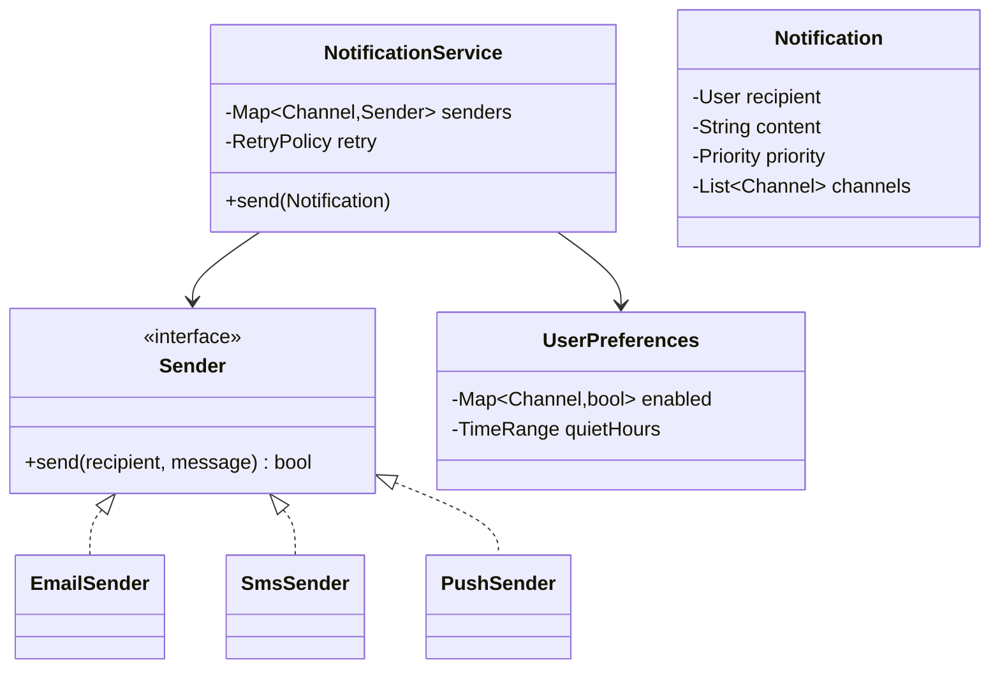

# LLD Case Studies — Rate Limiter, Snake & Ladder, Notification

`Week 17` · Low Level Design

Three shorter problems that each test a specific skill.

---

## Rate Limiter — tests thread safety

### Token bucket

```
  capacity 10, refill 2 tokens/second

  ┌──────────────┐
  │ ● ● ● ● ● ●  │  ← refills continuously at 2/sec, capped at 10
  └──────┬───────┘
         │ each request consumes ONE token
         ▼
    token available? → ALLOW    no token? → 429

  ✓ ALLOWS BURSTS — a full bucket lets 10 through instantly
```

**The trick: don't run a background refill thread.** Compute tokens lazily from elapsed time.

```python
import time
import threading


class TokenBucket:
    def __init__(self, capacity: int, refill_rate: float):
        self.capacity = capacity
        self.refill_rate = refill_rate        # tokens per second
        self.tokens = float(capacity)
        self.last_refill = time.monotonic()   # monotonic, NOT time.time()
        self._lock = threading.Lock()

    def allow(self, n: int = 1) -> bool:
        with self._lock:
            now = time.monotonic()
            elapsed = now - self.last_refill
            # LAZY refill - no background thread needed
            self.tokens = min(self.capacity, self.tokens + elapsed * self.refill_rate)
            self.last_refill = now
            if self.tokens >= n:
                self.tokens -= n
                return True
            return False


class RateLimiter:
    """One bucket per client."""
    def __init__(self, capacity: int, refill_rate: float):
        self.capacity, self.refill_rate = capacity, refill_rate
        self.buckets: dict[str, TokenBucket] = {}
        self._lock = threading.Lock()

    def allow(self, client_id: str) -> bool:
        with self._lock:
            bucket = self.buckets.get(client_id)
            if bucket is None:
                bucket = TokenBucket(self.capacity, self.refill_rate)
                self.buckets[client_id] = bucket
        return bucket.allow()     # per-bucket lock, OUTSIDE the map lock
```

**Two details worth stating:**
- **`time.monotonic()`, not `time.time()`** — wall-clock can jump backwards on NTP sync and break the maths
- **Two-level locking** — a short lock to fetch the bucket, then the bucket's own lock. One global lock would serialise every client.

**Distributed version:** Redis + a **Lua script**, so the read-modify-write is atomic on the server. Doing it in application code reintroduces the race.

---

## Snake & Ladder — tests clean modelling



**The key modelling insight:** a snake and a ladder are **the same thing** — a jump from one cell to another. One `Map<int, int>` handles both. Modelling them as separate classes is the common over-engineering mistake.

```python
from collections import deque
import random


class Board:
    def __init__(self, size: int, snakes: dict[int, int], ladders: dict[int, int]):
        self.size = size
        self.jumps = {**snakes, **ladders}      # ONE map - a jump is a jump

    def next_position(self, pos: int) -> int:
        return self.jumps.get(pos, pos)         # chained jumps? loop instead


class Game:
    def __init__(self, board: Board, players: list[str], dice_sides: int = 6):
        self.board = board
        self.players = deque({"name": p, "pos": 0} for p in players)
        self.sides = dice_sides

    def play(self) -> str:
        while True:
            player = self.players.popleft()
            roll = random.randint(1, self.sides)
            target = player["pos"] + roll

            if target > self.board.size:
                self.players.append(player)      # overshoot - stay put
                continue

            player["pos"] = self.board.next_position(target)
            if player["pos"] == self.board.size:
                return player["name"]
            self.players.append(player)
```

**Follow-ups:** roll a 6 → extra turn · multiple dice · chained jumps (loop until stable) · "must land exactly on the final square".

---

## Notification System — tests extensibility



```python
from abc import ABC, abstractmethod
from enum import Enum


class Channel(Enum):
    EMAIL = "EMAIL"
    SMS = "SMS"
    PUSH = "PUSH"


class Sender(ABC):
    @abstractmethod
    def send(self, recipient: str, message: str) -> bool: ...


class EmailSender(Sender):
    def send(self, recipient, message):
        ...   # call the email provider
        return True


class NotificationService:
    def __init__(self, senders: dict[Channel, Sender], prefs, queue):
        self.senders = senders          # adding a channel = adding a Sender
        self.prefs = prefs
        self.queue = queue

    def send(self, notification) -> None:
        for channel in notification.channels:
            if not self.prefs.is_enabled(notification.recipient, channel):
                continue                                  # respect opt-out
            if self.prefs.in_quiet_hours(notification.recipient):
                self.queue.schedule_later(notification, channel)
                continue
            self.queue.enqueue(notification, channel)     # async, with retries
```

**The design points that matter:**
- **Strategy per channel** — adding WhatsApp means adding one class, touching nothing else
- **Always asynchronous** — never call a third-party provider inline in a request
- **Idempotency** — retries mean duplicates; deduplicate on a notification ID
- **User preferences and quiet hours** — the requirement candidates forget to ask about
- **Templates** — separate content from delivery

---

## Interview checklist

- [ ] Token bucket with **lazy** refill; `monotonic()` not `time()`
- [ ] Two-level locking — never one global lock
- [ ] Distributed rate limiting needs a Redis **Lua script** for atomicity
- [ ] Snake & ladder: a snake and a ladder are the same thing
- [ ] Notifications: Strategy per channel, async, idempotent, respect preferences
