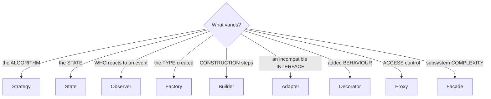

# Design Patterns — Full Reference

`Weeks 15–16` · Low Level Design

All 23 GoF patterns. The ★ ones are what actually get asked — know those cold.

---

## Creational — object creation

### ★ Singleton

**Intent:** exactly one instance, globally accessible.

```python
import threading

class Singleton:
    _instance = None
    _lock = threading.Lock()

    def __new__(cls):
        if cls._instance is None:              # first check (fast path)
            with cls._lock:
                if cls._instance is None:      # DOUBLE-CHECKED LOCKING
                    cls._instance = super().__new__(cls)
        return cls._instance
```

**Use:** config, connection pool, logger.
**Avoid:** it is **global mutable state** — hard to test, hides dependencies. Prefer dependency injection. Interviewers often *want* you to note this.

### ★ Factory Method

**Intent:** defer instantiation to a subclass / a creator function.

```python
class NotificationFactory:
    @staticmethod
    def create(channel: str) -> "Sender":
        return {"email": EmailSender, "sms": SmsSender}[channel]()
```

**Use:** the concrete type depends on runtime input. Removes `if/elif` chains from client code.

### Abstract Factory

**Intent:** create **families** of related objects without naming concretes.

**Use:** cross-platform UI kits (WindowsButton + WindowsCheckbox vs MacButton + MacCheckbox). Rare in backend interviews.

### ★ Builder

**Intent:** construct a complex object step by step; avoids a telescoping constructor.

```python
class Pizza:
    def __init__(self):
        self.toppings, self.size, self.crust = [], None, None

class PizzaBuilder:
    def __init__(self): self._p = Pizza()
    def size(self, s):      self._p.size = s;  return self      # chainable
    def crust(self, c):     self._p.crust = c; return self
    def add(self, t):       self._p.toppings.append(t); return self
    def build(self):        return self._p

pizza = PizzaBuilder().size("L").crust("thin").add("olives").build()
```

**Use:** many optional parameters; immutable objects.

### Prototype

**Intent:** create new objects by **cloning** an existing one.

**Use:** object creation is expensive (a deep config, a loaded ML model).

---

## Structural — composition

### ★ Adapter

**Intent:** make an incompatible interface usable.

```python
class LegacyPaymentGateway:            # third-party, can't change it
    def make_payment(self, amount_in_paise: int): ...

class PaymentAdapter(PaymentProcessor):    # our interface
    def __init__(self, legacy): self.legacy = legacy
    def pay(self, rupees: float) -> bool:
        return self.legacy.make_payment(int(rupees * 100))
```

**Use:** wrapping third-party SDKs, legacy code, incompatible APIs.

### ★ Decorator

**Intent:** add behaviour **at runtime** without subclassing.

```python
class Coffee:
    def cost(self): return 100

class MilkDecorator:
    def __init__(self, inner): self.inner = inner
    def cost(self): return self.inner.cost() + 20

class SugarDecorator:
    def __init__(self, inner): self.inner = inner
    def cost(self): return self.inner.cost() + 5

order = SugarDecorator(MilkDecorator(Coffee()))   # 125 — stack them freely
```

**Use:** the alternative is a class per combination — `CoffeeWithMilkAndSugar`, `CoffeeWithMilk`, … which explodes combinatorially. Java's `BufferedInputStream(FileInputStream(...))` is this pattern.

### ★ Proxy

**Intent:** a stand-in that controls access to the real object.

| Kind | Purpose |
|---|---|
| **Virtual** | lazy-load an expensive object |
| **Protection** | access control |
| **Remote** | represent an object on another machine (RPC stubs) |
| **Caching** | memoise results |

**Decorator vs Proxy:** decorator **adds behaviour**, proxy **controls access**. Same shape, different intent.

### ★ Facade

**Intent:** one simple interface over a complex subsystem.

```python
class OrderFacade:
    def place_order(self, user, items):
        self.inventory.reserve(items)
        payment = self.payments.charge(user, total(items))
        self.shipping.schedule(user, items)
        self.notifications.send(user, "confirmed")
        return payment
```

**Use:** hide orchestration complexity from callers. An API gateway is a facade.

### Composite

**Intent:** treat individual objects and compositions **uniformly** via a tree.

**Use:** file system (file vs folder), UI component trees, org charts. `folder.size()` recursing into children is this pattern.

### Bridge

**Intent:** separate abstraction from implementation so both vary independently.

**Use:** `Shape` × `Renderer` — avoids `CircleSVG`, `CircleCanvas`, `SquareSVG`, … Rare in interviews.

### Flyweight

**Intent:** share immutable state across many objects to save memory.

**Use:** characters in a text editor, particles in a game. Python's small-integer caching is a flyweight.

---

## Behavioural — communication

### ★★ Strategy

**Intent:** swap the **algorithm** at runtime.

```python
class SortStrategy(ABC):
    @abstractmethod
    def sort(self, data: list) -> list: ...

class Context:
    def __init__(self, strategy: SortStrategy): self.strategy = strategy
    def execute(self, data): return self.strategy.sort(data)
```

**Use:** payment methods, pricing rules, split types, compression algorithms, eviction policies. **The single most-used pattern in LLD interviews.** Adding a new algorithm = adding a class (Open/Closed).

### ★★ Observer

**Intent:** one-to-many notification; the subject doesn't know its listeners.

```python
class Subject:
    def __init__(self): self._observers = []
    def attach(self, o): self._observers.append(o)
    def detach(self, o): self._observers.remove(o)
    def notify(self, event):
        for o in list(self._observers):        # copy — a handler may detach
            o.update(event)
```

**Use:** event systems, UI bindings, pub/sub, model-view.
**Watch:** memory leaks if observers never detach; exceptions in one observer breaking the loop (isolate each call).

### ★★ State

**Intent:** behaviour changes with internal state; replaces a sprawling `if/elif` on an enum.

```python
class OrderState(ABC):
    @abstractmethod
    def next(self, order) -> "OrderState": ...
    @abstractmethod
    def cancel(self, order) -> "OrderState": ...

class Placed(OrderState):
    def next(self, o):   return Shipped()
    def cancel(self, o): return Cancelled()

class Shipped(OrderState):
    def next(self, o):   return Delivered()
    def cancel(self, o): raise ValueError("cannot cancel a shipped order")
```

**Use:** order lifecycle, elevator, vending machine, TCP connection. **Illegal transitions become impossible rather than a forgotten `if`.**

### ★ Command

**Intent:** wrap a request as an object — enabling undo, queuing, logging.

```python
class Command(ABC):
    @abstractmethod
    def execute(self): ...
    @abstractmethod
    def undo(self): ...
```

**Use:** undo/redo, task queues, transactional operations, remote controls.

### ★ Template Method

**Intent:** define the skeleton; subclasses fill in steps.

```python
class DataPipeline(ABC):
    def run(self):                  # the TEMPLATE — fixed order
        data = self.extract()
        data = self.transform(data)
        self.load(data)
    @abstractmethod
    def extract(self): ...
```

**Use:** ETL pipelines, test frameworks (setUp/test/tearDown), request handlers.

### ★ Chain of Responsibility

**Intent:** pass a request along a chain until one handler deals with it.

**Use:** middleware, request filters, approval workflows, exception handling. Every web framework's middleware stack is this.

### Iterator

**Intent:** traverse a collection without exposing its internals. Python's `__iter__` / `__next__`.

### Mediator

**Intent:** centralise communication so objects don't reference each other directly.

**Use:** chat rooms, air traffic control, complex UI forms.

### Memento

**Intent:** capture and restore state without violating encapsulation. Undo snapshots, checkpoints.

### Visitor

**Intent:** add operations to a class hierarchy without modifying it. AST traversal, compilers.

### Interpreter

**Intent:** define a grammar and evaluate sentences. Rare — regex engines, SQL parsers.

---

## Quick reference

| Category | Patterns | Must know |
|---|---|---|
| **Creational** | Singleton, Factory Method, Abstract Factory, Builder, Prototype | Singleton, Factory, Builder |
| **Structural** | Adapter, Decorator, Proxy, Facade, Composite, Bridge, Flyweight | Adapter, Decorator, Proxy, Facade |
| **Behavioural** | Strategy, Observer, State, Command, Template Method, Chain of Responsibility, Iterator, Mediator, Memento, Visitor, Interpreter | **Strategy, Observer, State** |

---

## Choosing a pattern



> **"Identify what varies and encapsulate it."** That is the one sentence behind almost every pattern — and it's a strong thing to say when asked *why* you chose one.

---

## Anti-patterns to avoid

| Anti-pattern | Why it hurts |
|---|---|
| **Pattern obsession** | using a pattern where a function would do |
| **God object** | one class doing everything — violates SRP |
| **Singleton abuse** | global state that hides dependencies and breaks tests |
| **Anaemic domain model** | data classes with no behaviour, all logic in "services" |
| Deep inheritance | prefer composition; inheritance is the tightest coupling there is |

---

## Interview checklist

- [ ] Strategy, Observer, State — code each from memory
- [ ] Decorator vs Proxy — behaviour vs access
- [ ] Why Singleton is often criticised
- [ ] Builder for telescoping constructors
- [ ] "Identify what varies and encapsulate it"
- [ ] Composition over inheritance, with an example where inheritance broke
