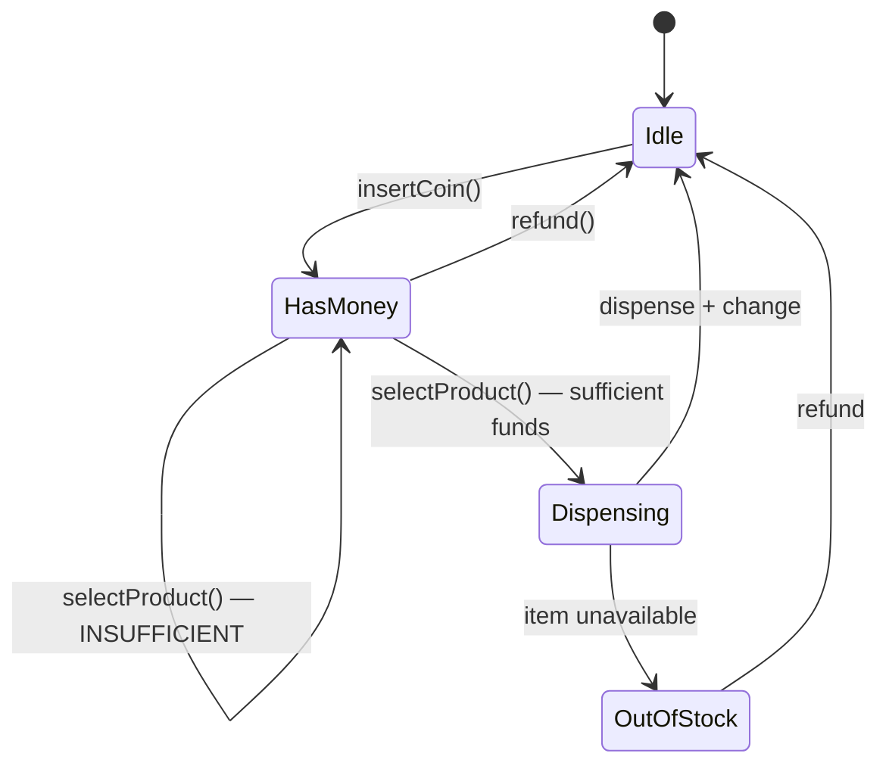
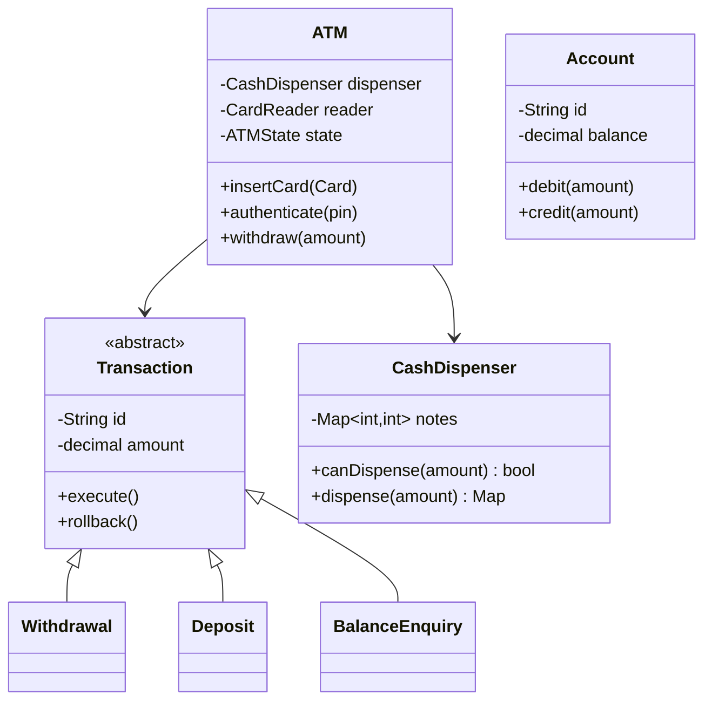
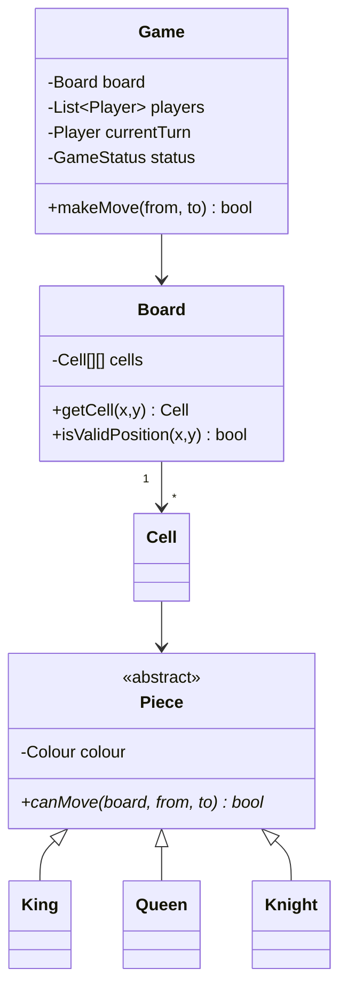
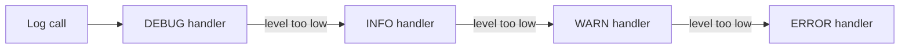

# LLD Case Studies — Vending Machine, ATM, Chess, Logger

`Week 17` · Low Level Design

Four more that each test a distinct skill.

---

## Vending Machine — the canonical State pattern question



**Why State, not `if/elif`:** each state class only implements the transitions that are **legal** from it. `selectProduct()` in `Idle` raises rather than silently doing nothing — illegal transitions become impossible instead of a forgotten branch.

```python
from abc import ABC, abstractmethod


class VendingState(ABC):
    @abstractmethod
    def insert_coin(self, machine, coin: int): ...
    @abstractmethod
    def select(self, machine, code: str): ...
    @abstractmethod
    def refund(self, machine): ...


class IdleState(VendingState):
    def insert_coin(self, machine, coin):
        machine.balance += coin
        machine.state = HasMoneyState()
    def select(self, machine, code):
        raise ValueError("Insert money first")
    def refund(self, machine):
        raise ValueError("No money to refund")


class HasMoneyState(VendingState):
    def insert_coin(self, machine, coin):
        machine.balance += coin
    def select(self, machine, code):
        item = machine.inventory.get(code)
        if not item or item.qty == 0:
            machine.state = OutOfStockState(); return
        if machine.balance < item.price:
            raise ValueError(f"Need {item.price - machine.balance} more")
        machine.state = DispensingState()
        machine.dispense(code)
    def refund(self, machine):
        machine.return_coins(machine.balance)
        machine.balance = 0
        machine.state = IdleState()


class VendingMachine:
    def __init__(self, inventory, coins):
        self.state = IdleState()
        self.inventory = inventory
        self.balance = 0
        self.coin_stock = coins

    # delegate everything to the current state
    def insert_coin(self, coin): self.state.insert_coin(self, coin)
    def select(self, code):      self.state.select(self, code)
    def refund(self):            self.state.refund(self)

    def make_change(self, amount: int) -> dict[int, int]:
        """Greedy works for standard currencies. NOT universally optimal."""
        change = {}
        for coin in sorted(self.coin_stock, reverse=True):
            n = min(amount // coin, self.coin_stock[coin])
            if n:
                change[coin] = n
                amount -= coin * n
        if amount:
            raise ValueError("Cannot make exact change")
        return change
```

**The follow-up they ask:** *"Is greedy change-making always optimal?"*
**No.** With coins `[1, 3, 4]` and target 6, greedy gives `4+1+1` (3 coins); optimal is `3+3` (2). Standard currencies are *canonical* so greedy works — but say you'd use DP ([coin change](../../patterns/greedy-dp/dp-knapsack.md)) if the denominations were arbitrary. **That link between LLD and DP is a strong answer.**

---

## ATM — tests transactions and safety



**The critical ordering — get this wrong and you lose money:**

```
  ✗ WRONG                          ✓ RIGHT
  ────────────────────────         ──────────────────────────────
  1. dispense cash                 1. check dispenser CAN dispense
  2. debit the account             2. debit account (in a TRANSACTION)
                                   3. dispense cash
  crash between 1 and 2            4. commit
  → cash gone, balance unchanged
                                   crash before 3 → roll back the debit
                                   crash after 3  → reconciliation job
```

**Also:** note-denomination dispensing is the same **coin-change problem** — you may be able to dispense ₹2000 but not ₹2300 if you only hold ₹500 notes. `canDispense()` must check *before* debiting.

**Patterns:** State (card inserted / authenticated / dispensing), Command (each transaction with `execute`/`rollback`), Strategy (dispensing algorithm).

---

## Chess / Tic-Tac-Toe — tests clean modelling



**The key design decision:** `canMove` is **polymorphic on the piece**, not a giant `switch` in `Game`.

```python
class Knight(Piece):
    def can_move(self, board, src, dst) -> bool:
        dx, dy = abs(dst.x - src.x), abs(dst.y - src.y)
        if sorted((dx, dy)) != [1, 2]:
            return False
        target = board.get(dst)
        return target is None or target.colour != self.colour
```

Adding a new piece means **adding a class** — no existing code changes (Open/Closed).

**Follow-ups:** check/checkmate detection (simulate the move, test if your king is attacked), castling and en passant (special-case flags on the King/Pawn), move history (Memento or Command for undo).

---

## Logger — tests Chain of Responsibility + Singleton



```python
from abc import ABC, abstractmethod
from enum import IntEnum


class Level(IntEnum):
    DEBUG = 10
    INFO = 20
    WARN = 30
    ERROR = 40


class LogHandler(ABC):
    def __init__(self, level: Level, nxt: "LogHandler" = None):
        self.level, self.next = level, nxt

    def handle(self, level: Level, message: str) -> None:
        if level >= self.level:
            self.write(message)
        if self.next:
            self.next.handle(level, message)     # pass ALONG the chain

    @abstractmethod
    def write(self, message: str): ...


class ConsoleHandler(LogHandler):
    def write(self, message): print(message)


class FileHandler(LogHandler):
    def __init__(self, level, path, nxt=None):
        super().__init__(level, nxt)
        self.path = path
    def write(self, message):
        with open(self.path, "a") as f:
            f.write(message + "\n")
```

**Design points:**
- **Chain of Responsibility** for handlers — add a Slack handler without touching anything else
- **Singleton** for the logger instance (one of the few genuinely justified uses)
- **Strategy** for formatting (JSON vs plain text)
- **Thread safety** — appends must be synchronised, or use a queue and a single writer thread
- **Async logging** — never block a request thread on disk I/O

---

## Interview checklist

- [ ] Vending machine: State pattern; greedy change isn't always optimal
- [ ] ATM: **check → debit → dispense**, never dispense first
- [ ] Chess: polymorphic `canMove`, not a switch
- [ ] Logger: Chain of Responsibility; async writes
- [ ] In every one: identify what varies, put it behind an interface
