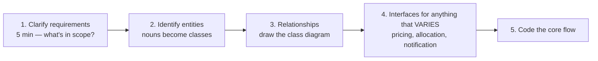

# OOP & Low Level Design

`Weeks 14–17` of the prep plan.

| # | File | Topics |
|---|---|---|
| 01 | [OOP, SOLID & Patterns](01-oop-solid-patterns.md) | SOLID, creational/structural/behavioural patterns, parking lot case study |

## The LLD interview shape

**Machine coding rounds** (Flipkart, Swiggy, Meesho, Myntra) give you 90 minutes to build a working OO system. Practise these end to end:

| Problem | The hard part |
|---|---|
| Parking Lot | spot allocation strategy, pricing strategy |
| Elevator System | scheduling, direction state machine |
| Splitwise | split strategies, balance simplification |
| BookMyShow | **seat locking, double-booking prevention** |
| Snake & Ladder | game loop, board modelling |
| Rate Limiter | token bucket, thread safety |

## The patterns that actually appear

**Strategy · Observer · State** — the interview trio. Know them cold, code them from memory.

Then: Factory, Singleton, Builder, Decorator, Adapter.

## Connections

| LLD concept | Where it reappears |
|---|---|
| Strategy pattern | [System Design](../system-design/) — pluggable pricing, routing, eviction |
| Seat locking (BookMyShow) | [Coordination](../system-design/07-coordination-and-consistency.md) — distributed locks, optimistic concurrency |
| LRU cache design | [LRU pattern](../../patterns/design/lru-lfu-cache.md) · [OS page replacement](../os/04-memory-management.md) |
| State machine | [DP state machine](../../patterns/greedy-dp/dp-state-machine.md) |
