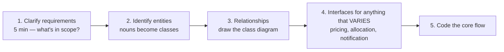

# OOP & Low Level Design

`Weeks 14–17` of the prep plan.

| # | File | Topics |
|---|---|---|
| 01 | [OOP, SOLID & Patterns](01-oop-solid-patterns.md) | SOLID, creational/structural/behavioural patterns, **Parking Lot** |
| 02 | [Elevator System](02-elevator-system.md) | state machine, dispatch strategy, two sorted sets, starvation, lock granularity |
| 03 | [Splitwise](03-splitwise.md) | split strategies, balance sheet, **debt simplification**, the rounding trap |
| 04 | [BookMyShow](04-bookmyshow.md) | **seat-locking concurrency**, three correct solutions, flash sales |
| 05 | [Rate Limiter & others](05-rate-limiter-and-others.md) | token bucket + thread safety, Snake & Ladder, Notification System |

## The LLD interview shape

**Machine coding rounds** (Flipkart, Swiggy, Meesho, Myntra) give you 90 minutes to build a working OO system. Practise these end to end:

| Problem | The hard part | Written up |
|---|---|---|
| Parking Lot | spot allocation strategy, pricing strategy | [01](01-oop-solid-patterns.md) |
| Elevator System | scheduling, direction state machine | [02](02-elevator-system.md) |
| Splitwise | split strategies, balance simplification | [03](03-splitwise.md) |
| BookMyShow | **seat locking, double-booking prevention** | [04](04-bookmyshow.md) |
| Rate Limiter | token bucket, thread safety | [05](05-rate-limiter-and-others.md) |
| Snake & Ladder | game loop, board modelling | [05](05-rate-limiter-and-others.md) |
| Notification System | channel strategy, async, idempotency | [05](05-rate-limiter-and-others.md) |

## The patterns that actually appear

**Strategy · Observer · State** — the interview trio. Know them cold, code them from memory.

Then: Factory, Singleton, Builder, Decorator, Adapter.

## Connections

| LLD concept | Where it reappears |
|---|---|
| Strategy pattern | [System Design](../system-design/) — pluggable pricing, routing, eviction |
| Seat locking (BookMyShow) | [Coordination](../system-design/07-coordination-and-consistency.md) — distributed locks, optimistic concurrency |
| LRU cache design | [LRU pattern](../../patterns/design/lru-lfu-cache.md) · [OS page replacement](../os/04-memory-management.md) |
| State machine | [DP state machine](../../patterns/greedy-dp/dp-state-machine.md) |
