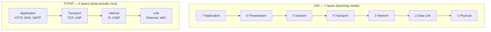
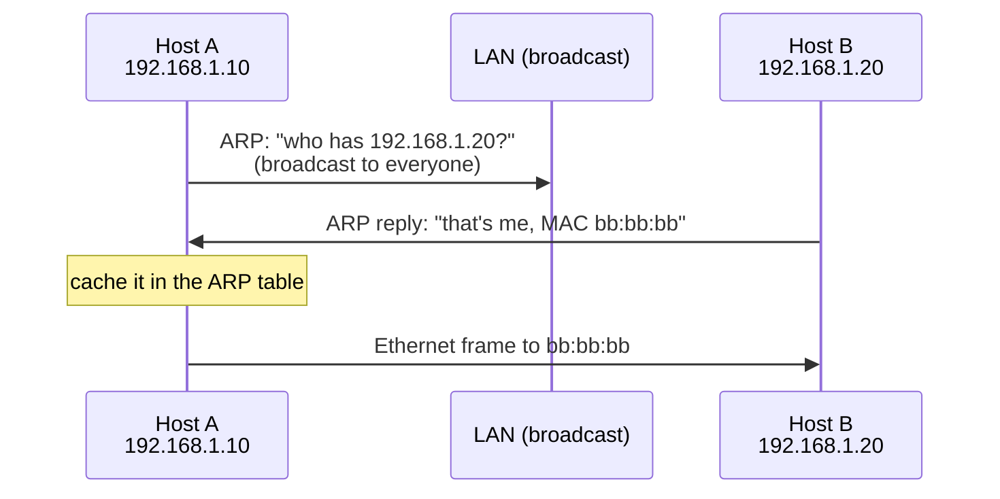

# Models, Layers & the Link Layer

`Week 6` · Computer Networks

## OSI vs TCP/IP



OSI layers 5–7 barely exist in practice. **The real internet runs the TCP/IP stack** — say that, it shows you know the difference between the model and reality.

### Encapsulation — headers added on the way down

```
  Application    │              DATA                │
                 ▼
  Transport      │ TCP hdr │    DATA                │   ← SEGMENT
                 ▼
  Network        │ IP hdr │ TCP hdr │ DATA          │   ← PACKET
                 ▼
  Link           │ Eth hdr │ IP hdr │ TCP hdr │ DATA │ Eth trailer │  ← FRAME
                 ▼
  Physical                     bits on the wire
```

Each layer treats everything above it as opaque payload. That is what lets you swap WiFi for Ethernet without touching TCP.

### Layer numbers matter in practice

| Device / term | Layer |
|---|---|
| Hub | L1 — repeats blindly to every port |
| **Switch** | **L2** — forwards by MAC |
| **Router** | **L3** — forwards by IP |
| L4 load balancer | transport — routes on IP/port, cannot see HTTP |
| L7 load balancer | application — routes on path, header, cookie |

## MAC addresses, switches and ARP



A **switch** learns which MAC lives on which port by inspecting source addresses, then forwards frames only to the correct port. A **hub** repeats to every port — which is why switches eliminated collisions.

> **ARP has no authentication.** That enables ARP spoofing / man-in-the-middle on a LAN. Worth mentioning.

**Broadcasts do not cross routers** — which is exactly why ARP is strictly local, and why VLANs exist to shrink broadcast domains.

## MTU and fragmentation — a real debugging story

```
  Ethernet MTU = 1500 bytes

  packet 4000 bytes ──► router with a 1500 MTU link
                        │
       DF bit clear ────┼──► fragments into 3 pieces
                        │    (lose ONE → retransmit ALL)
       DF bit set ──────┴──► DROPS it, returns
                             ICMP "fragmentation needed"
                             → sender shrinks (Path MTU Discovery)
```

```
  ╔════════════════════════════════════════════════════════════╗
  ║ "Small requests work, large uploads hang forever"          ║
  ║                                                            ║
  ║ → a firewall is blocking ICMP, so PMTUD gets no feedback   ║
  ║ → the sender never learns to shrink its packets            ║
  ║                                                            ║
  ║ Naming this diagnosis signals real debugging experience.   ║
  ╚════════════════════════════════════════════════════════════╝
```

VPNs and tunnels reduce the effective MTU and cause the same symptom.

## Interview checklist

- [ ] Both stacks, in order, one protocol per layer
- [ ] Trace a packet down and back up through encapsulation
- [ ] Hub vs switch vs router, by layer
- [ ] What happens when two hosts on the same subnet communicate (ARP, then direct frame — **no router involved**)
- [ ] The MTU/ICMP debugging story
