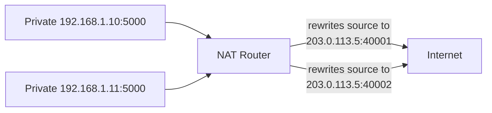
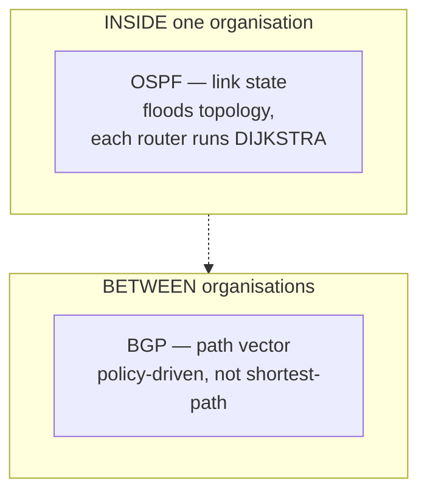

# IP Addressing, Subnetting & Routing

`Week 7` · Computer Networks

## Subnetting — guaranteed marks, learn the method

```
  IPv4 = 32 bits.  CIDR /n means the first n bits are the NETWORK.

  ┌──────────────────────────────┬─────────────┐
  │        network (n bits)      │ host (32-n) │
  └──────────────────────────────┴─────────────┘

  usable hosts = 2^(32-n) - 2     (all-zeros = network ID,
                                   all-ones  = broadcast)

  block size   = 256 - (mask octet)
```

### Worked example — do ten of these

```
  192.168.1.0/26

  /26 → 26 network bits, 6 host bits
  mask      = 255.255.255.192      (192 = 11000000)
  block size = 256 - 192 = 64
  hosts     = 2^6 - 2 = 62

  subnets:
    192.168.1.0    – .63     network .0     broadcast .63    usable .1–.62
    192.168.1.64   – .127    network .64    broadcast .127   usable .65–.126
    192.168.1.128  – .191
    192.168.1.192  – .255
```

### Memorise this table

| CIDR | Mask | Usable hosts |
|---|---|---|
| /24 | 255.255.255.0 | 254 |
| /25 | .128 | 126 |
| /26 | .192 | 62 |
| /27 | .224 | 30 |
| /28 | .240 | 14 |
| /29 | .248 | 6 |
| /30 | .252 | 2 |

**Private ranges:** `10.0.0.0/8`, `172.16.0.0/12`, `192.168.0.0/16`

> **Cloud gotcha:** AWS reserves **5** addresses per subnet, not 2.

## NAT — why your home router works



The router keeps a translation table to reverse it on the way back. One public IP serves a whole network.

**Costs:** breaks true end-to-end connectivity, complicates peer-to-peer and VoIP (hence STUN/TURN/ICE), and inbound connections need explicit port forwarding.

## Routing



| | Distance Vector (RIP) | Link State (OSPF) |
|---|---|---|
| Shares | its whole routing table | link information, flooded |
| Each router knows | only neighbours' costs | the **full topology** |
| Convergence | slow, count-to-infinity | fast |
| Algorithm | Bellman-Ford | **Dijkstra** |

> **OSPF runs Dijkstra in production.** Connect that to your graph week explicitly — it is the same algorithm you implemented.

**BGP** connects autonomous systems and is **policy** driven (commercial relationships), not shortest-path. It has almost no built-in security, which is why route hijacks can black-hole large parts of the internet — the 2021 Facebook outage was a BGP withdrawal.

Forwarding always uses **longest prefix match**.

## ICMP and traceroute

```
  traceroute works by ABUSING the TTL field:

  send packet TTL=1 ──► router 1 decrements to 0 ──► ICMP "time exceeded"
                                                      → we learn hop 1
  send packet TTL=2 ──► ... router 2 replies          → we learn hop 2
  send packet TTL=3 ──► ... and so on

  until the packet finally reaches the destination
```

Explaining traceroute via TTL + ICMP is a great answer — it shows real understanding rather than recall.

**ICMP is often blocked**, so `ping` failing does **not** mean a host is down.

## IPv6 — the headline differences

| | IPv4 | IPv6 |
|---|---|---|
| Size | 32 bits | **128 bits** |
| Broadcast | yes | **none** — multicast instead |
| ARP | ARP | **NDP** |
| Router fragmentation | allowed | **never** — sender only |
| NAT | required | unnecessary |
| Autoconfig | DHCP | **SLAAC** built in |

## Interview checklist

- [ ] Subnet a /26 and state mask, hosts, ranges
- [ ] The CIDR table, from memory
- [ ] How NAT works and what it breaks
- [ ] Distance vector vs link state, and that OSPF = Dijkstra
- [ ] Why BGP outages take down the internet
- [ ] Traceroute via TTL and ICMP
