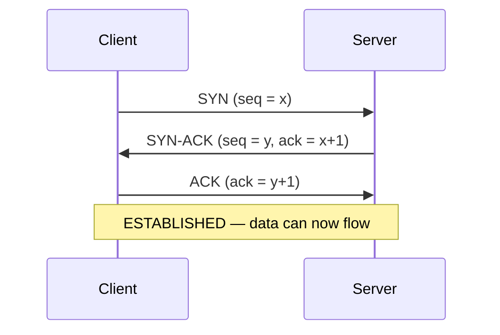
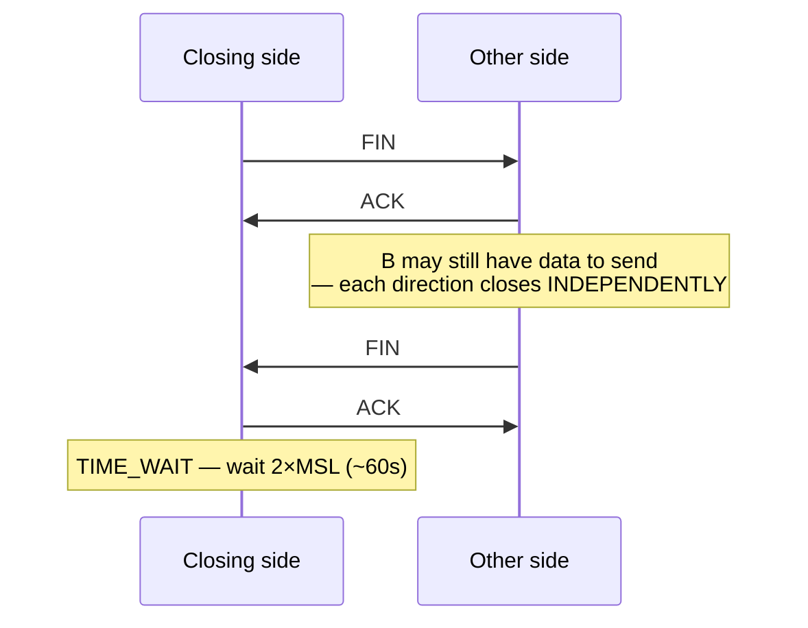
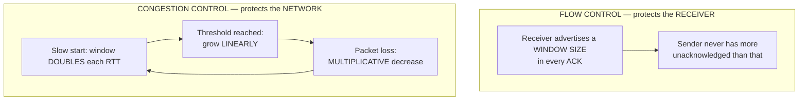
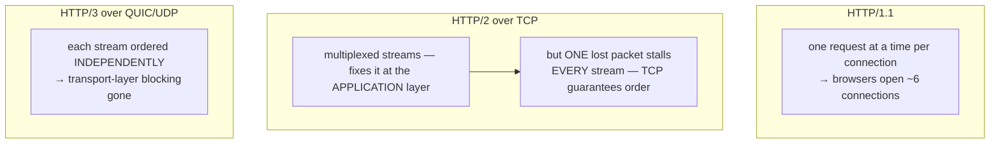
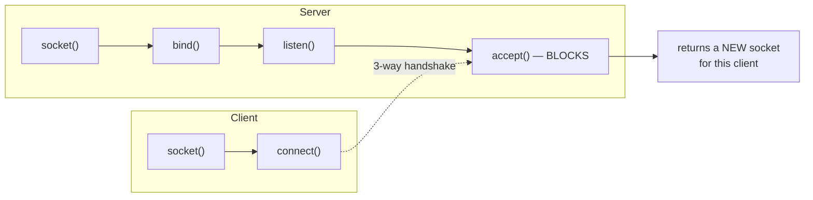

# TCP, UDP & the Transport Layer

`Week 8` · Computer Networks

## The three-way handshake



**Why three and not two?** Both sides must agree on the other's initial sequence number. Two messages only synchronise one direction.

**Cost:** a full round trip **before any data moves**. That is precisely why HTTP/3 moved to QUIC, which combines transport and TLS setup.

## Four-way teardown and TIME_WAIT



**Why four?** TCP is full-duplex; each direction is closed separately. That is the whole answer.

**Why TIME_WAIT?** Two reasons: guarantee the final ACK arrives, and absorb delayed duplicate packets so they cannot corrupt a *new* connection reusing the same ports.

### Port exhaustion — a real production failure

```
  ╔═══════════════════════════════════════════════════════════╗
  ║ A busy proxy makes thousands of short outbound            ║
  ║ connections. Each closing socket sits in TIME_WAIT ~60s.  ║
  ║ ~28,000 ephemeral ports → they run out → connect() fails. ║
  ║                                                           ║
  ║ THE FIX: connection POOLING (reuse, don't reopen).        ║
  ║ Not tcp_tw_reuse, not SO_REUSEADDR — those are plasters.  ║
  ╚═══════════════════════════════════════════════════════════╝
```

*"Why does my load balancer start refusing connections under load?"* — this is an excellent answer.

## Flow control vs congestion control

These are **different problems** and are constantly confused.



**AIMD** — Additive Increase, Multiplicative Decrease — is the reason the internet does not collapse under load. It is a distributed, cooperative algorithm with no central coordinator.

```
  congestion window over time

  cwnd │      ╱╲            ╱╲
       │     ╱  ╲          ╱  ╲
       │    ╱    ╲        ╱
       │   ╱      ╲      ╱        ← additive increase
       │  ╱        ▼    ╱         ▼ multiplicative decrease on loss
       │ ╱ slow start
       └──────────────────────────► time
```

**Weakness:** TCP interprets **all loss as congestion**. On wireless links loss is often corruption, so throughput suffers badly on mobile.

## TCP vs UDP — the guaranteed comparison

| | TCP | UDP |
|---|---|---|
| Connection | handshake first | **fire and forget** |
| Reliability | guaranteed, retransmits | none |
| Ordering | guaranteed | none |
| Header | 20 bytes | **8 bytes** |
| Congestion control | yes | **no** |
| Speed | slower | **faster** |
| Broadcast/multicast | no | **yes** |

**Why DNS uses UDP:** one small request, one small reply. A handshake would triple the cost. It falls back to TCP for responses too large for a single datagram.

> **TCP has no message boundaries.** It is a byte *stream* — you must length-prefix or delimit your own messages. This surprises people and is a great thing to raise.

## QUIC and head-of-line blocking



**The killer detail:** HTTP/2 solved application-layer head-of-line blocking, which *exposed* the transport-layer version as the new bottleneck. HTTP/3 fixes that by abandoning TCP entirely.

QUIC also gives **0-RTT reconnection** and **connection migration** — switching WiFi → cellular does not drop the connection, because a connection ID rather than the IP/port tuple identifies it.

## Sockets



A socket is the **5-tuple**: `(protocol, src IP, src port, dst IP, dst port)`. That is how one server port serves thousands of distinct connections.

> **`accept()` returns a NEW socket.** People assume the listening socket is reused — it is not.

## Interview checklist

- [ ] Draw the 3-way handshake with sequence numbers
- [ ] Why four steps to close, and why TIME_WAIT exists
- [ ] Port exhaustion → connection pooling
- [ ] Flow control vs congestion control — receiver vs network
- [ ] AIMD and slow start
- [ ] The TCP/UDP table, and why DNS uses UDP
- [ ] Head-of-line blocking at BOTH layers, and which HTTP version fixes which
