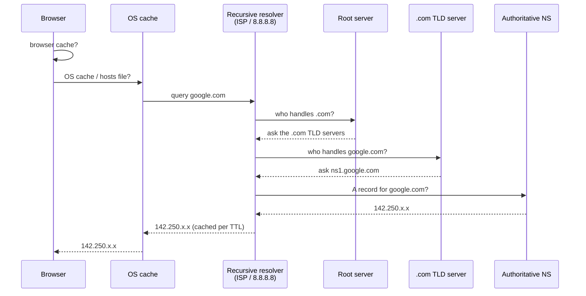
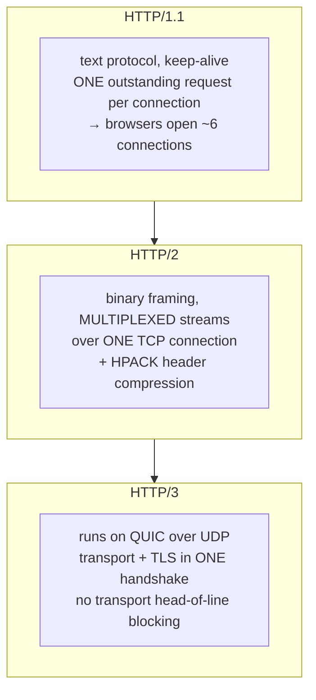
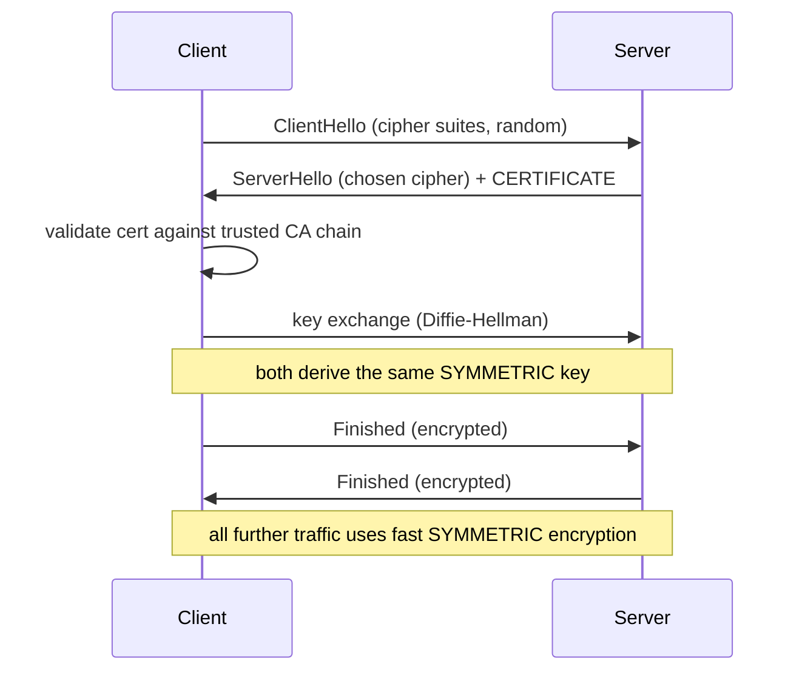
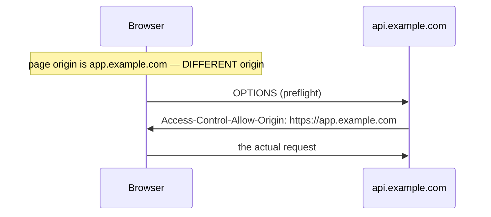
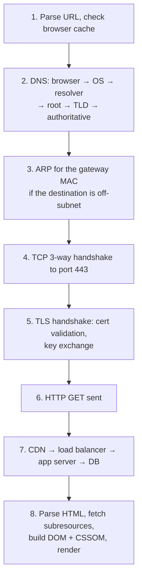

# DNS, HTTP & TLS

`Weeks 9–10` · Computer Networks

## DNS resolution — the full chain



| Record | Purpose |
|---|---|
| **A** | name → IPv4 |
| **AAAA** | name → IPv6 |
| **CNAME** | alias to another name |
| **MX** | mail server |
| **NS** | nameserver for the zone |
| **TXT** | verification, SPF |

**TTL is the trade-off:** short (30–60s) = fast failover, more queries. Long (24h) = fewer lookups, slow propagation.

DNS is **unencrypted by default** (hence DoH/DoT), spoofable, and a favourite DDoS amplification vector.

## HTTP — three generations



### Methods — safe vs idempotent

| Method | Safe | Idempotent |
|---|---|---|
| GET, HEAD | ✅ | ✅ |
| PUT, DELETE | ❌ | ✅ |
| **POST** | ❌ | **❌** |
| PATCH | ❌ | ❌ (usually) |

**Safe** = no side effects. **Idempotent** = repeating it has the same effect as once. POST being neither is why payment APIs need idempotency keys.

### Status codes that get asked

| | |
|---|---|
| **301 vs 302** | permanent (cached forever!) vs temporary |
| **401 vs 403** | unauthenticated (who are you?) vs forbidden (I know you, no) |
| **400 vs 422** | malformed syntax vs valid syntax, invalid semantics |
| **429** | rate limited — include `Retry-After` |
| **502 vs 503 vs 504** | bad upstream response / overloaded / upstream timeout |

## TLS handshake



```
  ╔════════════════════════════════════════════════════════════╗
  ║ WHY BOTH KINDS OF CRYPTO?                                  ║
  ║                                                            ║
  ║ Asymmetric (RSA/ECDHE) is SLOW — used only to agree on a   ║
  ║ shared key and to prove the server's identity.             ║
  ║ Symmetric (AES) is FAST — used for all the actual data.    ║
  ║                                                            ║
  ║ Most candidates miss this. It is the crux of the question. ║
  ╚════════════════════════════════════════════════════════════╝
```

**Forward secrecy:** ephemeral Diffie-Hellman means a stolen private key cannot decrypt *past* traffic. TLS 1.3 cuts the handshake to one round trip.

## Cookies, sessions, CORS

```
  SESSION                          JWT / TOKEN
  ─────────────────────────        ──────────────────────────
  server stores the state          token CARRIES the claims
  cookie holds an opaque ID        server just verifies a signature
  → lookup on every request        → no lookup, scales statelessly
  → REVOKE INSTANTLY  ✓            → CANNOT revoke before expiry  ✗
```

Modern answer: **short-lived access JWT (5–15 min) + a revocable refresh token.**

**Cookie flags:** `HttpOnly` (JS cannot read it — blocks XSS theft), `Secure` (HTTPS only), `SameSite` (blocks CSRF).

### CORS



> **CORS protects the USER, not the server.** It is enforced by the **browser** only — a curl request or any non-browser client ignores it entirely. It is not server-side security. This is widely misunderstood.

## HTTP caching

| Header | Effect |
|---|---|
| `Cache-Control: max-age=N` | fresh for N seconds, no request at all |
| `no-cache` | store it, but **revalidate** before use |
| `no-store` | never write it to disk |
| `ETag` + `If-None-Match` | content hash → `304 Not Modified`, saves the body |

**The production pattern:** hash the filename (`app.a3f9b2.js`) and serve with `max-age=31536000, immutable`. Invalidation becomes free because a change produces a new URL.

**The dangerous bug:** caching a personalised response as `public` leaks one user's data to another.

## "What happens when you type google.com"

**The most-asked networking question.** Rehearse a clean 3-minute version:



Then be ready to go five minutes deep on **any single step** when probed.

## Interview checklist

- [ ] Full DNS chain, record types, TTL trade-off
- [ ] HTTP/1.1 vs 2 vs 3, and which blocking each fixes
- [ ] Safe vs idempotent; 301/302, 401/403
- [ ] TLS handshake — **and why both crypto types are used**
- [ ] Session vs JWT, and the revocation problem
- [ ] CORS protects the user, browser-enforced only
- [ ] The full google.com walkthrough in 3 minutes
