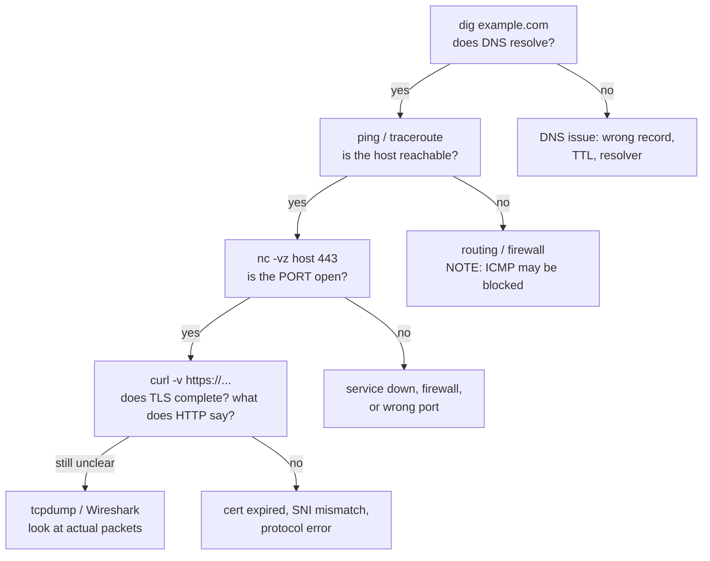

# Troubleshooting Toolkit

`Week 10` · Computer Networks

## "The service is unreachable — how do you debug it?"

Work **up the layers**. That method *is* the answer they want.



## The commands, and what each actually proves

| Command | Proves |
|---|---|
| `dig example.com` | DNS resolves, and **which server answered** |
| `ping host` | ICMP reachability + RTT — **proves nothing if ICMP is blocked** |
| `traceroute host` | hop-by-hop path (uses TTL + ICMP) |
| `nc -vz host 443` | the TCP port is actually open |
| `curl -v https://host` | full request/response **including the TLS handshake** |
| `ss -tulpn` | local listening sockets and connection states |
| `tcpdump -i any port 443` | the raw packets, when nothing else explains it |

```bash
# is it DNS?
dig +short example.com
dig @8.8.8.8 example.com        # bypass the local resolver

# is the port open?
nc -vz example.com 443

# what does the server actually say?
curl -v https://example.com 2>&1 | head -40

# how many connections are in TIME_WAIT?
ss -tan | awk '{print $1}' | sort | uniq -c

# who is listening on what?
ss -tulpn
```

## Three things that mislead people

```
  1. ping FAILS but the service WORKS
     → ICMP is blocked by a firewall. ping proves nothing.

  2. traceroute shows * * * for some hops
     → those routers just don't send ICMP time-exceeded. Not a fault.

  3. "Small requests work, large uploads hang"
     → MTU / Path MTU Discovery broken by an ICMP-blocking firewall
```

## Latency vs bandwidth — the sentence worth memorising

```
  BANDWIDTH  = capacity      (how wide the pipe is)
  THROUGHPUT = achieved rate (always lower than bandwidth)
  LATENCY    = delay         (how long one trip takes)

  latency = propagation (distance / speed of light)
          + transmission (size / bandwidth)
          + queuing
          + processing
```

| Distance | RTT |
|---|---|
| Same datacentre | ~0.5 ms |
| Same continent | ~30 ms |
| Cross-continent | ~150 ms |
| RAM access | ~100 **ns** |

> **You cannot buy lower latency.** Propagation delay is bounded by physics — which is exactly **why CDNs exist**. Adding bandwidth does nothing for a latency-bound workload.

Being able to say *"this is latency-bound, not bandwidth-bound, so more bandwidth won't help — we need an edge cache"* connects networking to system design and lands very well.

## Bufferbloat

```
  Oversized router buffers absorb congestion by ADDING LATENCY
  instead of dropping packets — but drops are how TCP LEARNS.

  speed test:  full bandwidth  ✓
  video call:  unusable        ✗
  symptom:     everything is fine until someone starts a big upload

  fix: Active Queue Management (CoDel, FQ-CoDel) drops early
       and deliberately to signal congestion
```

## Interview checklist

- [ ] Walk the debugging method in order, layer by layer
- [ ] What each tool proves — and what `ping` does *not*
- [ ] Bandwidth vs throughput vs latency
- [ ] Why CDNs exist (propagation delay is physics)
- [ ] Bufferbloat: high bandwidth, terrible latency under load
