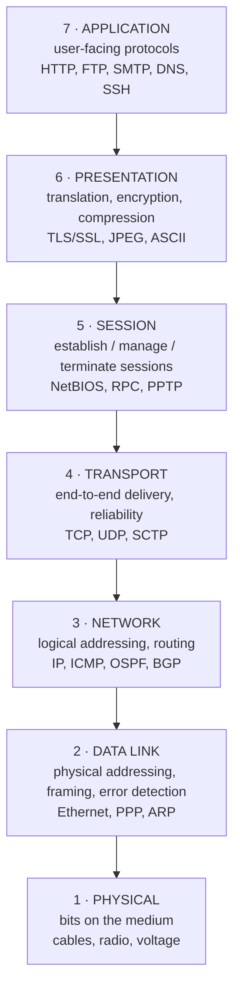

# The OSI 7 Layers — In Detail

`Week 6` · Computer Networks

The layer-by-layer reference. Know the **function, PDU, protocols, devices and headers** for each.

---

## The whole stack at a glance



**Mnemonic (top down):** **A**ll **P**eople **S**eem **T**o **N**eed **D**ata **P**rocessing
**Bottom up:** **P**lease **D**o **N**ot **T**hrow **S**ausage **P**izza **A**way

---

## Layer-by-layer reference

| # | Layer | PDU | Address | Devices | Key protocols |
|---|---|---|---|---|---|
| 7 | Application | Data | — | gateway, L7 LB | HTTP, DNS, SMTP, FTP, SSH, DHCP |
| 6 | Presentation | Data | — | — | TLS, SSL, JPEG, MPEG, ASCII |
| 5 | Session | Data | — | — | NetBIOS, RPC, SIP |
| 4 | Transport | **Segment** (TCP) / Datagram (UDP) | **Port** | firewall, L4 LB | TCP, UDP, SCTP |
| 3 | Network | **Packet** | **IP address** | **router**, L3 switch | IP, ICMP, IGMP, OSPF, BGP, IPsec |
| 2 | Data Link | **Frame** | **MAC address** | **switch**, bridge, NIC | Ethernet, PPP, ARP, VLAN, STP |
| 1 | Physical | **Bit** | — | hub, repeater, cable | Ethernet physical, USB, Bluetooth, DSL |

**The PDU names and addresses are asked verbatim.** Memorise that table.

---

## Layer 1 — Physical

**Function:** transmit raw bits over a medium.

Deals with: voltage levels, timing, connectors, cable specs, modulation, bit synchronisation.

```
  TRANSMISSION MODES            MULTIPLEXING
  ──────────────────────        ──────────────────────
  SIMPLEX      one way only     TDM  divide by TIME
  HALF-DUPLEX  both ways,       FDM  divide by FREQUENCY
               one at a time    WDM  divide by WAVELENGTH (fibre)
  FULL-DUPLEX  both at once
```

| Medium | Speed | Distance | Notes |
|---|---|---|---|
| Twisted pair (Cat6) | 1–10 Gbps | 100 m | cheap, most common |
| Coaxial | 10–100 Mbps | 500 m | legacy |
| **Fibre optic** | 100 Gbps+ | km | immune to EMI, expensive |
| Wireless | varies | varies | shared medium → collisions |

---

## Layer 2 — Data Link

**Function:** node-to-node delivery **on the same network**, framing, error detection, MAC addressing.

Split into two sublayers:

```
  ┌─────────────────────────────────┐
  │ LLC — Logical Link Control      │  flow control, multiplexing L3 protocols
  ├─────────────────────────────────┤
  │ MAC — Media Access Control      │  who transmits when, physical addressing
  └─────────────────────────────────┘
```

### Ethernet frame

```
  ┌──────────┬─────┬──────────┬──────────┬──────┬───────────┬─────┐
  │ Preamble │ SFD │ Dest MAC │ Src MAC  │ Type │  Payload  │ FCS │
  │  7 bytes │  1  │  6 bytes │  6 bytes │  2   │ 46-1500   │  4  │
  └──────────┴─────┴──────────┴──────────┴──────┴───────────┴─────┘
                                                              ▲
                                      CRC-32 — ERROR DETECTION, not correction
```

### Error detection

| Method | Detects | Cost |
|---|---|---|
| Parity bit | odd numbers of bit errors | 1 bit |
| Checksum | most errors | cheap, weaker |
| **CRC** | burst errors up to the polynomial degree | standard in Ethernet |
| Hamming code | detects **and CORRECTS** single-bit | more overhead |

> Ethernet **detects and discards**; it does not correct. Retransmission is TCP's job at layer 4.

### Media access control

```
  CSMA/CD  (wired Ethernet)         CSMA/CA  (WiFi)
  ─────────────────────────         ─────────────────────────
  Carrier Sense Multiple Access     Collision AVOIDANCE
  with Collision DETECTION
                                    cannot detect collisions while
  1. listen                         transmitting on radio, so:
  2. transmit if idle               1. listen
  3. DETECT collision               2. wait a random backoff
  4. send jam signal                3. optional RTS/CTS handshake
  5. exponential backoff, retry     4. transmit
```

Modern switched Ethernet is full-duplex, so CSMA/CD is effectively obsolete — but it is still examined.

### Switching

```
  HUB (L1)                SWITCH (L2)              ROUTER (L3)
  ──────────────────      ──────────────────       ──────────────────
  repeats to ALL ports    learns MAC → port        forwards by IP
  ONE collision domain    one collision domain     separates BROADCAST
  one broadcast domain      PER PORT                 domains
                          one broadcast domain
```

**STP (Spanning Tree Protocol)** prevents switching loops by disabling redundant links — without it, a loop broadcasts forever and melts the network.

---

## Layer 3 — Network

**Function:** logical addressing and routing **between** networks.

### IPv4 header

```
  0               8              16                            31
  ┌───────┬───────┬───────────────┬──────────────────────────────┐
  │Version│  IHL  │      TOS      │        Total Length          │
  ├───────┴───────┴───────────────┼─────┬────────────────────────┤
  │        Identification         │Flags│    Fragment Offset     │
  ├───────────────┬───────────────┼─────┴────────────────────────┤
  │      TTL      │   Protocol    │       Header Checksum        │
  ├───────────────┴───────────────┴──────────────────────────────┤
  │                     Source IP Address                        │
  ├──────────────────────────────────────────────────────────────┤
  │                  Destination IP Address                      │
  └──────────────────────────────────────────────────────────────┘

  TTL       decremented per hop; hits 0 → discarded + ICMP → THIS IS HOW
            TRACEROUTE WORKS
  Protocol  6 = TCP, 17 = UDP, 1 = ICMP
  Flags/    fragmentation control (DF = Don't Fragment)
  Offset
```

### Routing algorithms

| Type | Protocol | How | Convergence |
|---|---|---|---|
| **Distance vector** | RIP | share your whole table with neighbours | slow, count-to-infinity |
| **Link state** | OSPF, IS-IS | flood link info, each runs **Dijkstra** | fast |
| **Path vector** | BGP | share AS paths, policy-driven | slow (minutes) |

### Forwarding vs routing

```
  ROUTING     building the table   (control plane, slow, periodic)
  FORWARDING  using the table      (data plane, fast, per-packet)
```

**Longest prefix match** decides which entry wins:

```
  destination 192.168.1.50

  table:   0.0.0.0/0        → default gateway
           192.168.0.0/16   → interface A
           192.168.1.0/24   → interface B   ← LONGEST match wins
```

---

## Layer 4 — Transport

**Function:** end-to-end delivery, **process-to-process** via ports, reliability.

### TCP header

```
  0               8              16                            31
  ┌───────────────────────────────┬──────────────────────────────┐
  │          Source Port          │      Destination Port        │
  ├───────────────────────────────┴──────────────────────────────┤
  │                     Sequence Number                          │
  ├──────────────────────────────────────────────────────────────┤
  │                  Acknowledgment Number                       │
  ├─────┬─────────┬───────────────┬──────────────────────────────┤
  │ Off │ Reserved│ U A P R S F   │         Window Size          │
  ├─────┴─────────┴───────────────┼──────────────────────────────┤
  │           Checksum            │        Urgent Pointer        │
  └───────────────────────────────┴──────────────────────────────┘

  FLAGS:  SYN  synchronise (open)     FIN  finish (close)
          ACK  acknowledgment          RST  reset (abort)
          PSH  push to application     URG  urgent
```

### Port ranges

| Range | Name | Examples |
|---|---|---|
| 0–1023 | **well-known** | 20/21 FTP, 22 SSH, 25 SMTP, 53 DNS, 80 HTTP, 443 HTTPS |
| 1024–49151 | registered | 3306 MySQL, 5432 Postgres, 6379 Redis, 27017 Mongo |
| 49152–65535 | **ephemeral** | client-side source ports |

**Memorise the well-known ports** — they get asked directly.

---

## Layers 5 & 6 — Session & Presentation

Largely absorbed into the application layer in practice, but examined.

| Layer | Responsibility | Real examples |
|---|---|---|
| **5 Session** | establish, maintain, terminate; checkpointing; dialog control | RPC, NetBIOS, SIP; TLS session resumption |
| **6 Presentation** | translation, **encryption**, compression, serialisation | TLS/SSL, JPEG, MPEG, ASCII/Unicode, JSON/Protobuf |

> **TLS is usually placed at layer 6** (presentation — it encrypts) though it operates between 4 and 7. If asked, say "between transport and application, conventionally layer 6".

---

## Layer 7 — Application

The protocols users and programs actually speak.

| Protocol | Port | Transport | Purpose |
|---|---|---|---|
| HTTP / HTTPS | 80 / 443 | TCP (QUIC/UDP for HTTP3) | web |
| **DNS** | 53 | **UDP** (TCP for large) | name resolution |
| SMTP / IMAP / POP3 | 25 / 143 / 110 | TCP | email |
| FTP | 20 data, 21 control | TCP | file transfer |
| SSH | 22 | TCP | secure shell |
| DHCP | 67 / 68 | UDP | address assignment |
| SNMP | 161 | UDP | network management |
| NTP | 123 | UDP | time sync |

---

## OSI vs TCP/IP vs Hybrid

```mermaid
graph TB
    subgraph OSI["OSI — 7 layers (reference model)"]
        O7[Application] --> O6[Presentation] --> O5[Session] --> O4[Transport] --> O3[Network] --> O2[Data Link] --> O1[Physical]
    end
    subgraph TCP["TCP/IP — 4 layers (what runs)"]
        T4["Application<br/>= OSI 5+6+7"] --> T3["Transport<br/>= OSI 4"] --> T2["Internet<br/>= OSI 3"] --> T1["Link<br/>= OSI 1+2"]
    end
    subgraph HY["Hybrid — 5 layers (teaching)"]
        H5[Application] --> H4[Transport] --> H3[Network] --> H2[Data Link] --> H1[Physical]
    end
```



| | OSI | TCP/IP |
|---|---|---|
| Layers | 7 | 4 |
| Origin | ISO standard, designed first | built from working protocols |
| Use today | **reference / teaching** | **what actually runs** |
| Layer coupling | strict separation | more pragmatic |

> **Say this:** OSI is the reference model everyone teaches; TCP/IP is what the internet actually implements. Layers 5 and 6 barely exist as distinct implementations.

---

## Interview checklist

- [ ] All 7 layers in order, both mnemonics
- [ ] The PDU / address / device / protocol table
- [ ] Ethernet frame fields; CRC detects but does not correct
- [ ] CSMA/CD vs CSMA/CA
- [ ] Hub vs switch vs router — collision and broadcast domains
- [ ] IPv4 header fields, especially TTL and Protocol
- [ ] TCP header flags; well-known ports
- [ ] Forwarding vs routing; longest prefix match
- [ ] OSI vs TCP/IP mapping
