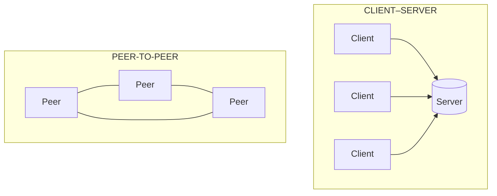
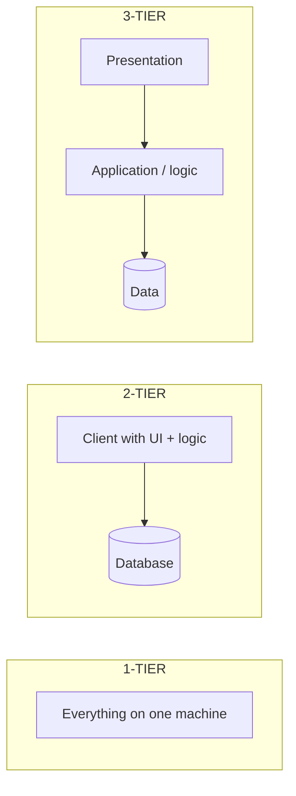
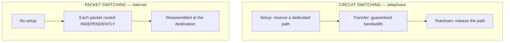
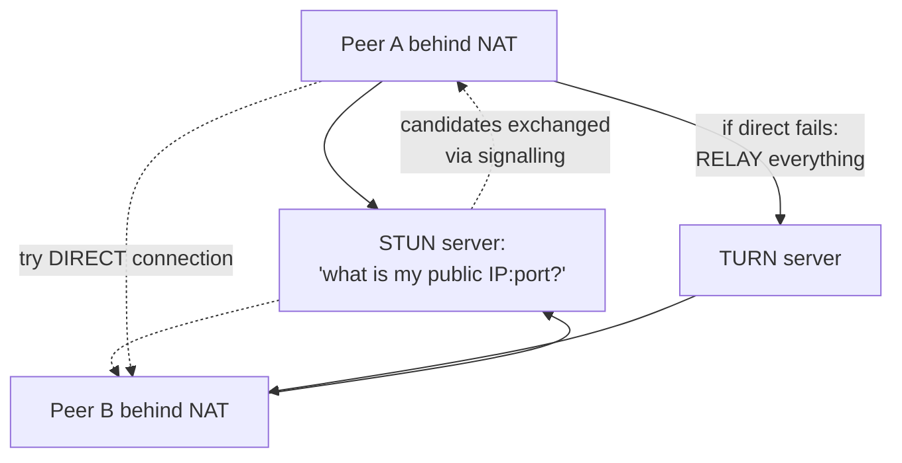

# Network Architectures, Topologies & Switching

`Week 6` · Computer Networks

---

## Communication architectures



| | Client–Server | Peer-to-Peer |
|---|---|---|
| Control | centralised | distributed |
| Scaling | server is the bottleneck | **scales with users** (each adds capacity) |
| Reliability | server is a SPOF | no single point of failure |
| Security | easier to enforce | hard — every peer is a surface |
| Cost | server infrastructure | uses participants' resources |
| Examples | web, email, databases | BitTorrent, blockchain, WebRTC calls |

**Hybrid** is common: a central server for discovery/signalling, then direct peer connections for the data (this is exactly how WebRTC video calls work — the signalling server introduces the peers, then media flows directly).

---

## Tiered application architectures



| Tier | Structure | Trade-off |
|---|---|---|
| 1-tier | all on one box | simple; no scaling, no sharing |
| 2-tier | fat client + DB | fast; business logic duplicated per client, hard to update |
| **3-tier** | presentation / logic / data | **the standard** — each tier scales independently |
| N-tier | + caching, messaging, services | maximum flexibility, maximum operational cost |

**3-tier is the default** because the logic tier can be scaled horizontally and stateless while the data tier stays authoritative.

---

## Network topologies

```
  BUS                    STAR                  RING
  ──────────────         ─────────────         ─────────────
  ─┬──┬──┬──┬─             A   B                 A ── B
   A  B  C  D               \ /                  │     │
                         D ──●── C               D ── C
  one cable, cheap        central hub          each connects to 2
  ✗ one break kills all   ✗ hub is a SPOF      ✗ one break splits it
  ✗ collisions            ✓ easy to add nodes  ✓ predictable latency
                          ✓ MOST COMMON today


  MESH                   TREE / HIERARCHICAL
  ──────────────         ─────────────────────
   A ─── B                      root
   │ ╲ ╱ │                     /    \
   │  ╳  │                  sw1      sw2
   │ ╱ ╲ │                  / \      / \
   D ─── C                 A   B    C   D

  every node to every    layered, scalable
  ✓ most fault tolerant  ✓ matches real networks
  ✗ n(n-1)/2 links       ✗ root failure splits it
    — expensive
```

| Topology | Links for n nodes | Fault tolerance | Used for |
|---|---|---|---|
| Bus | 1 cable | worst | legacy |
| **Star** | n | hub is the SPOF | **LANs today** |
| Ring | n | one break splits it | token ring, FDDI, SONET |
| **Full mesh** | n(n−1)/2 | best | backbone, critical links |
| Tree | n−1 | root is the SPOF | enterprise networks |

---

## Circuit vs packet switching



| | Circuit | Packet |
|---|---|---|
| Setup | required, takes time | none |
| Bandwidth | **reserved and guaranteed** | shared, best-effort |
| Efficiency | wasted when idle | **statistical multiplexing — far better** |
| Failure | connection drops | **reroute around it** |
| Latency | constant, predictable | variable (jitter) |
| Used by | traditional telephony | **the internet** |

**Packet switching won** because most traffic is bursty — reserving bandwidth for an idle connection wastes the link. Plus rerouting around failures comes free.

**Virtual circuits** (MPLS, ATM, Frame Relay) are the hybrid: a path is established, but capacity is still shared.

---

## VLANs and segmentation

```
  ONE PHYSICAL SWITCH, THREE LOGICAL NETWORKS

  ┌────────────────────────────────────────┐
  │  port1  port2  port3  port4  port5     │
  │  VLAN10 VLAN10 VLAN20 VLAN20 VLAN30    │
  └────────────────────────────────────────┘
       │      │      │      │      │
      Eng    Eng   Finance Finance  HR

  Frames are TAGGED with a VLAN ID (802.1Q).
  A switch will NOT forward between different VLANs —
  crossing VLANs requires a ROUTER (or an L3 switch).

  TRUNK ports carry many tagged VLANs between switches.
```

### Advantages
- Isolates broadcast traffic — a broadcast storm stays in one VLAN
- Segments departments without extra cabling
- A compromised machine cannot directly reach other segments

### Disadvantages
- Misconfigured trunk ports allow **VLAN hopping** attacks
- Inter-VLAN routing reintroduces a bottleneck and a SPOF
- Management complexity grows quickly

---

## VPN & tunnelling


**How it works:** encapsulate the original packet inside a new, encrypted one. The remote machine appears to be on the private network.

| Type | Use |
|---|---|
| Remote access | employee → corporate network |
| Site-to-site | office → office, or on-prem → cloud |
| Protocols | WireGuard (modern, fast), IPsec, OpenVPN |

**Disadvantages:** adds latency; **reduces effective MTU** (encapsulation overhead — a classic source of the "large uploads hang" bug); the gateway is a bottleneck and SPOF.

---

## NAT traversal — STUN, TURN, ICE

**Problem:** two peers both behind NAT cannot connect directly — neither has a reachable public address.



| | What it does | Cost |
|---|---|---|
| **STUN** | tells a host its public IP:port so peers can try a direct connection | cheap |
| **TURN** | **relays** all traffic when direct fails | **expensive — real bandwidth** |
| **ICE** | tries all candidate paths, picks the best | orchestrates both |

**Symmetric NAT defeats STUN**, forcing the expensive TURN relay. For a video-calling design question, knowing that **TURN costs real bandwidth money** is the senior detail.

---

## Firewalls

| Type | Inspects | Strength |
|---|---|---|
| Packet filter (stateless) | IP, port, protocol per packet | fast, dumb |
| **Stateful** | tracks connections, allows return traffic automatically | the standard |
| Application / proxy | full payload, L7 | deep inspection, slow |
| **WAF** | HTTP semantics (SQLi, XSS patterns) | web-specific |

> Firewalls blocking **ICMP** break Path MTU Discovery and traceroute — the cause of the "small requests work, large uploads hang" symptom.

---

## Wireless essentials

```
  802.11 standards       Band       Typical speed
  ──────────────────     ──────     ─────────────
  802.11n  (WiFi 4)      2.4/5 GHz  600 Mbps
  802.11ac (WiFi 5)      5 GHz      3.5 Gbps
  802.11ax (WiFi 6)      2.4/5 GHz  9.6 Gbps

  2.4 GHz   longer range, more interference, fewer channels
  5 GHz     shorter range, faster, more channels
```

Wireless is a **shared, half-duplex medium** — hence CSMA/CA, the hidden-terminal problem, and why measured throughput is well below the headline number.

---

## Interview checklist

- [ ] Client–server vs P2P, and the hybrid (WebRTC)
- [ ] Why 3-tier is the default
- [ ] The five topologies, link counts and failure modes
- [ ] Circuit vs packet switching — why packet won
- [ ] VLANs are layer 2; crossing them needs layer 3
- [ ] STUN vs TURN vs ICE, and that TURN costs bandwidth
- [ ] Stateful vs stateless firewalls; ICMP blocking breaks PMTUD
