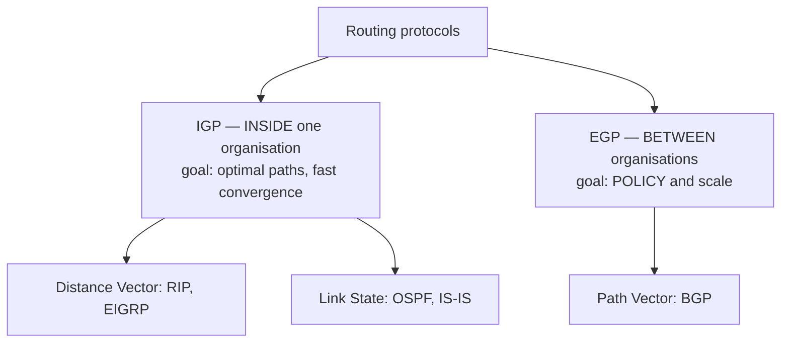
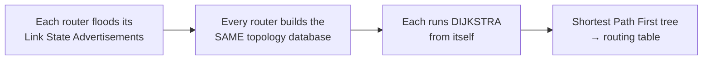

# Routing Protocols — RIP, OSPF, BGP

`Week 7` · Computer Networks

---

## The two families



---

## Distance Vector — RIP

**How it works:** each router knows only the **cost to its neighbours**, and periodically shares its **entire routing table** with them. Over rounds, information propagates.

```
  Bellman-Ford:   D(x,y) = min over neighbours v of [ c(x,v) + D(v,y) ]

  A ──1── B ──1── C ──1── D

  round 0:  A knows: B=1
  round 1:  A learns from B: C=2
  round 2:  A learns from B: D=3      ← information travels ONE HOP PER ROUND
```

### Count-to-infinity — the defining flaw

```
  ╔════════════════════════════════════════════════════════════╗
  ║  A ──1── B ──1── C          C fails                        ║
  ║                                                            ║
  ║  B sees C is gone. But A still advertises "I can reach C,  ║
  ║  cost 2". So B thinks: "I'll go via A, cost 3."            ║
  ║  A then hears B's cost 3 and updates to 4. B → 5. A → 6…   ║
  ║                                                            ║
  ║  The cost climbs slowly to INFINITY (RIP caps it at 16).   ║
  ╚════════════════════════════════════════════════════════════╝
```

**Mitigations:**

| Technique | How |
|---|---|
| **Split horizon** | never advertise a route back to the neighbour you learned it from |
| Poison reverse | advertise it back with cost = infinity |
| Hold-down timer | ignore updates about a route for a period after it fails |
| Max hop count | RIP caps at 15; 16 = unreachable |

### RIP in one table

| | |
|---|---|
| Metric | **hop count only** (ignores bandwidth!) |
| Max hops | 15 |
| Update interval | 30 s (full table) |
| Convergence | **slow** — minutes |
| Use today | almost none; examined for the theory |

---

## Link State — OSPF

**How it works:** each router **floods** a description of its own links to every other router. Every router therefore builds an **identical, complete topology map** — then runs **Dijkstra** locally.



> **This is your Dijkstra implementation, in production.** Make that connection explicitly — see [the pattern guide](../../patterns/graphs/dijkstra.md).

### Areas — how OSPF scales

```
              ┌──────────────────────────────┐
              │      AREA 0 (BACKBONE)       │
              │   every area must touch it   │
              └───┬──────────────────────┬───┘
                  │ ABR              ABR │
          ┌───────▼────────┐   ┌─────────▼──────┐
          │    AREA 1      │   │    AREA 2      │
          │ flooding stays │   │ flooding stays │
          │ INSIDE         │   │ INSIDE         │
          └────────────────┘   └────────────────┘

  Without areas, every router floods to every other router —
  the LSA database and Dijkstra cost explode.
  Areas bound the flooding; ABRs summarise between them.
```

| Router role | Job |
|---|---|
| Internal | all interfaces in one area |
| **ABR** (Area Border) | connects an area to the backbone, **summarises** routes |
| **ASBR** (AS Boundary) | injects external routes (from BGP, static) |

### Cost metric

```
  OSPF cost = reference_bandwidth / interface_bandwidth

  default reference = 100 Mbps
     10 Mbps link  → cost 10
    100 Mbps link  → cost 1
      1 Gbps link  → cost 1   ← both 1! raise the reference on modern networks
```

Unlike RIP, OSPF **accounts for bandwidth** — which is why it picks sensible paths.

### DR / BDR on broadcast networks

```
  n routers on one Ethernet segment → n(n-1)/2 adjacencies.  Too many.

  Elect a DESIGNATED ROUTER (and a backup).
  Everyone adjacency-peers with the DR only → n adjacencies.
```

---

## Path Vector — BGP

**The protocol that makes the internet one network.**

**How it works:** each **Autonomous System** advertises *"to reach prefix P, follow this AS path"*. The AS path both prevents loops and drives policy.

```
  AS 100 ──── AS 200 ──── AS 300     (each AS = one organisation/ISP)

  AS 300 advertises 10.0.0.0/8
  AS 200 receives  "10.0.0.0/8 via AS_PATH [300]"
  AS 100 receives  "10.0.0.0/8 via AS_PATH [200, 300]"

  LOOP PREVENTION: if a router sees ITS OWN AS number in the
  path, it rejects the route.
```

### eBGP vs iBGP

| | eBGP | iBGP |
|---|---|---|
| Between | **different** ASes | routers **inside** one AS |
| TTL | 1 (usually directly connected) | multi-hop |
| Re-advertise | to everyone | **not to other iBGP peers** (loop prevention) |
| Consequence | — | needs a **full mesh** or route reflectors |

### Path selection — in order

```
  1. Highest WEIGHT            (Cisco-local)
  2. Highest LOCAL_PREF        ← how YOU prefer to send traffic OUT
  3. Locally originated
  4. Shortest AS_PATH          ← the famous one
  5. Lowest ORIGIN
  6. Lowest MED                ← how you ask others to send traffic IN
  7. eBGP over iBGP
  8. Lowest IGP cost to the next hop
```

> **LOCAL_PREF controls outbound, AS_PATH prepending influences inbound.** That asymmetry is the core of BGP traffic engineering.

### Why BGP breaks the internet

```
  ╔════════════════════════════════════════════════════════════╗
  ║ BGP HAS ALMOST NO BUILT-IN SECURITY.                       ║
  ║                                                            ║
  ║ Any AS can advertise any prefix. Neighbours largely        ║
  ║ trust it. A more-specific prefix WINS (longest match).     ║
  ║                                                            ║
  ║   PREFIX HIJACK   announce someone else's space →          ║
  ║                   traffic reroutes to you                  ║
  ║   ROUTE LEAK      re-advertise routes you shouldn't →      ║
  ║                   a small ISP becomes a transit path       ║
  ║   WITHDRAWAL      remove your own routes → you VANISH      ║
  ║                   (the 2021 Facebook outage)               ║
  ║                                                            ║
  ║ MITIGATIONS: RPKI (cryptographically sign prefix origin),  ║
  ║ prefix filtering, max-prefix limits.                       ║
  ╚════════════════════════════════════════════════════════════╝
```

Convergence is **minutes**, not seconds — during which packets are lost.

---

## Comparison

| | RIP | OSPF | BGP |
|---|---|---|---|
| Type | distance vector | **link state** | path vector |
| Algorithm | Bellman-Ford | **Dijkstra** | best-path policy |
| Metric | hop count | bandwidth-derived cost | AS path + attributes |
| Scope | tiny networks | **inside an org** | **between orgs** |
| Convergence | minutes | seconds | minutes |
| Knows | neighbours only | **full topology** | AS-level paths |
| Transport | UDP 520 | IP protocol 89 | **TCP 179** |

---

## Multicast & broadcast

```
  UNICAST     one → one          normal traffic
  BROADCAST   one → ALL          ARP, DHCP discover (IPv4 only)
  MULTICAST   one → a GROUP      IPTV, stock feeds, OSPF LSAs
  ANYCAST     one → NEAREST      DNS root servers, CDN edges
```

**Anycast is how CDNs and public DNS work:** the *same* IP is announced from many locations, and BGP routes you to the topologically nearest one. `8.8.8.8` is a different physical machine depending on where you are.

**IGMP** manages multicast group membership; broadcast does not cross routers, which is why DHCP needs a relay agent across subnets.

---

## Interview checklist

- [ ] Distance vector vs link state — what each router knows
- [ ] Count-to-infinity and split horizon
- [ ] **OSPF runs Dijkstra**; why areas exist
- [ ] OSPF cost is bandwidth-based; RIP is hop count only
- [ ] BGP is path vector and **policy**-driven, not shortest-path
- [ ] eBGP vs iBGP and the full-mesh requirement
- [ ] LOCAL_PREF (outbound) vs AS_PATH prepending (inbound)
- [ ] Why BGP hijacks work; RPKI
- [ ] Anycast and how CDNs use it
