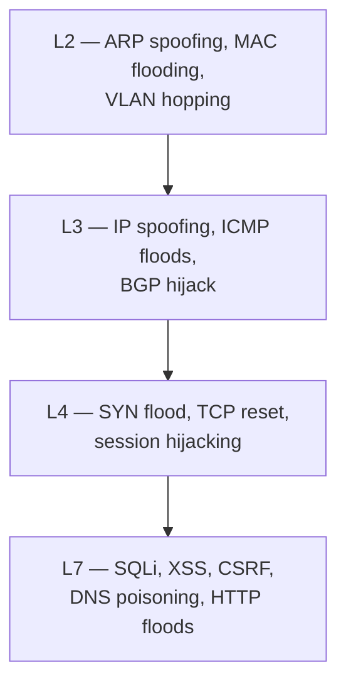
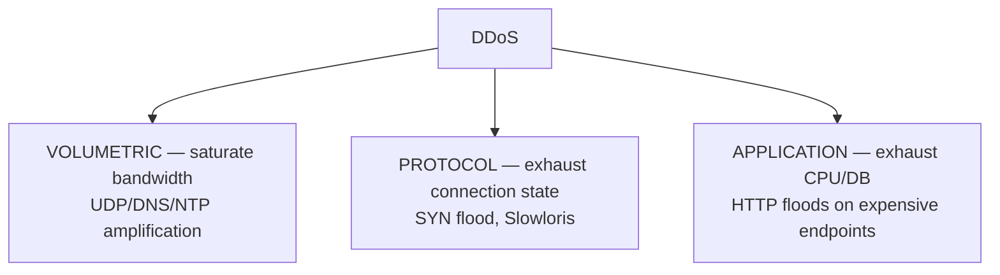
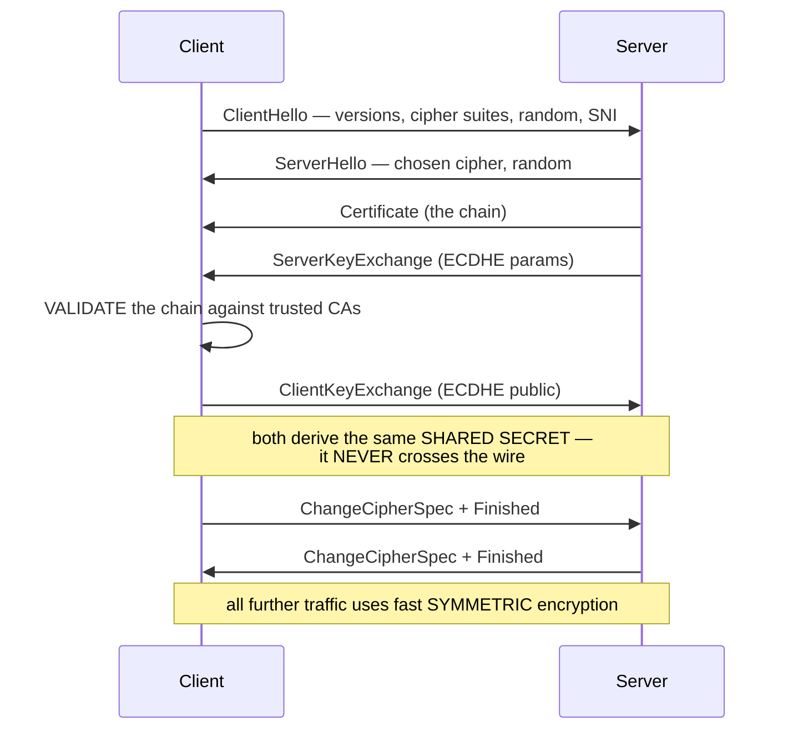
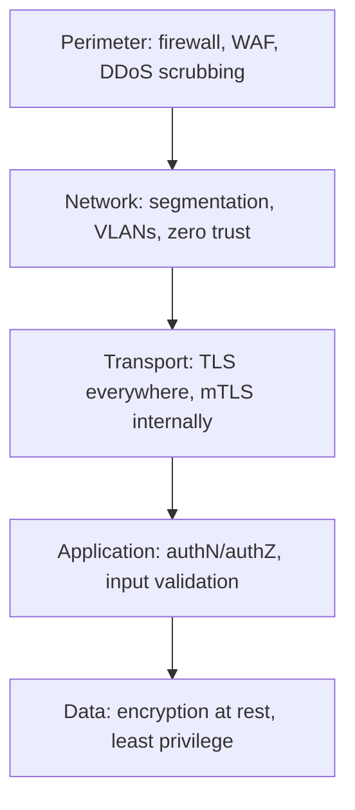

# Network Security & Attacks

`Week 9` · Computer Networks

---

## Attacks by layer



---

## ARP spoofing — man in the middle on a LAN

```
  ARP HAS NO AUTHENTICATION. Any host can claim any IP.

  NORMAL                          SPOOFED
  ──────────────────────          ──────────────────────────────
  Victim ──► Gateway              Victim ──► ATTACKER ──► Gateway
                                            (reads/modifies everything)

  The attacker sends unsolicited ARP replies:
     "192.168.1.1 is at aa:bb:cc:dd:ee:ff"   ← the attacker's MAC
  Victims cache it and send all traffic to the attacker.
```

**Defences:** dynamic ARP inspection on switches, static ARP entries for critical hosts, port security, and — most practically — **encrypt everything (TLS)** so interception gains little.

---

## DNS attacks

| Attack | How | Defence |
|---|---|---|
| **Cache poisoning** | inject a forged response before the real one arrives | DNSSEC, randomised source ports + query IDs |
| **DNS spoofing** | answer a query with an attacker-controlled IP | DNSSEC, DoH/DoT |
| **DNS amplification** | small spoofed query → huge response sent to the victim | disable open resolvers, rate limit |
| Domain hijack | compromise the registrar account | registrar lock, MFA |
| Tunnelling | exfiltrate data inside DNS queries | monitor query volume and entropy |

```
  DNS AMPLIFICATION — why it is so effective

     attacker sends a 60-byte query with a SPOOFED source IP
     resolver replies with a 4000-byte answer TO THE VICTIM

     amplification factor ≈ 70×

     1 Gbps of attacker traffic → 70 Gbps hitting the victim
```

**DNSSEC** signs records so responses can be verified. **DoH/DoT** encrypt the query itself (privacy, not integrity).

---

## DDoS — the three categories



### SYN flood

```
  Normal handshake            SYN FLOOD
  ─────────────────────       ──────────────────────────────
  SYN  →                      SYN (spoofed source) →
  ←  SYN-ACK                  ←  SYN-ACK (goes nowhere)
  ACK  →  connection          [never ACKs]
                              → the server holds a HALF-OPEN
                                connection, consuming memory
                              → repeat until the backlog is full
                              → legitimate clients are refused
```

**Defence: SYN cookies.** The server encodes the connection state into the sequence number and keeps **no state** until the final ACK arrives. Elegant — worth being able to explain.

| Attack | Defence |
|---|---|
| Volumetric | CDN/scrubbing absorption, anycast to spread the load |
| SYN flood | **SYN cookies**, backlog tuning, rate limiting |
| Slowloris | connection timeouts, limits per IP, a reverse proxy that buffers |
| Application | rate limiting, CAPTCHA, caching, WAF |

> **You cannot out-provision a volumetric attack.** The answer is absorption at the edge (a CDN's aggregate capacity) plus anycast.

---

## TLS in depth



### Why both kinds of cryptography

```
  ╔════════════════════════════════════════════════════════════╗
  ║ ASYMMETRIC (RSA/ECDHE)  ~1000x SLOWER                      ║
  ║   → used ONLY to authenticate the server and agree a key   ║
  ║                                                            ║
  ║ SYMMETRIC (AES)         FAST, hardware-accelerated         ║
  ║   → used for ALL the actual data                           ║
  ║                                                            ║
  ║ Most candidates miss this. It IS the question.             ║
  ╚════════════════════════════════════════════════════════════╝
```

### Certificate chain

```
  Root CA (in your OS/browser trust store, self-signed)
     │ signs
  Intermediate CA
     │ signs
  Server certificate  (example.com)

  The client walks UP the chain until it reaches a trusted root.
  A MISSING INTERMEDIATE is the most common TLS misconfiguration —
  it works in browsers (which cache intermediates) but fails in curl.
```

### Forward secrecy

```
  WITHOUT (static RSA)              WITH (ECDHE)
  ──────────────────────────        ──────────────────────────────
  the session key is encrypted      an EPHEMERAL key pair per session
  with the server's public key      the private key is DISCARDED after

  steal the private key later       stealing the long-term key reveals
  → decrypt ALL recorded past       NOTHING about past sessions
    traffic
```

**TLS 1.3** removed static RSA entirely — forward secrecy is now mandatory — and cut the handshake to **one round trip** (0-RTT on resumption).

### mTLS

Both sides present certificates. Used for **service-to-service** authentication in zero-trust architectures — the network position grants nothing; identity is proven cryptographically on every call.

---

## IPsec vs TLS

| | IPsec | TLS |
|---|---|---|
| Layer | **3 (network)** | between 4 and 7 |
| Protects | **every** packet, all protocols | one connection |
| Transparent to apps | ✅ | ❌ app must use it |
| Modes | transport (payload) / **tunnel** (whole packet) | — |
| Use | site-to-site VPN | HTTPS, everything web |

```
  IPsec TUNNEL MODE — the whole original packet is encapsulated

  ┌─────────┬──────┬────────────────────────────────┐
  │ New IP  │ ESP  │  [ Original IP | TCP | Data ]  │  ← all encrypted
  └─────────┴──────┴────────────────────────────────┘
       ▲
  gateway-to-gateway addresses — the internal topology is hidden
```

**AH** provides authentication only; **ESP** provides encryption + authentication (ESP is what's actually used).

---

## Session hijacking & spoofing

| Attack | Mechanism | Defence |
|---|---|---|
| Session hijacking | steal the session cookie (XSS, sniffing) | **HttpOnly + Secure + SameSite**, HTTPS everywhere, rotate on privilege change |
| IP spoofing | forge the source address | ingress/egress filtering (BCP 38) |
| TCP reset | forge an RST to kill a connection | sequence randomisation, TLS |
| Replay | re-send a captured valid request | nonces, timestamps, **idempotency keys** |

---

## WiFi security

```
  WEP    BROKEN — RC4 flaws, crackable in minutes. Never use.
  WPA    interim fix (TKIP), also broken
  WPA2   AES-CCMP. Solid, but vulnerable to KRACK (patched)
  WPA3   SAE handshake — resists offline dictionary attacks,
         forward secrecy, protects even open networks (OWE)
```

**Open WiFi is a hostile network.** Anyone can capture traffic — which is why HTTPS everywhere matters, and why a VPN on public WiFi is genuinely useful.

---

## Defence in depth



> **Zero trust:** the internal network is **not** a trust boundary. Authenticate and authorise every request regardless of where it came from. See [System Design: security](../system-design/09-apis-and-security.md).

---

## Interview checklist

- [ ] ARP has no authentication → spoofing
- [ ] DNS amplification and why the factor matters
- [ ] SYN flood and **SYN cookies**
- [ ] The three DDoS categories; you cannot out-provision volumetric
- [ ] TLS handshake — **and why both crypto types**
- [ ] Certificate chains; the missing-intermediate bug
- [ ] Forward secrecy, and that TLS 1.3 makes it mandatory
- [ ] IPsec vs TLS — which layer, what each protects
- [ ] Cookie flags: HttpOnly, Secure, SameSite
- [ ] Zero trust: the network is not a trust boundary
