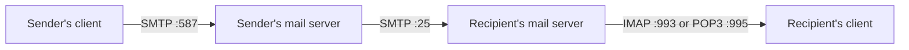
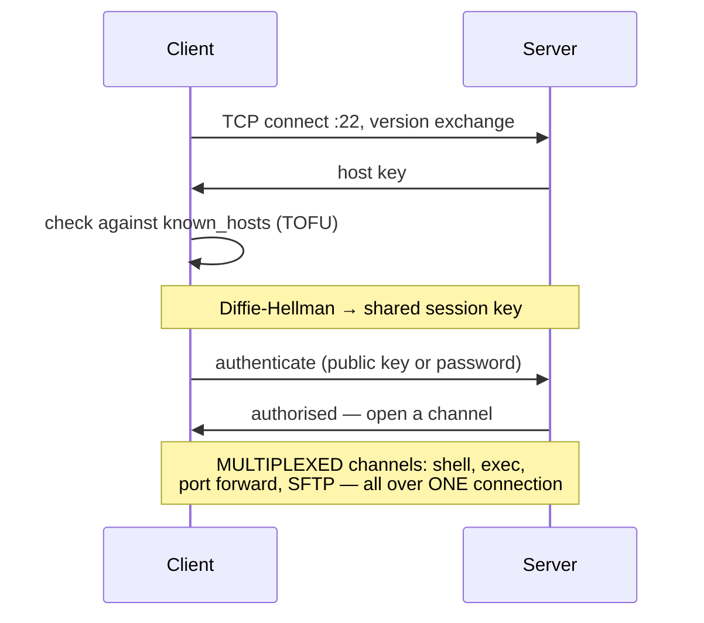
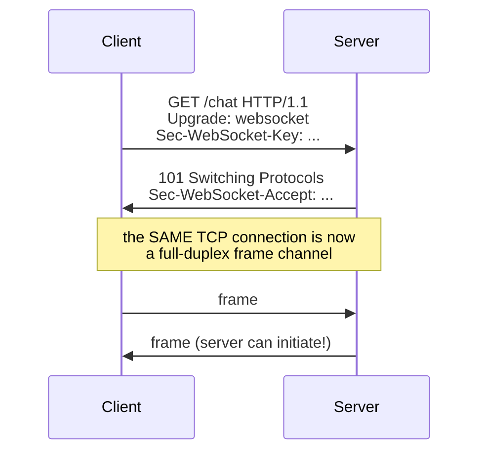
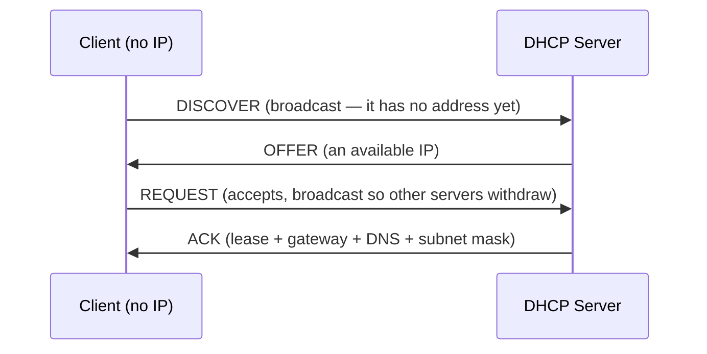

# Application Protocols in Depth

`Week 9` · Computer Networks

---

## Email — the three-protocol stack



| Protocol | Port | Direction | Purpose |
|---|---|---|---|
| **SMTP** | 25 (server-to-server), 587 (submission) | **push** | **sending** |
| **IMAP** | 143 / **993 TLS** | pull | **read, keeps mail on the server** — syncs across devices |
| **POP3** | 110 / 995 TLS | pull | download and usually delete — single device |

> **SMTP sends; IMAP and POP3 retrieve.** The common mistake is thinking SMTP does both.

**IMAP vs POP3:** IMAP keeps state on the server (folders, read/unread) so multiple devices stay in sync. POP3 downloads and forgets — fine for one device, wrong for modern use.

### Anti-spoofing — SMTP has no built-in authentication

| Mechanism | What it checks |
|---|---|
| **SPF** | is this server *allowed* to send for this domain? (a DNS TXT record) |
| **DKIM** | a cryptographic signature proving the message wasn't altered |
| **DMARC** | policy: what to do when SPF/DKIM fail, plus reporting |

All three are DNS records. Without them, anyone can forge your `From:` address.

---

## FTP — active vs passive

```
  ACTIVE MODE                        PASSIVE MODE
  ─────────────────────────────      ──────────────────────────────
  client connects to :21 (control)   client connects to :21 (control)
  client says "connect back to me"   client says "PASV"
  SERVER opens the data connection   server says "connect to port N"
     TO the client                   CLIENT opens the data connection

  ✗ BREAKS through client NAT/       ✓ both connections are OUTBOUND
    firewalls — inbound blocked        from the client → works
```

**Passive mode exists because of NAT and firewalls.** That is the whole answer, and it's a neat illustration of how NAT reshaped protocol design.

FTP is **plaintext** — credentials included. Use **SFTP** (over SSH, port 22) or FTPS (FTP over TLS).

---

## SSH



**Public key auth:** your private key never leaves your machine. The server sends a challenge; you sign it. Far safer than passwords.

### Port forwarding

```
  LOCAL    ssh -L 8080:db.internal:5432 bastion
           your :8080 → through the bastion → db.internal:5432
           "bring a remote service to me"

  REMOTE   ssh -R 9000:localhost:3000 server
           server's :9000 → back through the tunnel → your :3000
           "expose my local service on the server"

  DYNAMIC  ssh -D 1080 server
           a SOCKS proxy — route arbitrary traffic through the server
```

`-L` is how you reach a database that only accepts connections from inside a VPC.

---

## WebSockets



**It starts as HTTP** — which is why it traverses proxies and firewalls that only allow ports 80/443.

### The scaling problem

```
  ╔════════════════════════════════════════════════════════════╗
  ║ WEBSOCKETS ARE STATEFUL.                                   ║
  ║                                                            ║
  ║ User A is connected to server 1. User B to server 3.       ║
  ║ A sends B a message — server 1 has no connection to B.     ║
  ║                                                            ║
  ║ FIX: a PUB/SUB BACKPLANE (Redis, Kafka). Server 1          ║
  ║ publishes; server 3 receives and pushes to B.              ║
  ║                                                            ║
  ║ Raising this is what separates a real answer in a chat     ║
  ║ system design question.                                    ║
  ╚════════════════════════════════════════════════════════════╝
```

Also: load balancers need long idle timeouts, and you need heartbeats (ping/pong) to detect dead connections.

### Choosing a real-time transport

| | Direction | Complexity | Use when |
|---|---|---|---|
| Short polling | client pulls | trivial | very infrequent updates |
| Long polling | client pulls, server holds | low | legacy compatibility needed |
| **SSE** | **server → client only** | **low** | notifications, live feeds, **LLM token streaming** |
| **WebSocket** | **bidirectional** | high | chat, collaborative editing, games |
| WebRTC | peer-to-peer | very high | audio/video, low latency |

> **SSE is underrated.** It runs over plain HTTP, reconnects automatically, and needs no special infrastructure. If you only push *server → client*, it is simpler than WebSockets and usually sufficient.

---

## HTTP — details worth knowing

### Connection handling across versions

```
  HTTP/1.0   one request per TCP connection — a handshake EVERY time
  HTTP/1.1   keep-alive — reuse the connection
             pipelining exists but is broken in practice
             → browsers open ~6 connections per host
  HTTP/2     ONE connection, MULTIPLEXED streams + HPACK header compression
  HTTP/3     over QUIC/UDP — no transport head-of-line blocking
```

### Content negotiation

```
  Client:  Accept: application/json, text/html;q=0.9
           Accept-Encoding: gzip, br
           Accept-Language: en-GB, en;q=0.8
                                    ▲
                            q = quality/preference, 0..1

  Server:  Content-Type: application/json
           Content-Encoding: br
           Vary: Accept-Encoding    ← TELLS CACHES the response
                                      varies by this header
```

**Forgetting `Vary`** means a cache may serve a gzipped response to a client that cannot decompress it.

### Conditional requests

```
  first request     → 200 OK + ETag: "abc123"
  next request      → If-None-Match: "abc123"
  unchanged         → 304 Not Modified   (NO BODY — saves the bandwidth)
```

### Chunked transfer encoding

Used when the response length isn't known upfront (streaming, generated content). `Transfer-Encoding: chunked` sends size-prefixed chunks terminated by a zero-length chunk.

---

## gRPC over HTTP/2

```
  HTTP/2 features gRPC depends on:
     multiplexing      many concurrent RPCs on one connection
     binary framing    efficient, no text parsing
     header compression small per-call overhead
     STREAMS           enables all four call types

  FOUR CALL TYPES
     unary               1 request  → 1 response
     server streaming    1 request  → N responses   (a live feed)
     client streaming    N requests → 1 response    (an upload)
     bidirectional       N ↔ N                      (a chat)
```

Not natively browser-usable — needs **gRPC-Web** plus a proxy, because browsers do not expose raw HTTP/2 frames to JavaScript.

---

## DHCP — the DORA sequence



**D-O-R-A.** The lease has a duration; the client renews at 50% elapsed.

**Broadcasts do not cross routers**, so a subnet without a local DHCP server needs a **relay agent** to forward DISCOVER to a central server. That is a common exam question.

---

## NTP

Clock synchronisation, organised in **strata**: stratum 0 = atomic clocks/GPS, stratum 1 = servers directly attached, and so on. Accuracy is typically within milliseconds.

**Why it matters for distributed systems:** clock skew breaks Snowflake ID generation, TLS certificate validation, distributed lock TTLs, and log correlation. *"NTP going backwards causes duplicate IDs"* is a real production failure.

---

## Interview checklist

- [ ] SMTP sends; IMAP/POP3 retrieve — and IMAP vs POP3
- [ ] SPF / DKIM / DMARC
- [ ] FTP passive mode exists because of NAT
- [ ] SSH `-L` port forwarding to reach a private database
- [ ] WebSocket upgrade handshake; **the pub/sub backplane problem**
- [ ] SSE vs WebSocket — pick SSE when it's one-directional
- [ ] `Vary` header and why caches need it
- [ ] ETag → 304
- [ ] gRPC's four call types
- [ ] DHCP **DORA**; why relay agents exist
- [ ] Clock skew consequences
