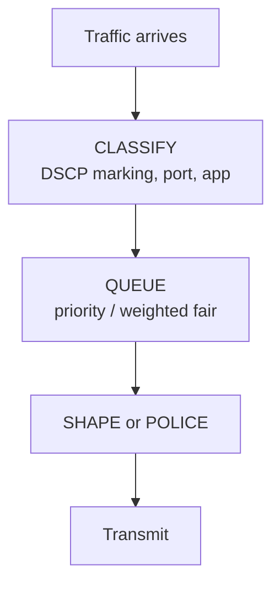
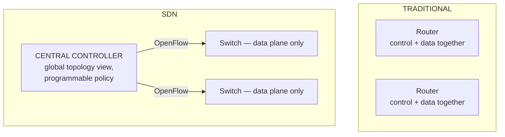
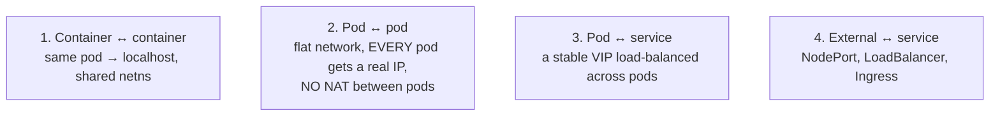

# Performance, QoS & Modern Networking

`Week 10` · Computer Networks

---

## TCP congestion control algorithms

```
  cwnd
   │        ╱╲            ╱╲              ← congestion avoidance
   │       ╱  ╲          ╱  ╲               (ADDITIVE increase)
   │      ╱    ╲        ╱
   │     ╱      ▼      ╱                  ← loss: MULTIPLICATIVE decrease
   │    ╱  slow start
   │   ╱   (exponential)
   └──────────────────────────────────► time
```

| Algorithm | Signal | Behaviour |
|---|---|---|
| **Tahoe** | loss | on loss → cwnd = 1, restart slow start |
| **Reno** | loss | fast retransmit + fast recovery → cwnd halved |
| **CUBIC** | loss | cubic growth; **Linux default**, good on high-bandwidth long-distance links |
| **BBR** | **bandwidth + RTT** | models the path instead of waiting for loss — much better on lossy links |

```
  ╔════════════════════════════════════════════════════════════╗
  ║ LOSS-BASED CONGESTION CONTROL'S CORE FLAW                  ║
  ║                                                            ║
  ║ TCP treats ALL loss as congestion. On wireless links,      ║
  ║ loss is often CORRUPTION — so TCP needlessly halves its    ║
  ║ window and mobile throughput collapses.                    ║
  ║                                                            ║
  ║ BBR measures actual bandwidth and RTT instead, which is    ║
  ║ why Google deployed it for YouTube.                        ║
  ╚════════════════════════════════════════════════════════════╝
```

### Fast retransmit

```
  sender: seq 1, 2, 3, 4, 5      packet 2 is LOST

  receiver ACKs: 1, 1, 1, 1      ← DUPLICATE ACKs ("I still want 2")

  THREE duplicate ACKs → retransmit IMMEDIATELY,
  don't wait for the retransmission timeout (RTO, hundreds of ms)
```

---

## Bandwidth-delay product

```
  BDP = bandwidth × RTT       = how many bits are "in flight"

  1 Gbps link, 100 ms RTT:
     BDP = 1,000,000,000 × 0.1 = 100,000,000 bits = 12.5 MB

  ╔════════════════════════════════════════════════════════════╗
  ║ If the TCP WINDOW is smaller than the BDP, the sender      ║
  ║ stalls waiting for ACKs and you CANNOT fill the pipe —     ║
  ║ no matter how much bandwidth you bought.                   ║
  ║                                                            ║
  ║ The original 16-bit window maxes at 64 KB. WINDOW SCALING  ║
  ║ (RFC 7323) is what makes long fat networks usable.         ║
  ╚════════════════════════════════════════════════════════════╝
```

This is why a file transfer between continents can be slow on a fast link — a classic "why is my transfer slow?" answer.

---

## Latency budget

```
  total latency = propagation + transmission + queuing + processing
                  └────┬────┘   └─────┬────┘   └──┬──┘   └───┬───┘
                  distance /      size /      congestion   router
                  speed of light  bandwidth                work

  PROPAGATION IS PHYSICS — you cannot buy your way out of it.
  ~5 µs per km in fibre (light is slower in glass than vacuum).

  London → New York ≈ 5,600 km ≈ 28 ms one way ≈ 56 ms RTT minimum
```

| | Optimise by |
|---|---|
| Propagation | **move the data closer** → CDN, edge |
| Transmission | more bandwidth, compression |
| Queuing | AQM, QoS, traffic shaping |
| Processing | faster hardware, fewer hops |

> *"This is latency-bound, not bandwidth-bound — more bandwidth won't help, we need an edge cache."* That sentence connects networking to system design and lands very well.

---

## QoS and traffic shaping



| | Shaping | Policing |
|---|---|---|
| Excess traffic | **buffered and delayed** | **dropped** |
| Output | smooth | bursty |
| Needs | memory | none |

**Queue disciplines:**

| Discipline | Behaviour |
|---|---|
| FIFO | simple; one heavy flow starves everything |
| Priority queuing | strict priority; **low priority can starve** |
| **WFQ** | weighted fair share per flow |
| **FQ-CoDel** | fair queuing + active queue management — **the modern default** |

### Bufferbloat, again

```
  Oversized buffers absorb congestion by ADDING LATENCY instead
  of dropping packets — but drops are how TCP LEARNS.

  symptom: speed test shows full bandwidth ✓
           video call is unusable          ✗
           everything degrades the moment someone starts an upload

  fix: AQM (CoDel, FQ-CoDel) drops EARLY and deliberately
```

---

## SDN — separating control from data



| | |
|---|---|
| **Advantages** | central policy, global optimisation, programmable, vendor-neutral, fast reconfiguration |
| **Disadvantages** | the controller is a **SPOF and a bottleneck**; controller-switch latency; a new failure domain |

**Where you actually meet it:** cloud provider networks, Kubernetes CNI plugins, and service meshes — all are SDN ideas applied above the physical layer.

---

## Overlay networks & tunnelling

```
  An overlay runs a VIRTUAL network on top of a physical one.

  ┌──────────────────────────────────────────────────────┐
  │ Outer IP (physical hosts) │ VXLAN hdr │ Inner frame  │
  └──────────────────────────────────────────────────────┘
                                             ▲
                            the container's own packet, untouched

  VXLAN  L2 over UDP, 24-bit VNI → 16 MILLION segments
         (VLAN's 12-bit ID caps at 4096 — the reason VXLAN exists)
  GRE    generic encapsulation
  Geneve extensible, increasingly the default
```

**The MTU consequence:** encapsulation adds ~50 bytes, so the effective MTU drops (1500 → ~1450). Get this wrong and you hit the *"small requests work, large uploads hang"* bug again — which is why Kubernetes clusters often set an explicit MTU.

---

## Kubernetes networking — the four problems



```
  THE KUBERNETES NETWORK MODEL — three rules
     1. every pod gets its own IP
     2. pods communicate WITHOUT NAT
     3. a pod sees its own IP as others see it

  A Service is a VIRTUAL IP with no process behind it —
  kube-proxy (iptables or IPVS rules) rewrites the destination
  to a real pod IP. That is why you cannot ping a ClusterIP.
```

| Resource | Layer | Use |
|---|---|---|
| ClusterIP | L4 | internal only (default) |
| NodePort | L4 | a port on every node |
| LoadBalancer | L4 | a cloud load balancer |
| **Ingress** | **L7** | host/path routing, TLS termination |

**Service mesh** (Istio, Linkerd) adds a sidecar proxy per pod for mTLS, retries, circuit breaking and tracing — without changing application code. Cost: a proxy per pod (latency, memory) and real operational complexity.

---

## HTTP/3 and QUIC — why it exists

```
  HTTP/2 over TCP                    HTTP/3 over QUIC (UDP)
  ─────────────────────────────      ────────────────────────────────
  streams multiplexed on ONE TCP     streams INDEPENDENTLY ordered
  connection
                                     ✓ a lost packet stalls only
  ✗ ONE lost packet stalls EVERY       its own stream
    stream — TCP guarantees order

  TCP handshake + TLS handshake      ✓ combined → 1 RTT, 0-RTT on resume
  = 2-3 RTT before data

  connection = (src IP, port,        ✓ CONNECTION ID → survives a network
                dst IP, port)          change (WiFi → cellular)
  ✗ changing network kills it
```

**Downsides:** UDP is blocked or deprioritised by some corporate firewalls; user-space processing uses more CPU than kernel TCP; harder to inspect and debug.

---

## Interview checklist

- [ ] Reno vs CUBIC vs BBR; why loss-based hurts wireless
- [ ] Fast retransmit on three duplicate ACKs
- [ ] **Bandwidth-delay product** and window scaling
- [ ] The four latency components; propagation is physics
- [ ] Shaping vs policing; FQ-CoDel and bufferbloat
- [ ] SDN: control/data plane separation, and the controller SPOF
- [ ] VXLAN and the **MTU consequence**
- [ ] The Kubernetes network model's three rules; why you can't ping a ClusterIP
- [ ] QUIC: per-stream ordering, 0-RTT, connection migration
