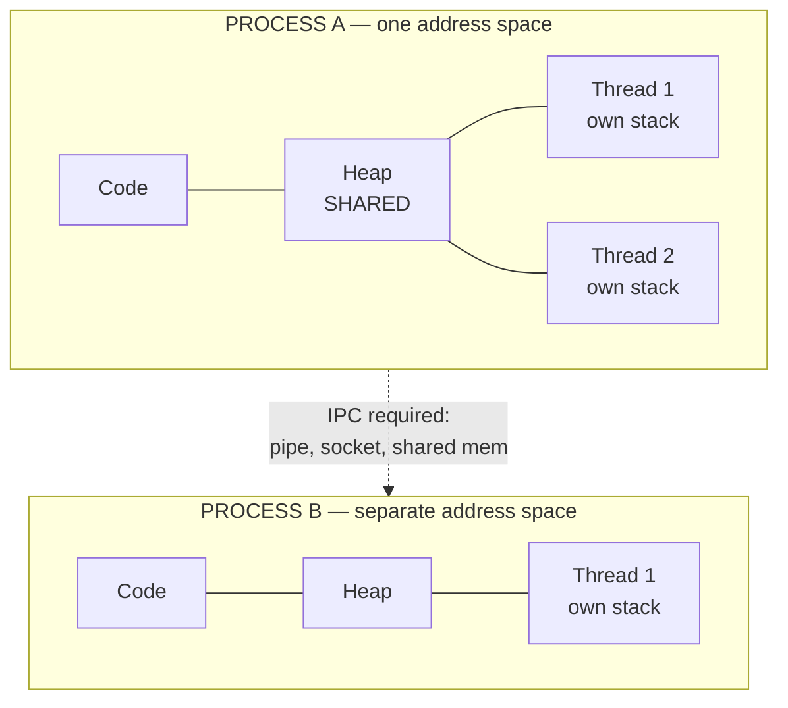
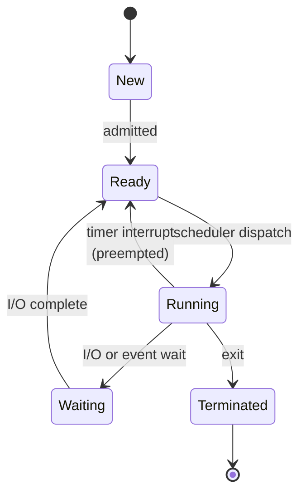
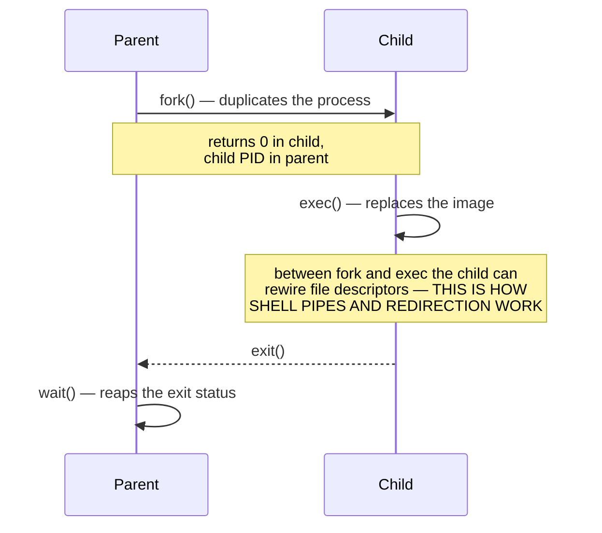
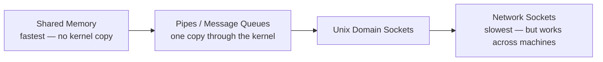
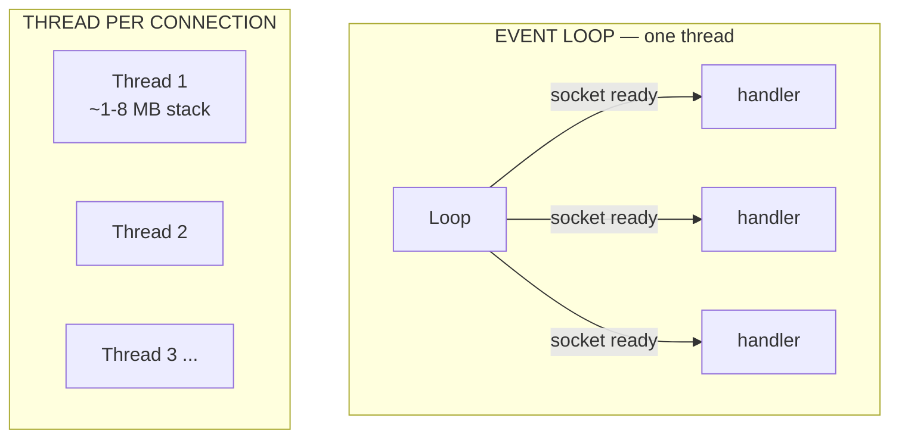

# Processes & Threads

`Weeks 1–2` · Operating Systems

## Process vs Thread — the one question that always comes

Everything follows from **one** difference: a process has its **own address space**, threads **share** one.



| | Shared between threads | Private per thread |
|---|---|---|
| Code / text | ✅ | |
| Heap, globals | ✅ | |
| Open file descriptors | ✅ | |
| **Stack** | | ✅ |
| **Registers, program counter** | | ✅ |
| **Thread-local storage** | | ✅ |

**Memorise that table.** It is asked verbatim.

## Process states



The **timer interrupt** is what makes `Running → Ready` possible. Without it a process could never be forced to yield — that is why preemptive multitasking needs hardware support.

## Context switch — where the cost hides

```
  Thread switch (same process)      Process switch (different address space)
  ────────────────────────────      ────────────────────────────────────────
  save registers + PC               save registers + PC
  restore the other thread's        SWITCH PAGE TABLES
                                    FLUSH or re-tag the TLB
                                    restore the other process's

  ~1 µs                             ~1-10 µs direct cost
                                    + the caches and TLB are now COLD
                                      ← this hidden cost is usually bigger
```

> The direct cost is measurable; the **cache pollution** is what actually hurts. That is the senior answer.

## fork / exec, zombies and orphans



| State | Meaning | Whose fault |
|---|---|---|
| **Zombie** | Child finished, parent never called `wait()` | **the parent's** — leaks PID table entries |
| **Orphan** | Parent died while the child still runs | nobody's — `init` (PID 1) adopts it |

Know these cold. *"Dead but not reaped"* vs *"alive with a dead parent"*.

## IPC — ranked by speed



The ranking is explained by **how many times the data is copied** through the kernel. Shared memory copies zero times — but you must then do your own synchronisation.

## Concurrency models — threads vs event loop



- **Threads** → CPU-**bound** parallelism. Real cores, real parallel work.
- **Event loop** → I/O-**bound** concurrency. 100k idle connections cost almost nothing.

**The trap:** one blocking call stalls the *entire* event loop. A single synchronous file read or CPU-heavy loop freezes every connection. That is the classic Node.js production incident.

## Interview checklist

- [ ] Process vs thread — recite the shared/private table
- [ ] Why is a process switch more expensive than a thread switch?
- [ ] Zombie vs orphan
- [ ] Why does `fork` return twice?
- [ ] Rank the IPC mechanisms and explain *why* that order
- [ ] Threads vs event loop — and the blocking-call trap
