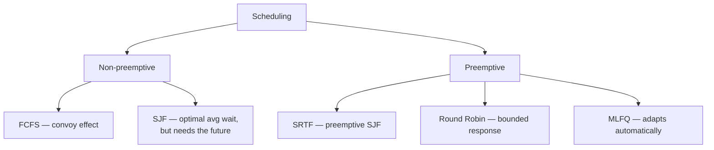
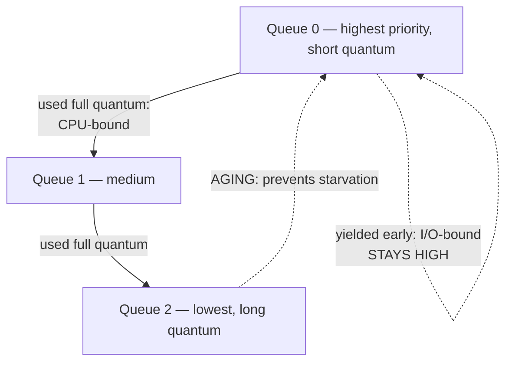
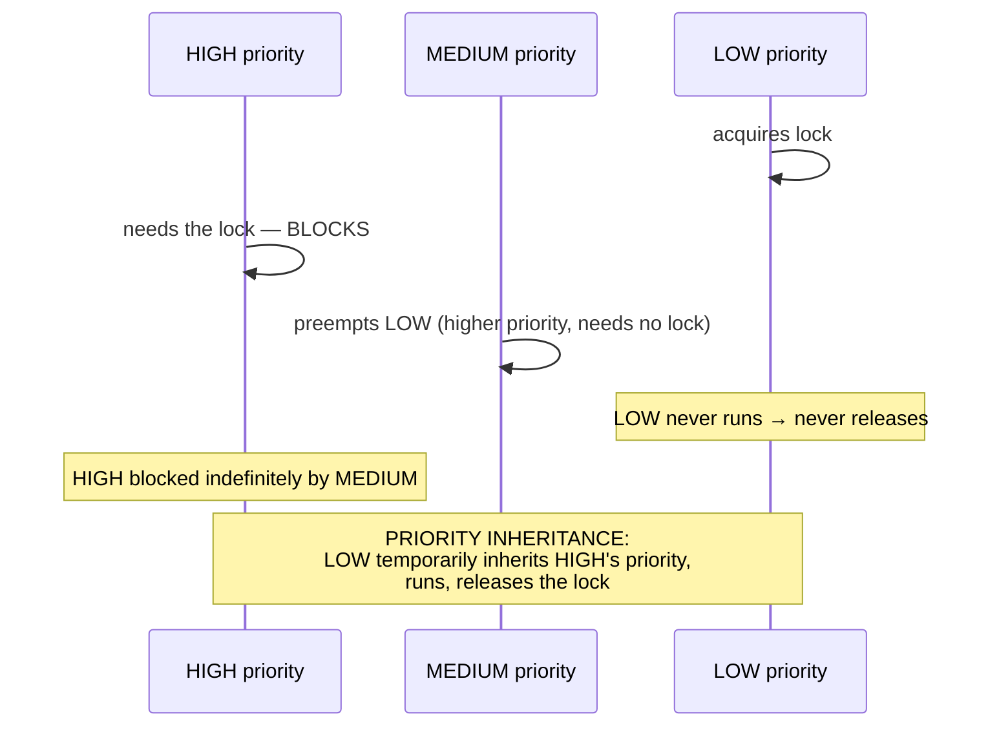

# CPU Scheduling

`Week 2` · Operating Systems

## The metrics

| Metric | Definition | Who cares |
|---|---|---|
| **Throughput** | processes completed / time | batch systems |
| **Turnaround** | completion − arrival | batch |
| **Waiting** | time in the ready queue | fairness |
| **Response** | arrival → *first* run | **interactive users** |

They **conflict**. Minimising average waiting time (SJF) starves long jobs. Maximising throughput hurts response time.

## The algorithms



### Worked Gantt chart — you WILL be asked this

```
  Process  Arrival  Burst
     P1       0       7
     P2       2       4
     P3       4       1
     P4       5       4

  FCFS:
     │ P1      │ P2   │P3│ P4   │
     0         7      11 12     16

     waiting:  P1 = 0-0  = 0
               P2 = 7-2  = 5
               P3 = 11-4 = 7
               P4 = 12-5 = 7
     average waiting = (0+5+7+7)/4 = 4.75

  SJF (non-preemptive):
     │ P1      │P3│ P2   │ P4   │
     0         7  8      12     16

     waiting:  P1=0, P3=8-4=4, P2=8-2=6, P4=12-5=7
     average = (0+4+6+7)/4 = 4.25   ← lower, as SJF guarantees
```

Practise five of these by hand. It is free marks.

### The convoy effect

```
  FCFS with one long job first:

     │ P1 (100ms)                    │P2│P3│P4│
     0                              100 101 102 103
       ▲
     everything queues behind it — response time collapses
```

### Round Robin — the quantum trade-off

```
  quantum TOO SMALL   → context-switch overhead dominates
  quantum TOO LARGE   → degenerates into FCFS

  typical: 10–100 ms
```

### MLFQ — infers behaviour without being told



The insight: **a process that yields early is interactive; one that burns its whole quantum is CPU-bound.** MLFQ learns this from behaviour alone.

## Priority inversion — the Mars Pathfinder story



Mars Pathfinder kept resetting on Mars in 1997 for exactly this reason. Engineers remotely enabled priority inheritance and it was fixed. Tell that story — it lands.

## Interview checklist

- [ ] Compute average waiting/turnaround from a Gantt chart
- [ ] Why is SJF optimal but unimplementable?
- [ ] The RR quantum trade-off, with a number
- [ ] How does MLFQ tell interactive from CPU-bound?
- [ ] Priority inversion and inheritance
