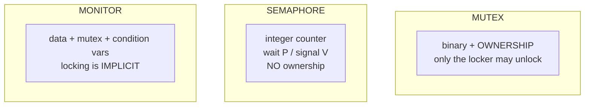
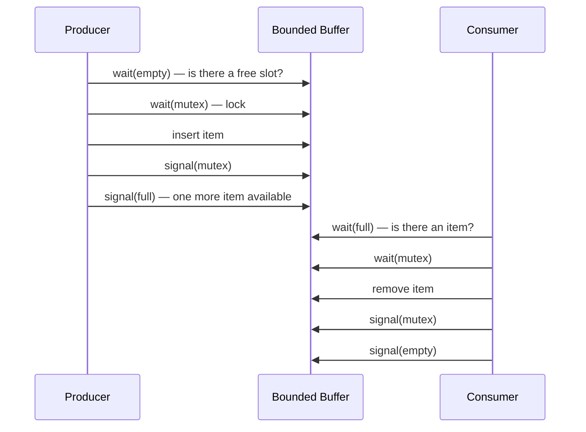
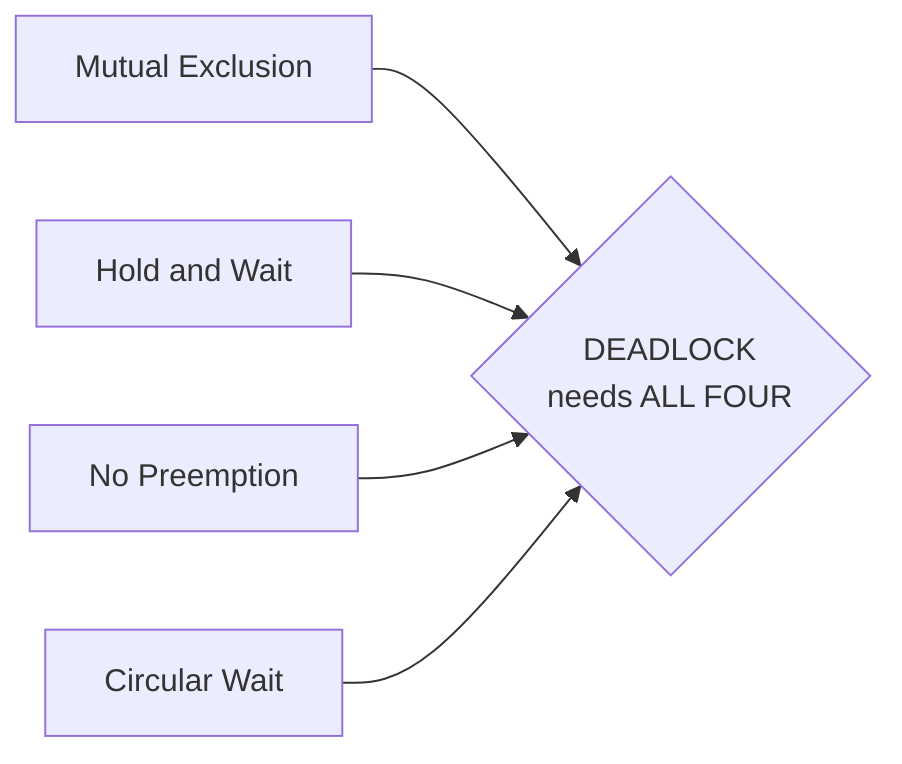

# Concurrency & Synchronisation

`Week 3` · Operating Systems

## Why `count++` is not atomic

```
  count++ compiles to THREE machine operations:

       LOAD   R1, count        read
       ADD    R1, 1            modify
       STORE  count, R1        write

  Two threads interleaving:

   Thread A          Thread B         count
   ────────          ────────         ─────
   LOAD  R1=5                           5
                     LOAD R1=5          5
   ADD   R1=6                           5
                     ADD  R1=6          5
   STORE                                6
                     STORE              6   ← LOST UPDATE, should be 7
```

Be able to draw this. It is the foundation of every concurrency question.

## The critical section — three requirements

Any correct solution must provide **all three**:

1. **Mutual exclusion** — at most one thread inside
2. **Progress** — if free, someone waiting gets in
3. **Bounded waiting** — no infinite overtaking

## Mutex vs Semaphore vs Monitor



| | Ownership | Counts | Use for |
|---|---|---|---|
| Mutex | ✅ | binary | protecting a critical section |
| Counting semaphore | ❌ | N | a pool of N resources |
| Monitor | ✅ | — | high-level, hard to misuse |

### Why `wait()` goes in a `while`, never an `if`

```python
# WRONG
if not condition:
    cond.wait()

# RIGHT
while not condition:
    cond.wait()
```

**Spurious wakeups** are real, and another thread may consume the condition between the signal and your wakeup. Re-check, always.

## Producer–Consumer — the ordering trap



```
  ╔═══════════════════════════════════════════════════════════╗
  ║ ORDER MATTERS. Acquiring the mutex BEFORE the counting    ║
  ║ semaphore deadlocks instantly:                            ║
  ║                                                           ║
  ║   wait(mutex)      ← holds the lock                       ║
  ║   wait(empty)      ← blocks, buffer full, still HOLDING   ║
  ║                      the mutex → consumer can never enter ║
  ╚═══════════════════════════════════════════════════════════╝
```

Write this from memory. It is the most-asked OS coding question.

## Deadlock — the four Coffman conditions



Break **any one** and deadlock is impossible.

| Strategy | Breaks | Practical? |
|---|---|---|
| **Lock ordering** | circular wait | ✅ **the real-world answer** |
| Request all at once | hold and wait | poor utilisation |
| Preemptible resources | no preemption | rarely possible |
| Banker's algorithm | avoidance | needs max demands upfront — unrealistic |
| Detection + recovery | — | you already suffered the deadlock |

```
  Circular wait:              Fixed by GLOBAL LOCK ORDERING:

    T1 holds A, wants B         everyone acquires A before B
    T2 holds B, wants A         → no cycle can form
       ┌─────┐                     T1: A then B
       ▼     │                     T2: A then B  ← waits for A, never holds B
      T1     T2
       │     ▲
       └─────┘
```

Most real operating systems **ignore** deadlock (the "ostrich algorithm") and let you restart.

## Dining philosophers

```
       P0
    F0    F1
  P4        P1        each philosopher needs BOTH adjacent forks
    F4    F2
       P3   P2
          F3

  Naive "grab left, then right" → all five grab left → DEADLOCK

  Fixes:
    1. one philosopher grabs RIGHT first  → breaks the symmetry
    2. allow at most 4 at the table       → breaks hold-and-wait
    3. pick up both forks atomically      → breaks hold-and-wait
```

## Interview checklist

- [ ] Draw the lost-update interleaving
- [ ] Three critical-section requirements
- [ ] Mutex vs semaphore (ownership, binary vs counting)
- [ ] Why `while` not `if` around `wait()`
- [ ] Producer–consumer from memory, semaphores in the right order
- [ ] Four Coffman conditions + which strategy breaks which
- [ ] Banker's algorithm on a small matrix
