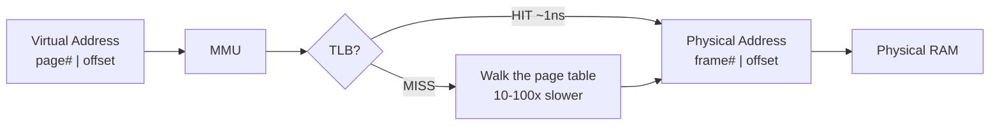
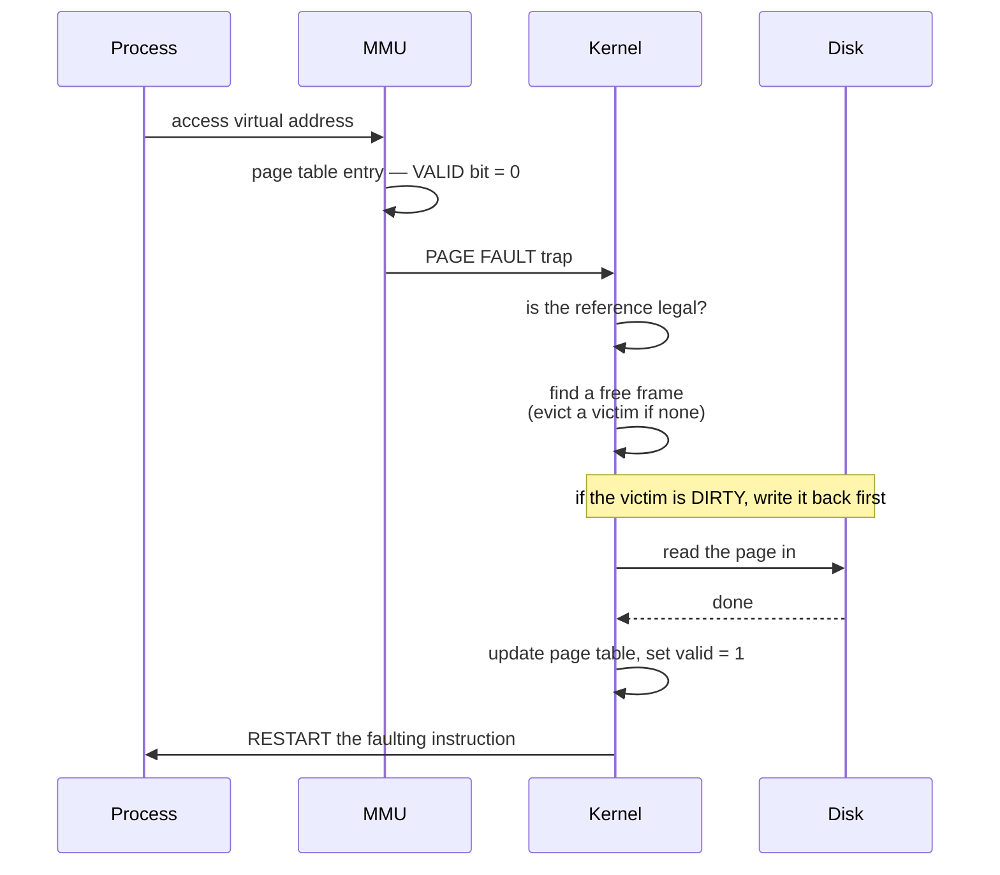

# Memory Management & Virtual Memory

`Weeks 4–5` · Operating Systems

## Address translation

Every process believes it owns a contiguous space starting at zero. The **MMU** makes that lie work.



### The split you must be able to compute

```
  32-bit address space, 4 KB pages

  4 KB = 2^12  →  offset = 12 bits
                  page number = 32 - 12 = 20 bits
                  → 2^20 = 1,048,576 page table entries

  ┌──────────────────────┬──────────────┐
  │  page number (20)    │  offset (12) │
  └──────────────────────┴──────────────┘
           │                    │
           │ index into         │ copied through
           │ the page table     │ UNCHANGED
           ▼                    ▼
  ┌──────────────────────┬──────────────┐
  │  frame number        │  offset (12) │
  └──────────────────────┴──────────────┘
```

This calculation is asked constantly. Practise it.

### TLB effective access time

```
  EAT = hit_ratio × (TLB_time + mem_time)
      + miss_ratio × (TLB_time + 2 × mem_time)

  example: 98% hit, TLB 1ns, memory 100ns
  EAT = 0.98 × 101 + 0.02 × 201 = 103 ns
```

## Fragmentation — which scheme causes which

```
  EXTERNAL (segmentation, contiguous allocation)
  ┌────┬──────┬────┬────────┬───┐
  │ P1 │ FREE │ P2 │  FREE  │P3 │    total free = plenty
  └────┴──────┴────┴────────┴───┘    but no single hole is big enough

  INTERNAL (paging)
  ┌─────────────────────┐
  │ used        │ WASTE │   allocated a whole 4KB page
  └─────────────────────┘   for 3.2KB of data
                            → ~half a page wasted per allocation
```

| Scheme | Fragmentation | Fixed by |
|---|---|---|
| Contiguous / segmentation | **external** | compaction (expensive) |
| Paging | **internal** | smaller pages (more table overhead) |

The mapping *external→segmentation, internal→paging* is exactly what examiners check.

## Demand paging & the page fault path



**The cost gap is the whole story:**

```
  RAM      ~100 ns
  SSD      ~100 µs      1,000x slower
  HDD      ~10 ms     100,000x slower
```

One page fault costs as much as ~100,000 memory accesses. That is why a 1% fault rate destroys performance.

## Thrashing


The vicious circle: **low CPU utilisation with a dead machine**. Deeply confusing without the concept.

**Fix:** the *working set model* — give each process enough frames for its active pages, and suspend processes if you cannot.

## Page replacement algorithms

```
  reference string: 7 0 1 2 0 3 0 4    3 frames

  FIFO                          LRU
  ──────────────────────────    ──────────────────────────
  7 | 7          fault          7 | 7          fault
  0 | 7 0        fault          0 | 7 0        fault
  1 | 7 0 1      fault          1 | 7 0 1      fault
  2 | 0 1 2      fault (ev 7)   2 | 0 1 2      fault (ev 7)
  0 | 0 1 2      HIT            0 | 0 1 2      HIT
  3 | 1 2 3      fault (ev 0)   3 | 0 2 3      fault (ev 1)
  0 | 2 3 0      fault (ev 1)   0 | 0 2 3      HIT
  4 | 3 0 4      fault (ev 2)   4 | 0 3 4      fault (ev 2)

  FIFO: 7 faults                LRU: 6 faults
```

| Algorithm | Note |
|---|---|
| **FIFO** | simple; suffers **Belady's anomaly** — more frames can cause *more* faults |
| **Optimal (OPT)** | evict the page used furthest in future — needs the future, so it is only a benchmark |
| **LRU** | close to optimal by locality, but exact LRU needs an update on **every** access — far too expensive in hardware |
| **Clock / Second Chance** | approximates LRU cheaply with a reference bit — **what real systems use** |
| **LFU** | clings to once-hot pages unless counters are aged |

> **LRU here is exactly LeetCode 146** — hash map + doubly linked list, same algorithm, same reason. Make that connection out loud.

## Interview checklist

- [ ] Compute offset/page bits for a given address size and page size
- [ ] Effective access time with a TLB hit ratio
- [ ] External vs internal fragmentation → which scheme
- [ ] Page fault handling, in order
- [ ] Thrashing, and why the scheduler makes it worse
- [ ] Count faults for FIFO / LRU / Optimal on a reference string
- [ ] Why is exact LRU impractical in hardware?
