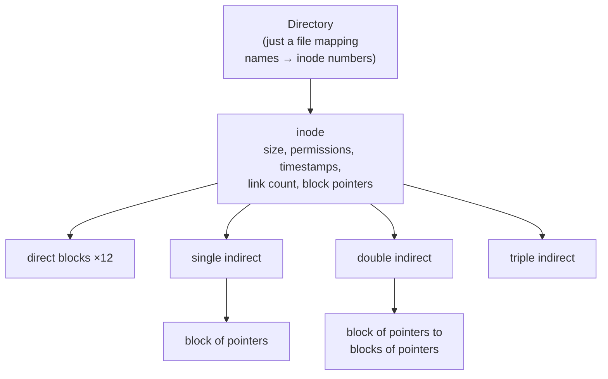
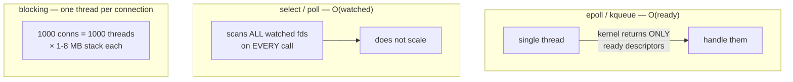
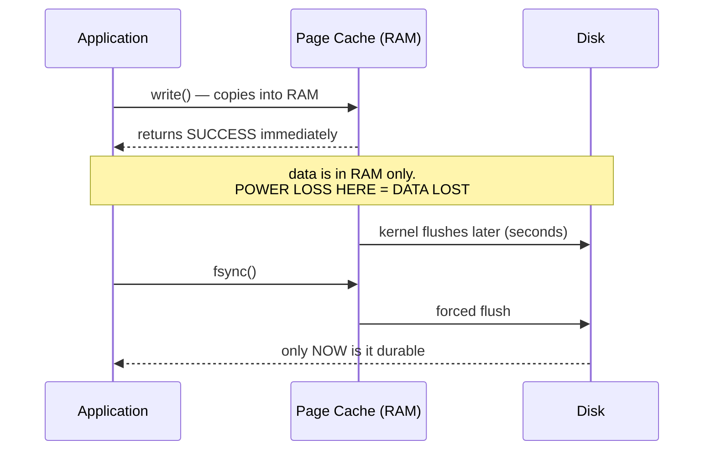
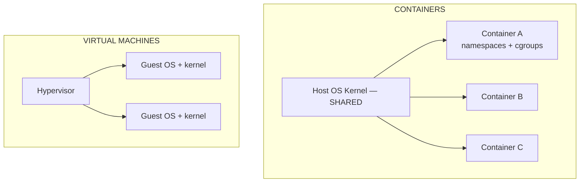
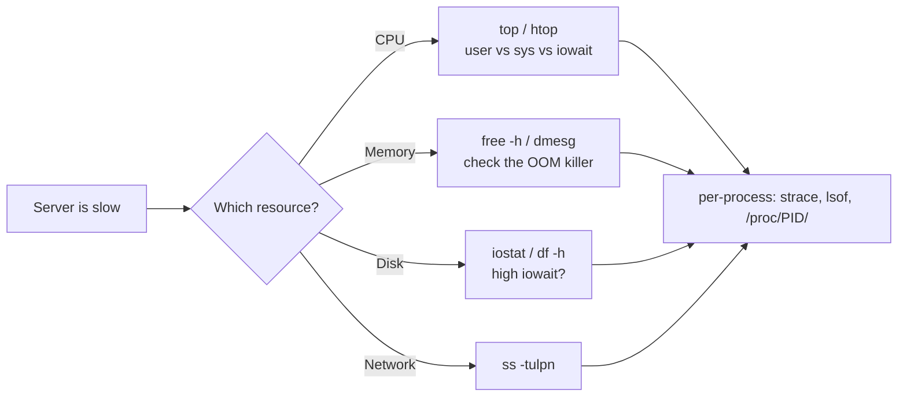

# Storage, I/O & Linux in Practice

`Week 5` · Operating Systems

## File systems and inodes



Small files use only direct pointers and stay cheap; huge files reach through the indirect levels.

### Hard link vs soft link

```
  HARD LINK — a second NAME for the same inode

    /a/file ──┐
              ├──► inode 42  (link count = 2)   data blocks
    /b/link ──┘

    delete /a/file → link count 1, data SURVIVES

  SOFT LINK (symlink) — a file containing a PATH

    /b/link ──► inode 99 ──► contents: "/a/file"
                                          │
                                          ▼
                             delete /a/file → link is BROKEN
```

Asked constantly. Hard links share the inode; soft links store a path.

## Disk scheduling

```
  requests: 98, 183, 37, 122, 14, 124, 65, 67     head at 53

  FCFS   : 53→98→183→37→122→14→124→65→67    total movement 640
  SSTF   : 53→65→67→37→14→98→122→124→183    total movement 236
  SCAN   : sweep one way, then reverse (elevator)
  C-SCAN : sweep one way, jump back to 0, sweep again
           → more UNIFORM waiting time
```

> **Say this:** disk scheduling is largely **irrelevant for SSDs** — there is no seek time. It shows current knowledge rather than recited textbook.

## RAID

```
  RAID 0  striping          A1 A2 | A3 A4        speed, ZERO redundancy
  RAID 1  mirroring         A1 A1 | A2 A2        survives 1 loss, 50% capacity
  RAID 5  striping+parity   A1 A2 Ap | B1 Bp B2  survives 1, write penalty
  RAID 6  double parity                          survives 2
  RAID 10 mirrored stripes                       speed + redundancy, 50%
```

**RAID IS NOT A BACKUP.** It protects against *disk failure*, not deletion, corruption or ransomware. Say it unprompted.

## Blocking vs non-blocking I/O — the C10K problem



| | Cost per call |
|---|---|
| `select` / `poll` | **O(watched)** — rescans everything; `select` caps at 1024 fds |
| `epoll` / `kqueue` | **O(ready)** — register once, get back only what fired |
| `io_uring` | shared submission/completion rings, fewer syscalls still |

> *"epoll is O(ready) while select is O(watched)"* — one sentence that answers **"how does nginx handle 100k connections?"**

## Page cache and durability — `write()` is NOT durable



**This is the D in ACID.** It explains why `fsync` is the bottleneck in every database, and why databases batch commits (group commit) to amortise its cost.

Excellent bridge between OS and DBMS — make it explicitly.

## VMs vs containers



| | VM | Container |
|---|---|---|
| Isolation | **hardware-level, strong** | kernel-level, weaker |
| Boot | minutes | **milliseconds** |
| Overhead | full guest OS each | negligible |
| Different OS? | ✅ | ❌ shares the host kernel |

Containers are **namespaces** (separate views of PIDs, network, mounts, users) plus **cgroups** (CPU/memory/IO limits). Naming those two specifically is what separates a real answer from a hand-wave.

**Security:** a kernel exploit escapes the container. That matters for untrusted multi-tenant code.

## Diagnosing a slow Linux box



**Two facts that instantly signal real experience:**

1. **Linux load average includes processes blocked on I/O**, not just CPU. High load + low CPU = **I/O bound**, which surprises people.
2. **Low "free" memory is normal.** The kernel uses spare RAM as page cache. Look at **available**, not free.

## Interview checklist

- [ ] Hard vs soft link
- [ ] Compute total head movement for FCFS / SSTF / SCAN
- [ ] RAID levels — and that RAID is not a backup
- [ ] epoll vs select, and the C10K problem
- [ ] Why `write()` returning success is not durability
- [ ] VMs vs containers — namespaces and cgroups by name
- [ ] "The server is slow" — walk the four resources in order
