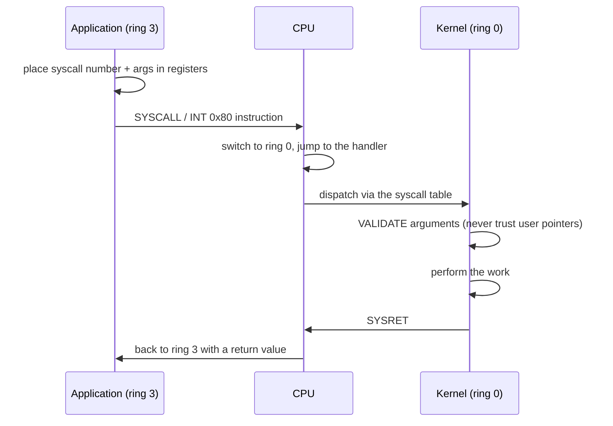
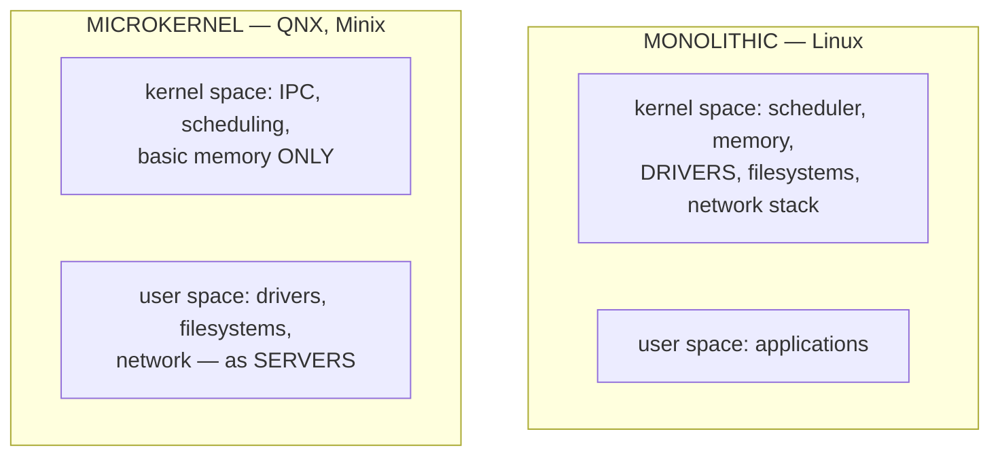
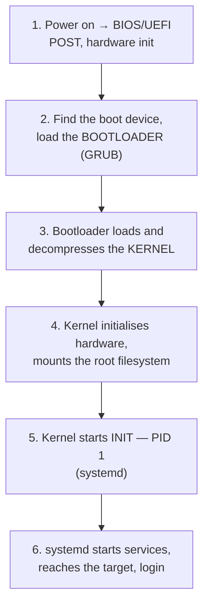

# Kernel Architecture, System Calls & Interrupts

`Week 1` · Operating Systems

---

## Protection rings

```
        ┌───────────────────────────────────┐
        │  Ring 3 — USER MODE               │  applications
        │   ┌─────────────────────────────┐ │
        │   │ Ring 2 (unused)             │ │
        │   │  ┌───────────────────────┐  │ │
        │   │  │ Ring 1 (unused)       │  │ │
        │   │  │  ┌─────────────────┐  │  │ │
        │   │  │  │ Ring 0 — KERNEL │  │  │ │  full hardware access
        │   │  │  └─────────────────┘  │  │ │
        │   │  └───────────────────────┘  │ │
        │   └─────────────────────────────┘ │
        └───────────────────────────────────┘

  x86 defines 4 rings; almost every OS uses only 0 and 3.
  A CPU status bit records the current ring. PRIVILEGED
  instructions (I/O, page-table changes, halt) TRAP if
  attempted in ring 3.
```

**Why it matters:** without this, one buggy program could touch any memory or device and destroy the machine. It is enforced by **hardware**, not convention.

---

## System calls — the controlled door into the kernel



**Cost:** roughly 100 ns – 1 µs. Far more expensive than a function call — which is why syscall-heavy code is slow and why batching APIs (`io_uring`, `readv`/`writev`, `sendmmsg`) exist.

### The syscalls worth knowing by category

| Category | Calls |
|---|---|
| **Process** | `fork`, `exec`, `wait`, `exit`, `getpid`, `clone` |
| **File** | `open`, `read`, `write`, `close`, `lseek`, `stat` |
| **Memory** | `mmap`, `munmap`, `brk`, `mprotect` |
| **Network** | `socket`, `bind`, `listen`, `accept`, `connect`, `send`, `recv` |
| **Sync** | `futex`, `semget`, `shmget` |
| **Signals** | `kill`, `sigaction`, `sigprocmask` |

> The kernel **must validate every argument** — a user-supplied pointer could point anywhere. This is why `copy_from_user()` exists rather than a plain dereference.

---

## Interrupts, traps and exceptions

Three ways control diverts into the kernel. The distinction gets asked.

```
  INTERRUPT     ASYNCHRONOUS, from HARDWARE
                timer, disk completion, keypress, network packet
                → unrelated to the instruction currently executing

  TRAP          SYNCHRONOUS and DELIBERATE
                a system call — the program asked for this

  EXCEPTION     SYNCHRONOUS and ACCIDENTAL
  / FAULT       divide by zero, page fault, invalid opcode
                → caused BY the current instruction
```

All three consult the **Interrupt Vector Table** to find a handler.


### Top half / bottom half

```
  ╔════════════════════════════════════════════════════════════╗
  ║ Interrupt handlers run with interrupts DISABLED, so a slow ║
  ║ handler causes MISSED EVENTS.                              ║
  ║                                                            ║
  ║   TOP HALF     minimal, fast: acknowledge the device,      ║
  ║                copy data out, schedule the rest            ║
  ║   BOTTOM HALF  the real work, deferred, interrupts on      ║
  ║                (softirq / tasklet / workqueue in Linux)    ║
  ╚════════════════════════════════════════════════════════════╝
```

**The timer interrupt is what makes preemptive multitasking possible.** Without it, a process that never yields could never be stopped.

---

## Kernel architectures



| | Monolithic | Microkernel |
|---|---|---|
| Speed | **fast** — direct function calls | slower — message passing |
| Fault isolation | a driver bug **crashes the machine** | a crashed driver can be **restarted** |
| Codebase | enormous | small, verifiable |
| Extensibility | loadable modules | add a server |
| Examples | **Linux**, BSD | QNX, Minix, seL4 |

**Hybrid** (Windows NT, macOS XNU) sits between.

> Linux is **monolithic with loadable modules** — which gives it some microkernel flexibility without the IPC cost. Microkernels are architecturally cleaner but lost commercially on performance.

---

## The boot sequence



Know it in order — it is a standard viva question. **PID 1 is `init`/`systemd`**, and it is also the process that adopts orphans.

---

## Signals

Asynchronous notifications delivered to a process.

| Signal | Number | Meaning | Catchable? |
|---|---|---|---|
| SIGINT | 2 | Ctrl-C | ✅ |
| SIGQUIT | 3 | Ctrl-\ + core dump | ✅ |
| SIGKILL | **9** | **immediate termination** | ❌ **never** |
| SIGSEGV | 11 | invalid memory access | ✅ (usually fatal) |
| SIGTERM | **15** | polite termination request | ✅ |
| SIGCHLD | 17 | a child exited | ✅ |
| SIGHUP | 1 | terminal closed / reload config | ✅ |

```
  ╔════════════════════════════════════════════════════════════╗
  ║ SIGTERM vs SIGKILL — the one that matters in practice      ║
  ║                                                            ║
  ║   SIGTERM  catchable → the process can finish in-flight    ║
  ║            requests, flush buffers, close connections      ║
  ║   SIGKILL  uncatchable → NO cleanup happens at all         ║
  ║                                                            ║
  ║ This is exactly why Kubernetes sends SIGTERM, waits for    ║
  ║ terminationGracePeriodSeconds, THEN sends SIGKILL.         ║
  ╚════════════════════════════════════════════════════════════╝
```

**Signal handler rules:** only **async-signal-safe** functions are legal inside one. Calling `printf` or `malloc` from a handler is a real bug — they are not reentrant. A signal can also interrupt a blocking syscall, which then returns `EINTR` and must be retried.

---

## Interview checklist

- [ ] Protection rings; why hardware enforcement matters
- [ ] Walk a system call step by step; why the kernel validates arguments
- [ ] Interrupt vs trap vs exception — asynchronous / deliberate / accidental
- [ ] Top half vs bottom half, and why
- [ ] The timer interrupt enables preemption
- [ ] Monolithic vs microkernel — speed vs fault isolation
- [ ] The boot sequence in order; PID 1
- [ ] SIGTERM vs SIGKILL, and the Kubernetes connection
