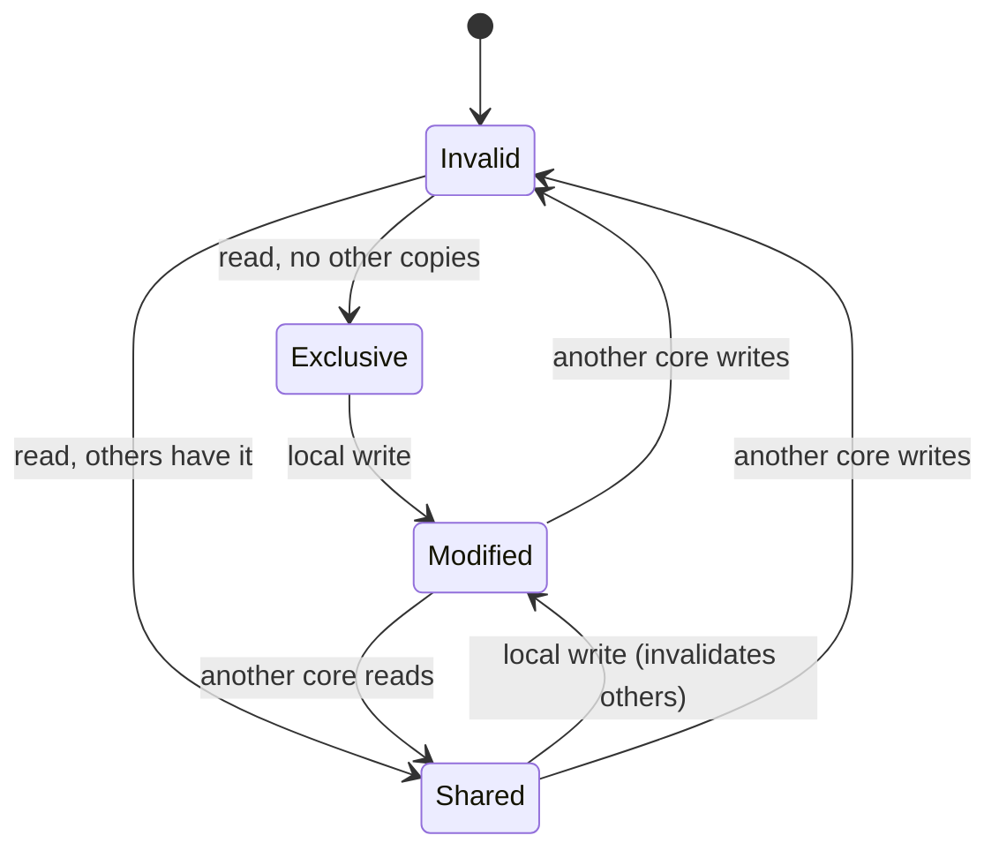
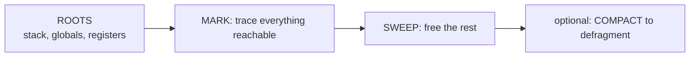
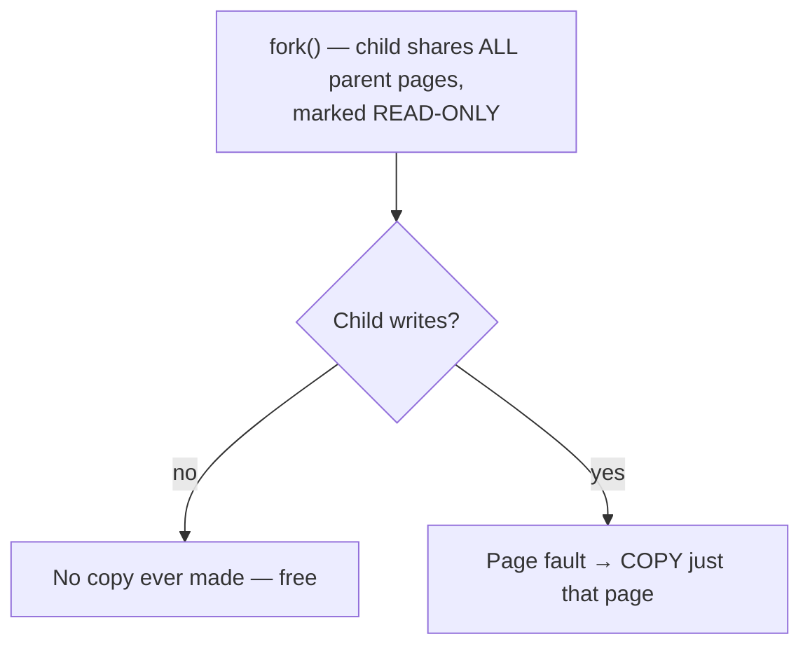

# Memory Performance, CPU Caches & Allocators

`Week 4` · Operating Systems

The layer below virtual memory — where real performance is won or lost.

---

## The memory hierarchy

```
                    size        latency      ~cycles
  ┌─────────────┐
  │  Registers  │   ~1 KB       <1 ns          1
  ├─────────────┤
  │  L1 cache   │   ~32-64 KB    ~1 ns         4
  ├─────────────┤
  │  L2 cache   │   ~256KB-1MB   ~4 ns        12
  ├─────────────┤
  │  L3 cache   │   ~8-32 MB    ~15 ns        40     (shared across cores)
  ├─────────────┤
  │  RAM        │   ~16-512 GB  ~100 ns      200+
  ├─────────────┤
  │  SSD        │   ~TB         ~100 µs   ~200,000
  ├─────────────┤
  │  HDD        │   ~TB          ~10 ms  ~20,000,000
  └─────────────┘

  Each level is roughly 10x slower and 10x larger than the one above.
```

**RAM is ~100× slower than L1.** Without caches the CPU would spend nearly all its time waiting.

---

## Cache lines — the unit that actually moves

```
  Memory moves in CACHE LINES of 64 bytes, never single bytes.

  reading a[0]  pulls in a[0..15]  (for 4-byte ints)
                └──────── one 64-byte line ────────┘

  → the next 15 reads are FREE
```

### Why this makes array traversal beat pointer chasing

```
  ARRAY — contiguous                LINKED LIST — scattered
  ┌──┬──┬──┬──┬──┬──┬──┬──┐        ┌──┐      ┌──┐      ┌──┐
  │ 1│ 2│ 3│ 4│ 5│ 6│ 7│ 8│        │ 1│─────▶│ 2│─────▶│ 3│
  └──┴──┴──┴──┴──┴──┴──┴──┘        └──┘      └──┘      └──┘
   one cache line fetch              a cache MISS per node
   → 8 elements available            → ~100 ns each

  This is why an O(n) array scan often beats an O(log n) tree
  lookup for small n — a genuinely strong thing to say when
  asked about theory vs practice.
```

### The two localities

| | Meaning | Exploit it by |
|---|---|---|
| **Temporal** | recently used data will be reused | keeping hot data small |
| **Spatial** | nearby data will be used next | sequential access, contiguous layout |

```
  ROW-MAJOR TRAVERSAL MATTERS

  for i in rows:            for j in cols:
      for j in cols:            for i in rows:
          sum += m[i][j]            sum += m[i][j]

  ✓ sequential in memory    ✗ strides across rows
    ~1 cache miss per line    ~1 cache miss per ELEMENT
                              can be 5-10x slower for the SAME Big-O
```

---

## False sharing — the invisible killer

```
  ╔════════════════════════════════════════════════════════════╗
  ║ Two threads write to DIFFERENT variables that happen to    ║
  ║ share ONE 64-byte cache line.                              ║
  ║                                                            ║
  ║   Core 1 writes counter_a ─┐                               ║
  ║                            ├─ same cache line              ║
  ║   Core 2 writes counter_b ─┘                               ║
  ║                                                            ║
  ║ Every write INVALIDATES the other core's copy. The line    ║
  ║ ping-pongs between cores over the interconnect.            ║
  ║                                                            ║
  ║ → massive slowdown, NO visible bug, correct output.        ║
  ║                                                            ║
  ║ FIX: pad the structs so each sits on its own line.         ║
  ╚════════════════════════════════════════════════════════════╝
```

```c
struct Counter {
    long value;
    char padding[56];   // 8 + 56 = 64 → one cache line each
};
```

Know it **by name** — it's a distinctive answer when asked why a parallel program didn't speed up.

---

## Cache coherence — MESI

With multiple cores each holding copies, they must agree.

```
  M  MODIFIED   this core has the only copy, and it is dirty
  E  EXCLUSIVE  only copy, clean (matches memory)
  S  SHARED     several cores hold clean copies
  I  INVALID    stale — must re-fetch
```



This protocol is *why* false sharing is expensive — every write forces invalidation traffic.

---

## NUMA

```
  ┌──────────────────┐        ┌──────────────────┐
  │  Socket 0        │        │  Socket 1        │
  │  cores 0-15      │◀──────▶│  cores 16-31     │
  │      ↓ FAST      │  slow  │      ↓ FAST      │
  │  ┌──────────┐    │  inter-│  ┌──────────┐    │
  │  │ Memory 0 │    │ connect│  │ Memory 1 │    │
  │  └──────────┘    │        │  └──────────┘    │
  └──────────────────┘        └──────────────────┘

  LOCAL memory access  ~100 ns
  REMOTE (other socket) ~150-200 ns   ← invisible until you measure
```

**NUMA-aware placement** keeps a thread near its memory. `numactl` controls it. Effects are invisible in code review and only show up in profiling.

---

## Stack vs heap

```
  STACK                             HEAP
  ─────────────────────────────     ──────────────────────────────
  per THREAD                        shared across threads
  LIFO — call frames, locals        arbitrary lifetime
  allocation = one pointer bump     free-list search / allocator work
  deallocation automatic on return  manual free, or GC
  FIXED SIZE (1-8 MB typical)       grows as needed
  perfect cache locality            fragmented over time
```

```
  ╔════════════════════════════════════════════════════════════╗
  ║ CONNECT THIS TO YOUR DSA WORK                              ║
  ║                                                            ║
  ║ Recursive DFS uses O(h) STACK. On a 10^6-node graph        ║
  ║ that overflows — Python's default limit is 1000 frames.    ║
  ║                                                            ║
  ║ THAT is why you convert deep recursion to an iterative     ║
  ║ explicit stack. Say this in an interview and it lands.     ║
  ╚════════════════════════════════════════════════════════════╝
```

---

## Memory allocators

| Strategy | How | Problem |
|---|---|---|
| **First fit** | first hole big enough | fast, fragments the front |
| Best fit | smallest adequate hole | slow scan, leaves tiny slivers |
| Worst fit | largest hole | rarely useful |
| **Buddy system** | split/merge power-of-two blocks | fast merge, internal fragmentation |
| **Slab** | pre-allocated caches of same-sized objects | **fast reuse — Linux kernel uses this** |

```
  BUDDY SYSTEM

  need 70 KB → round up to 128 KB

     1024 ──split──▶  512 | 512
                      512 ──split──▶ 256 | 256
                                     256 ──split──▶ 128 | 128
                                                    128 ← allocate

  freeing merges with its BUDDY if that is also free → O(log n)
```

**Production allocators** (jemalloc, tcmalloc) add per-thread caches so most allocations need no lock at all.

---

## Garbage collection



**Generational GC** exploits the fact that *most objects die young*: collect the small young generation frequently, the old generation rarely.

### The two things to say

```
  1. STOP-THE-WORLD PAUSES freeze the application.
     → the classic cause of p99 LATENCY SPIKES in JVM/Go services.
     Modern collectors (ZGC, Go's) are concurrent to keep pauses
     in the low milliseconds.

  2. YOU CAN STILL LEAK.
     GC prevents UNREACHABLE leaks, not LOGICAL ones.
     An ever-growing HashMap, an unbounded cache, a forgotten
     event listener — all still REACHABLE, so never collected.
     An unbounded cache is a memory leak in ANY language.
```

---

## Copy-on-write



**Why `fork()` is cheap:** nothing is copied upfront. Combined with `exec()` — which replaces the image entirely — a shell spawning a command copies almost nothing.

Also used by: `mmap` with `MAP_PRIVATE`, container image layers, snapshot filesystems (ZFS, btrfs).

---

## Interview checklist

- [ ] The hierarchy with real latency numbers
- [ ] 64-byte cache lines; why arrays beat linked lists
- [ ] Row-major vs column-major traversal — same Big-O, 5–10× difference
- [ ] **False sharing** by name, and the padding fix
- [ ] MESI in one sentence
- [ ] NUMA: local vs remote access
- [ ] Stack vs heap — and the recursive-DFS connection
- [ ] Buddy and slab allocators
- [ ] GC pauses → p99 spikes; GC does not prevent logical leaks
- [ ] Copy-on-write makes `fork()` cheap
