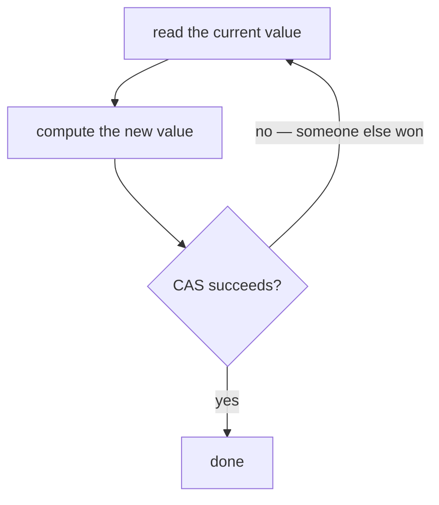
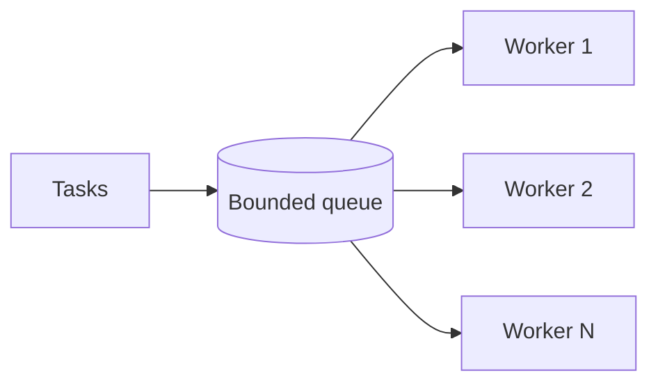

# Advanced Concurrency — Atomics, Lock-Free & Memory Models

`Week 3` · Operating Systems

Beyond mutexes and semaphores. This is where senior questions go.

---

## Atomic operations

**What they are** — operations the hardware guarantees are indivisible. No interleaving is possible.

```
  count++ is THREE operations → racy
  atomic_fetch_add(&count, 1) is ONE instruction → safe

  x86: LOCK XADD    ARM: LDREX/STREX loop
```

| Operation | Does |
|---|---|
| `fetch_add` / `fetch_sub` | atomic increment / decrement |
| `exchange` | swap and return the old value |
| **`compare_and_swap`** | **the fundamental primitive** |
| `load` / `store` | atomic read / write with ordering guarantees |

---

## Compare-and-Swap — the building block of everything

```
  CAS(address, expected, new):
      atomically:
          if *address == expected:
              *address = new
              return True
          else:
              return False      ← someone else changed it
```

```python
# the CAS retry loop — the shape of every lock-free algorithm
def atomic_increment(counter):
    while True:
        old = counter.load()
        new = old + 1
        if counter.compare_and_swap(old, new):   # atomic
            return new
        # someone beat us — re-read and retry
```



### Advantages
- **No blocking** → no deadlock, no priority inversion
- A thread suspended mid-operation cannot block others
- Much faster than a lock under **low** contention

### Disadvantages
- **Genuinely hard to get right** — lock-free algorithms are notoriously subtle
- Under **high** contention, retry loops can waste more CPU than a lock would
- The **ABA problem** (below)

---

## The ABA problem

```
  ╔════════════════════════════════════════════════════════════╗
  ║ Thread 1 reads value A                                     ║
  ║ Thread 1 gets preempted                                    ║
  ║ Thread 2 changes A → B → back to A                         ║
  ║ Thread 1 resumes, CAS sees A, SUCCEEDS                     ║
  ║                                                            ║
  ║ → but the world CHANGED underneath. In a lock-free stack,  ║
  ║   the node Thread 1 holds may have been freed and reused.  ║
  ║                                                            ║
  ║ FIX: a VERSION COUNTER packed alongside the pointer        ║
  ║      (A,1) → (B,2) → (A,3)   the CAS now fails correctly   ║
  ║      Also: hazard pointers, epoch-based reclamation.       ║
  ╚════════════════════════════════════════════════════════════╝
```

**Know it by name** — it is the standard follow-up after CAS.

---

## Progress guarantees

```
  BLOCKING        a suspended thread can block everyone (a mutex)

  OBSTRUCTION-FREE  a thread makes progress if it runs alone

  LOCK-FREE       at least ONE thread always makes progress
                  (individual threads may starve)

  WAIT-FREE       EVERY thread completes in a bounded number
                  of steps — strongest, rarest, hardest
```

Most "lock-free" production code is genuinely lock-free, not wait-free.

---

## Memory model, reordering and barriers

```
  ╔════════════════════════════════════════════════════════════╗
  ║ CODE DOES NOT EXECUTE IN THE ORDER YOU WROTE IT.           ║
  ║                                                            ║
  ║ The COMPILER reorders for optimisation.                    ║
  ║ The CPU reorders for out-of-order execution and store      ║
  ║ buffering.                                                 ║
  ║                                                            ║
  ║ Both preserve SINGLE-THREADED behaviour — but another      ║
  ║ thread can observe the operations in a different order.    ║
  ╚════════════════════════════════════════════════════════════╝
```

### The classic surprise

```
  initially: x = 0, y = 0

  Thread 1          Thread 2
  ─────────         ─────────
  x = 1             y = 1
  r1 = y            r2 = x

  Intuition says r1 and r2 cannot BOTH be 0.
  On real hardware, THEY CAN — the stores sit in store buffers
  while the loads execute.
```

### Memory barriers

```
  ACQUIRE barrier   no reads/writes AFTER it can move BEFORE it
  RELEASE barrier   no reads/writes BEFORE it can move AFTER it
  FULL barrier      nothing crosses in either direction

  The ACQUIRE/RELEASE pair is what makes a mutex correct:
     lock()   = acquire barrier  → the critical section can't leak out above
     unlock() = release barrier  → it can't leak out below
```

**Correctly using a mutex or an atomic gives you the right barriers automatically.** You only reason about barriers when writing lock-free code.

### Java `volatile` — the classic trick question

```java
volatile int counter = 0;
counter++;     // STILL A RACE
```

```
  volatile guarantees VISIBILITY and ORDERING.
  It does NOT guarantee ATOMICITY.

  counter++ is still read-modify-write → three operations.

  For atomicity use AtomicInteger.incrementAndGet()
```

Being able to state that crisply is a genuine differentiator.

---

## Reader-writer locks

```
  Many concurrent READERS  or  one exclusive WRITER

  ┌──────────────────────────────────────┐
  │  R  R  R  R   ← all concurrent       │
  │  ────────────────────────            │
  │           W   ← exclusive            │
  └──────────────────────────────────────┘
```

| Policy | Behaviour | Risk |
|---|---|---|
| Reader-preferring | readers never wait if one is active | **writers starve** |
| Writer-preferring | a waiting writer blocks new readers | readers starve |
| Fair (FIFO) | first come, first served | lower throughput |

**Only worth it when reads vastly outnumber writes** — the bookkeeping costs more than a plain mutex otherwise.

**Alternative: copy-on-write** — readers never lock at all; the writer builds a new copy and atomically swaps the pointer.

---

## Thread pools



**Why not thread-per-task:** thread creation costs ~1 ms and ~1–8 MB of stack. A pool amortises both.

### Sizing

```
  CPU-BOUND     pool size ≈ number of cores
                (more threads just add context switching)

  I/O-BOUND     pool size ≈ cores × (1 + wait_time / compute_time)
                threads are mostly blocked, so you need many more
```

```
  ╔════════════════════════════════════════════════════════════╗
  ║ ALWAYS USE A BOUNDED QUEUE.                                ║
  ║                                                            ║
  ║ An unbounded queue turns backpressure into an OOM kill:    ║
  ║ tasks pile up invisibly until the process dies.            ║
  ║                                                            ║
  ║ Bounded queue + a rejection policy (block the producer,    ║
  ║ drop, or run-on-caller) makes overload VISIBLE and         ║
  ║ survivable.                                                ║
  ╚════════════════════════════════════════════════════════════╝
```

---

## Livelock and starvation

| | What | Example |
|---|---|---|
| **Deadlock** | threads blocked forever, circular wait | classic dining philosophers |
| **Livelock** | threads **running** but making no progress | two people stepping aside into each other repeatedly |
| **Starvation** | one thread never gets the resource | a low-priority thread under constant high-priority load |

**Livelock fix:** randomised backoff — break the symmetry, exactly like Ethernet's CSMA/CD.
**Starvation fix:** aging — raise priority the longer a thread waits.

---

## Interview checklist

- [ ] CAS as the fundamental primitive; the retry-loop shape
- [ ] The **ABA problem** by name, and version counters
- [ ] Lock-free vs wait-free
- [ ] Memory reordering — the `r1 == r2 == 0` example
- [ ] Acquire/release barriers; a mutex gives them for free
- [ ] **Java `volatile` is visibility, not atomicity**
- [ ] Reader-writer locks and their starvation policies
- [ ] Thread pool sizing for CPU- vs I/O-bound
- [ ] **Bounded queues** — unbounded means OOM
- [ ] Deadlock vs livelock vs starvation
