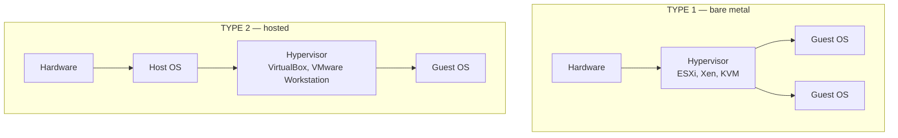
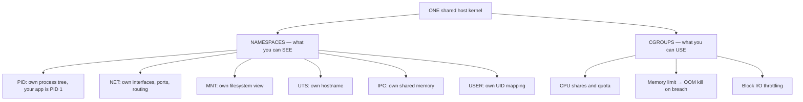

# Virtualisation, Containers & OS Security

`Week 5` · Operating Systems

---

## Virtual machines



| | Type 1 (bare metal) | Type 2 (hosted) |
|---|---|---|
| Runs on | hardware directly | on top of a host OS |
| Performance | **near-native** | slower — two OS layers |
| Use | **data centres, cloud** | developer laptops |

### How virtualisation actually works

| Technique | How | Speed |
|---|---|---|
| Full virtualisation (binary translation) | rewrite privileged instructions at runtime | slow |
| **Paravirtualisation** | the guest OS is *modified* to call the hypervisor | fast, needs guest changes |
| **Hardware-assisted** (Intel VT-x / AMD-V) | the CPU provides a ring **−1** for the hypervisor | **fast, the modern default** |

Memory needs **two levels** of translation (guest virtual → guest physical → host physical), which hardware Extended Page Tables accelerate.

---

## Containers — namespaces + cgroups

**A container is not a lightweight VM.** It is **just a process** with a restricted view and capped resources.



> **Naming namespaces and cgroups specifically** is what separates a real answer from "containers are lightweight VMs".

### VM vs container

| | VM | Container |
|---|---|---|
| Isolation | **hardware-level, strong** | kernel-level, weaker |
| Boot | minutes | **milliseconds** |
| Overhead | full guest OS each | negligible |
| Density | tens per host | **hundreds** |
| Different OS kernel | ✅ | ❌ |
| Security boundary | strong | **a kernel exploit escapes it** |

**When VMs still win:** untrusted multi-tenant code, compliance requiring hard isolation, or you need a different kernel.

**MicroVMs** (Firecracker, gVisor) are the middle ground — VM-grade isolation with container-like startup. That is what AWS Lambda actually runs on.

### Container images — layers and copy-on-write

```
  ┌──────────────────────────┐  ← writable container layer (COW)
  ├──────────────────────────┤
  │ COPY app/                │  ← read-only image layers,
  ├──────────────────────────┤     SHARED between all containers
  │ RUN pip install ...      │     from the same image
  ├──────────────────────────┤
  │ FROM python:3.12         │
  └──────────────────────────┘

  100 containers from one image share every read-only layer.
  Only their writes consume extra space.
```

**Why layer order matters in a Dockerfile:** put rarely-changing steps first. Changing one layer invalidates every layer below it in the cache.

---

## OS security

### Access control

```
  DAC  Discretionary      the OWNER sets permissions      (Unix rwx)
       → flexible, but a compromised process inherits the user's rights

  MAC  Mandatory          a central POLICY decides, the owner cannot
       → SELinux, AppArmor. Contains a compromised process.

  RBAC Role-Based         permissions attach to roles
       → Kubernetes RBAC, database roles
```

### Unix permissions

```
  -rwxr-xr--   1 alice devs  file.sh
   │└┬┘└┬┘└┬┘
   │ │  │  └── other:  r--  (4)
   │ │  └───── group:  r-x  (5)
   │ └──────── owner:  rwx  (7)
   └────────── type:   - file, d directory, l symlink

   chmod 754 file.sh

  SPECIAL BITS
    setuid (4000)  run with the OWNER's privileges  ← classic escalation vector
    setgid (2000)  run with the group's privileges
    sticky (1000)  only the owner may delete (used on /tmp)
```

### Principle of least privilege

```
  ╔════════════════════════════════════════════════════════════╗
  ║ Give every process the MINIMUM privileges it needs.        ║
  ║                                                            ║
  ║   ✗ running a container as root                            ║
  ║   ✗ a service account with wildcard permissions            ║
  ║   ✗ setuid binaries that don't need it                     ║
  ║                                                            ║
  ║ Linux CAPABILITIES split root into ~40 distinct rights —   ║
  ║ grant CAP_NET_BIND_SERVICE instead of full root just to    ║
  ║ bind port 80.                                              ║
  ╚════════════════════════════════════════════════════════════╝
```

### Common attack classes

| Attack | Mechanism | Defence |
|---|---|---|
| **Buffer overflow** | write past a buffer, overwrite the return address | bounds checking, **ASLR**, stack canaries, NX bit |
| Privilege escalation | exploit a setuid binary or kernel bug | least privilege, patching, MAC |
| TOCTOU race | check then use — state changes in between | atomic operations, `openat` with flags |
| Side channel | infer secrets from **timing** or cache behaviour | constant-time crypto |
| Spectre / Meltdown | speculative execution leaks across boundaries | microcode + kernel page-table isolation |

```
  ASLR — Address Space Layout Randomisation
     randomise where the stack, heap and libraries load
     → an attacker cannot predict the address to jump to

  NX / DEP — mark the stack non-executable
     → injected shellcode on the stack cannot run
```

---

## Real-time operating systems

```
  HARD REAL-TIME    missing a deadline is a SYSTEM FAILURE
                    pacemakers, airbags, flight control

  SOFT REAL-TIME    missing a deadline degrades quality
                    video streaming, VoIP
```

| Scheduling | How |
|---|---|
| **Rate Monotonic** | shorter period → higher priority (static) |
| **Earliest Deadline First** | nearest deadline runs first (dynamic, optimal) |

RTOS design prioritises **predictability over throughput**: bounded interrupt latency, no unbounded priority inversion (hence **priority inheritance** — the Mars Pathfinder fix), often no virtual memory at all because page faults are unpredictable.

---

## Interview checklist

- [ ] Type 1 vs Type 2 hypervisors
- [ ] Hardware-assisted virtualisation (ring −1)
- [ ] **Containers = namespaces + cgroups**, sharing one kernel
- [ ] VM vs container: the security boundary difference
- [ ] Image layers and copy-on-write; Dockerfile ordering
- [ ] DAC vs MAC vs RBAC; Unix permission bits; setuid risk
- [ ] Least privilege and Linux capabilities
- [ ] Buffer overflow + ASLR/NX/canaries
- [ ] Hard vs soft real-time; rate monotonic vs EDF
