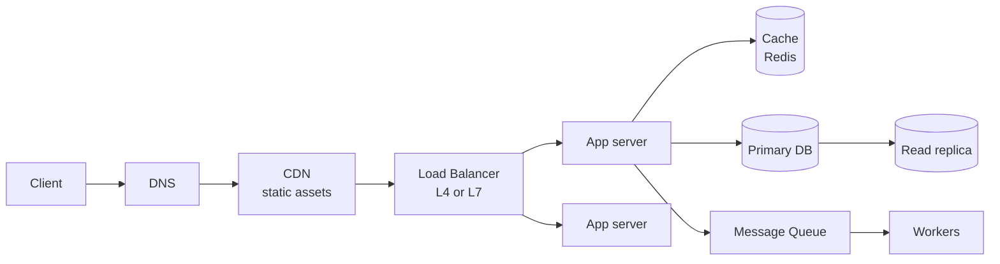
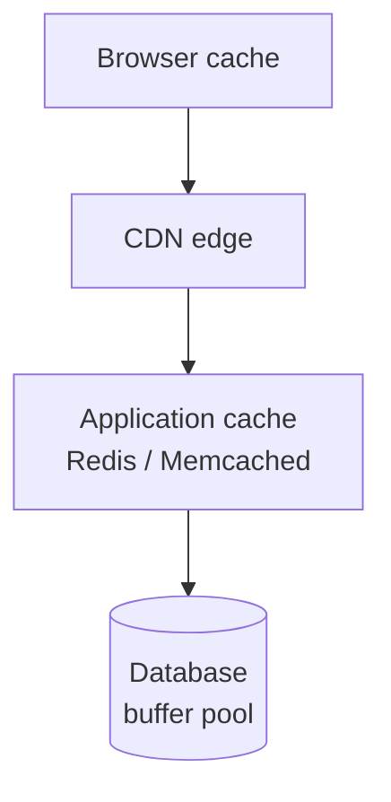
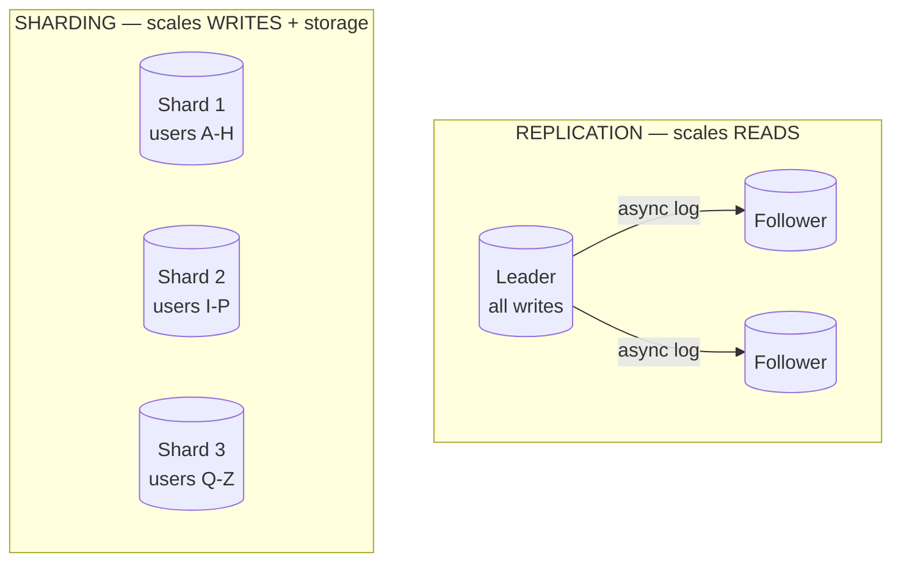
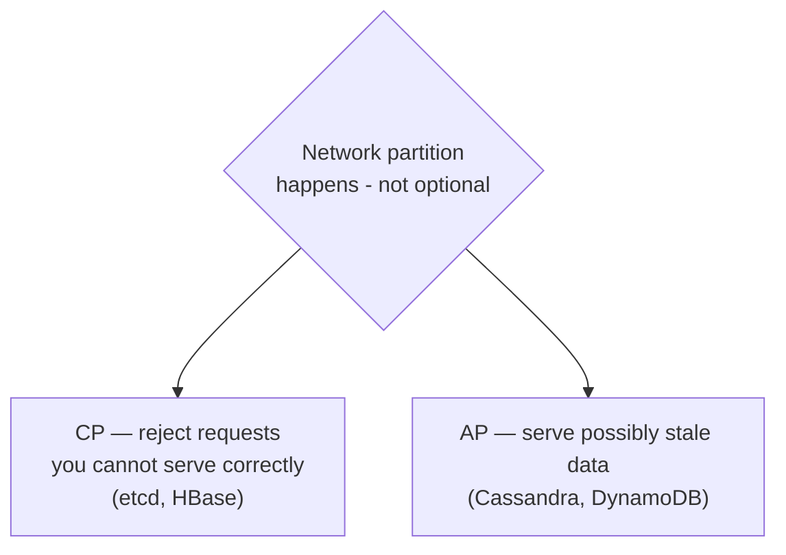
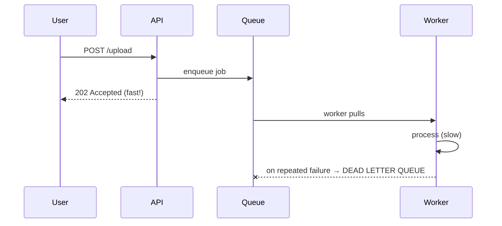
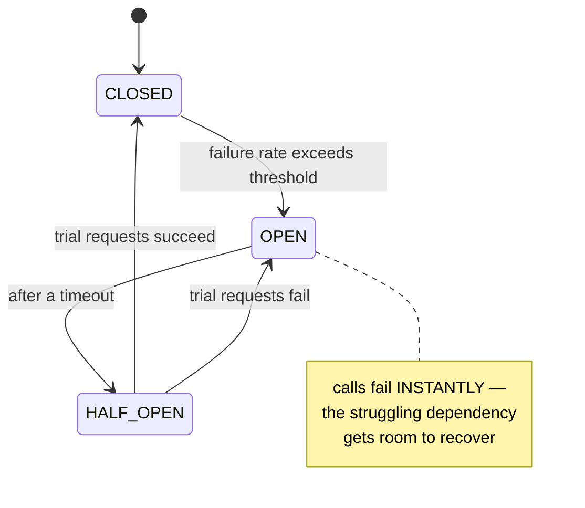
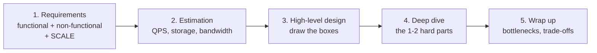

# System Design — Building Blocks

`Weeks 18–26` · System Design

## The request path



Learn to draw this from memory. Nearly every design starts here and then specialises.

## Caching — where and what



| Pattern | Write path | Trade-off |
|---|---|---|
| **Cache-aside** | app writes DB, invalidates cache | most common; stale window on failure |
| Read-through | cache loads on miss | simpler app code |
| Write-through | write cache + DB together | consistent, slower writes |
| Write-back | write cache, flush async | fastest, **can lose data** |

```
  ╔═════════════════════════════════════════════════════════╗
  ║ THUNDERING HERD / CACHE STAMPEDE                        ║
  ║                                                         ║
  ║ A popular key expires → 1000 concurrent requests all    ║
  ║ miss → all hit the DB at once → DB falls over.          ║
  ║                                                         ║
  ║ Fixes: a mutex so only one caller recomputes,           ║
  ║        probabilistic early expiry,                      ║
  ║        stale-while-revalidate                           ║
  ╚═════════════════════════════════════════════════════════╝
```

## Replication and sharding



**Replication lag** is the classic bug: a user writes, immediately reads from a follower, and does not see their own change.

> **Fix:** route a user's reads to the **leader** for a few seconds after they write (read-your-own-writes). Great detail to raise unprompted.

**Sharding is a last resort** — after replication, caching and vertical scaling are exhausted. Say that. A bad shard key creates hot spots (the celebrity problem), and cross-shard joins become impossible.

## Consistent hashing

```
  naive:  hash(key) % N     →  change N, and ALMOST EVERY key moves

  ring:            0
              ┌────●────┐
          N3 ●         ● N1        a key belongs to the first
              │   key   │          node CLOCKWISE from it
              │    ●    │
          ────●─────────●────       adding N4 steals keys from
             N2        N4           its neighbour ONLY → ~K/N move
```

**Virtual nodes** (each physical node placed at many ring positions) even out the distribution and let you weight bigger machines.

## CAP and consistency



> **"Pick 2 of 3" is wrong.** Partitions are not optional, so you are only ever choosing between C and A. Real systems are **tunable per operation**.

Say which you pick **per feature**: bank balance → strong. Like count → eventual. That nuance is what separates candidates.

## Queues and async work



Anything slower than ~100ms that the user does not need to wait for belongs here. Consumers **must be idempotent** — retries mean duplicate delivery.

### The dual-write problem, and the outbox fix

```
  ✗ write to DB, then publish to Kafka
      → publish fails → data exists with no event → permanent drift

  ✓ TRANSACTIONAL OUTBOX
      write the business row AND an outbox row in ONE local transaction
      a relay process (or CDC) publishes outbox rows afterwards
      → atomicity without distributed transactions
```

## Rate limiting

| Algorithm | Behaviour |
|---|---|
| **Token bucket** | refills at a fixed rate — **allows bursts** |
| Leaky bucket | drains at a constant rate — smooths output |
| Fixed window | simple counter — allows 2× burst at the boundary |
| Sliding window counter | the usual production compromise |

Place it at the **edge** so bad traffic dies early. Return `429` with `Retry-After`.

## Reliability



Pair the circuit breaker with **timeouts** and **retries with exponential backoff + jitter**. Jitter is the part people forget — without it, every client retries in lockstep and re-creates the stampede.

## Back-of-the-envelope

```
  DAU × actions/day = daily requests
  ÷ 86,400          = average QPS
  × 2-10            = peak QPS

  storage = records/day × bytes/record × retention

  LATENCY NUMBERS
    memory read          ~100 ns
    SSD random read      ~100 µs
    same-DC round trip   ~0.5 ms
    cross-continent RTT  ~150 ms
```

**Do this early in every design interview.** Example: 10K input + 1K output tokens at $5/$25 per Mtok ≈ $0.075/call; at 1M calls/day that is $75K/day — a number that reframes the whole architecture.

## The interview framework



Spend the first 5 minutes on requirements. Candidates who start drawing immediately design the wrong system.

## Interview checklist

- [ ] Draw the standard request path from memory
- [ ] Cache patterns + the thundering herd fix
- [ ] Replication lag → read-your-own-writes
- [ ] Why sharding is a last resort; what a bad shard key does
- [ ] Consistent hashing, and why virtual nodes exist
- [ ] CAP stated correctly — and chosen **per feature**
- [ ] Outbox pattern for the dual-write problem
- [ ] Circuit breaker states; retries with **jitter**
- [ ] Estimation arithmetic, out loud
