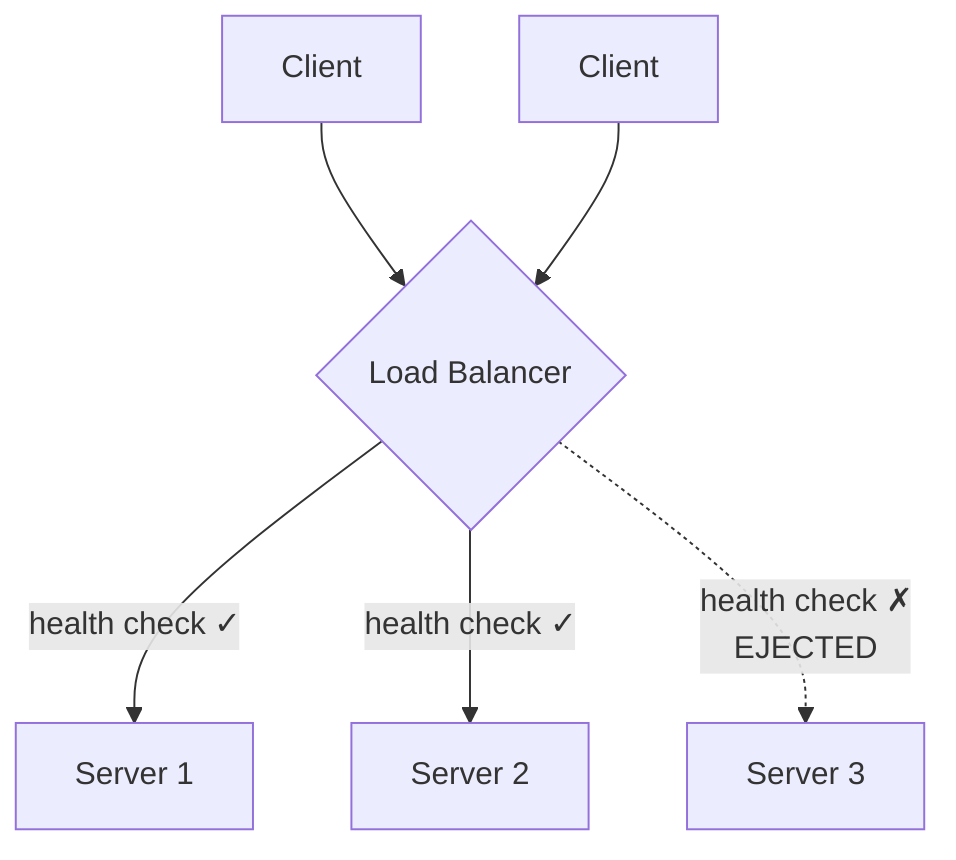
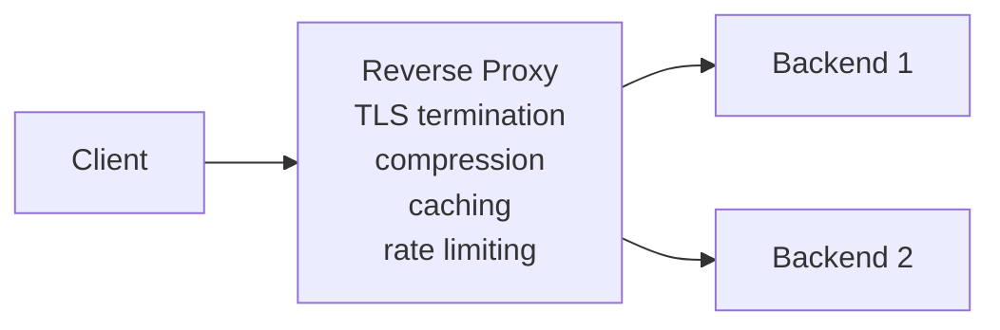
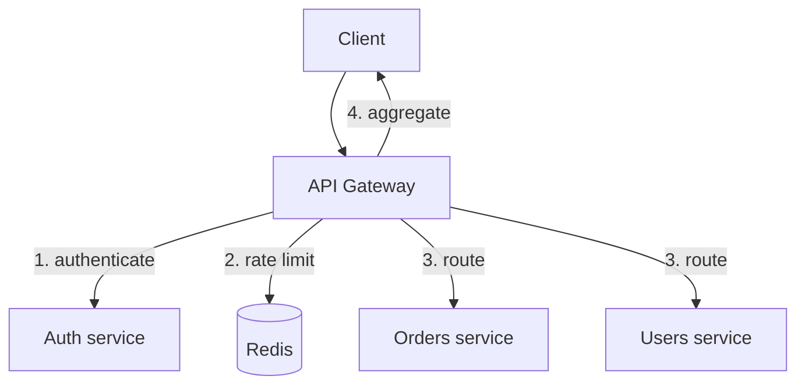
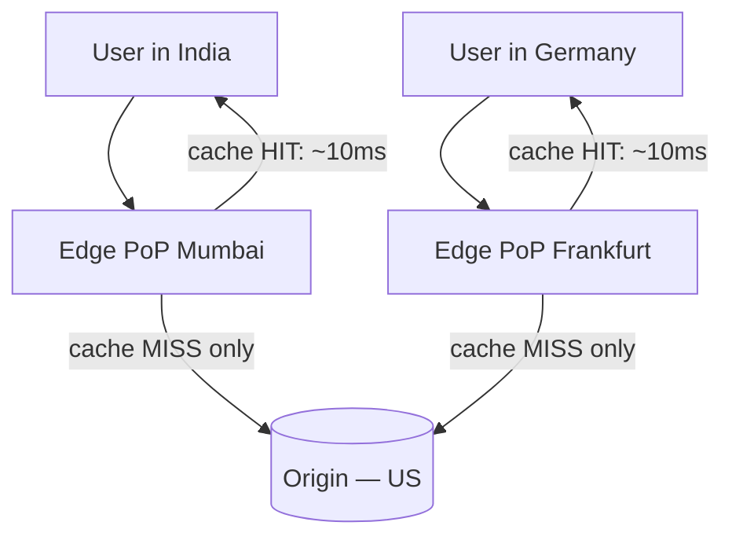

# Edge Layer — DNS, CDN, Load Balancers, Gateways

`Week 19` · System Design

Everything between the user and your application servers.

---

## Load Balancer

**What it is** — distributes incoming requests across multiple backend servers.

**Problem it solves** — one server cannot handle all traffic, and if it dies you have an outage. A LB gives you horizontal scale *and* redundancy.

### How it works



**L4 vs L7 — the distinction that gets asked:**

```
  L4 (TRANSPORT)                    L7 (APPLICATION)
  ─────────────────────────────     ─────────────────────────────
  sees: IP + port only              sees: the full HTTP request
  routes on: connection             routes on: path, header, cookie
  cannot read the payload           can do /api → service A
                                              /img → service B
  FASTER, protocol-agnostic         SLOWER (parses HTTP), smarter
  works for any TCP protocol        HTTP/gRPC only
                                    can terminate TLS, compress, cache
```

**Algorithms:**

| Algorithm | Use when |
|---|---|
| Round robin | servers are identical, requests are uniform |
| Weighted RR | servers have different capacity |
| **Least connections** | request durations vary a lot |
| IP hash | you need the same client on the same server |
| Least response time | latency-sensitive, heterogeneous backends |

### Advantages
- Horizontal scaling becomes possible at all
- Removes the single point of failure in the app tier
- Zero-downtime deploys (drain one server at a time)
- Can terminate TLS centrally

### Disadvantages
- **Becomes a single point of failure itself** unless deployed as a redundant pair with a floating IP
- Adds a network hop (~1ms)
- L7 inspection costs real CPU
- **Sticky sessions undermine even distribution** and break when a server dies

### When to use / not use

| Use | Don't use |
|---|---|
| Any service with >1 instance | A single-instance internal tool |
| L4 for raw throughput, non-HTTP, or TCP passthrough | L7 when you only need round-robin — you're paying CPU for nothing |
| L7 when you need path/header routing or TLS termination | |

**Examples:** NGINX, HAProxy, AWS ALB (L7) / NLB (L4), Envoy

---

## Reverse Proxy

**What it is** — sits in *front* of your servers; clients never talk to backends directly.

> A load balancer **is** a kind of reverse proxy. Say "reverse proxy" when emphasising the single entry point, "load balancer" when emphasising distribution.



**Forward proxy is the mirror image** — it sits in front of *clients* and makes outbound requests on their behalf. The destination sees the proxy's IP, not the client's. Used for corporate egress filtering. Knowing the distinction is a common question.

### Advantages
- Hides backend topology
- Centralises TLS, caching, compression, security
- Path-based routing to different services
- Backends never directly exposed

### Disadvantages
- Extra hop and a potential bottleneck
- Misconfiguration leaks or mangles headers (`X-Forwarded-For` handling is a classic bug)
- Another component to operate

**Examples:** NGINX, Envoy, Traefik, Caddy

---

## API Gateway

**What it is** — a single managed entry point that handles cross-cutting concerns before requests reach your services.

**Problem it solves** — in a microservices system, every service would otherwise reimplement auth, rate limiting, logging and versioning. Duplicated and inconsistent.



### Advantages
- One place for auth, throttling, observability
- Clients see one stable API surface
- Can aggregate several backend calls into one response → fewer client round trips
- Protocol translation (REST in → gRPC out)

### Disadvantages
- **Single point of failure and a bottleneck**
- Becomes a "god object" full of business logic if undisciplined
- Adds latency
- Another deployment to version and manage

### When to use / not use

| Use | Don't use |
|---|---|
| Multiple backend services + external clients | A single service — it's pure overhead |
| You need per-client rate limiting and API keys | Internal service-to-service (use a service mesh) |

**Examples:** Kong, AWS API Gateway, Apigee, Envoy

---

## CDN

**What it is** — globally distributed edge caches serving content from near the user.

**Problem it solves** — **latency is bounded by physics.** A user in India hitting a US origin pays ~250ms RTT no matter how fast your servers are.



**Pull CDN** caches on first request (lazy, simple). **Push CDN** is pre-loaded by you (good for large files with predictable demand).

### Advantages
- Massive latency reduction
- Absorbs traffic spikes; offloads bandwidth cost from origin
- DDoS absorption and TLS termination at the edge

### Disadvantages
- Costs per GB
- **Cache invalidation is genuinely hard**
- Useless for highly personalised or rapidly changing data
- Stale content if TTLs are wrong

### When to use / not use

| Use | Don't use |
|---|---|
| Static assets: images, video, JS/CSS | Per-user dynamic responses |
| Cacheable API GETs | Anything with a `Set-Cookie` you'd cache publicly |

**The production pattern:** hash the filename (`app.a3f9b2.js`), serve with `max-age=31536000, immutable`. Invalidation becomes free — a change produces a new URL.

**Examples:** Cloudflare, CloudFront, Akamai, Fastly

---

## Rate Limiter

**What it is** — caps how many requests a client may make in a window.

```
  TOKEN BUCKET                      LEAKY BUCKET
  ┌─────────────┐                   ┌─────────────┐
  │ ● ● ● ● ●   │ ← refills at      │ ▓▓▓▓▓▓▓▓▓   │ ← requests queue
  │             │   a fixed rate    │             │
  └──────┬──────┘                   └──────┬──────┘
         │ each request                    │ drains at a
         ▼ consumes one token              ▼ CONSTANT rate
    ALLOWS BURSTS                     SMOOTHS OUTPUT
    (bucket can fill up)              (no bursts through)
```

| Algorithm | Behaviour | Downside |
|---|---|---|
| **Token bucket** | allows bursts | — most common |
| Leaky bucket | constant output rate | no bursts at all |
| Fixed window | trivial counter | **2× burst at the boundary** |
| Sliding window log | exact | memory-heavy |
| Sliding window counter | good approximation | the usual production choice |

```
  FIXED WINDOW BOUNDARY PROBLEM — limit 100/min

   minute 1                    minute 2
   ...................|100 reqs|100 reqs|...................
                      59s      60s      61s
                              ▲
                    200 requests in 2 seconds, both "within limit"
```

### Advantages
- Protects downstream services and controls cost
- Enables paid tiers
- Mitigates brute-force and scraping

### Disadvantages
- Distributed limiting needs shared state (Redis) → latency + a dependency
- Race conditions under concurrency (use Lua scripts for atomicity)
- Too strict → breaks legitimate bursty clients

**Place it at the edge** so bad traffic dies early. Return `429` with `Retry-After`.

---

## WAF & DDoS Protection

**What it is** — filters malicious traffic before it reaches the application.

### Advantages
- Blocks OWASP-class attacks without app changes
- Absorbs volumetric floods you could never provision for

### Disadvantages
- **False positives block real users**
- Rules need constant maintenance
- Sophisticated application-layer attacks still get through

Usually bundled with your CDN — which is the natural place for it.

---

## Interview checklist

- [ ] L4 vs L7 — what each can and cannot see
- [ ] LB algorithms and when each fits
- [ ] Reverse vs forward proxy
- [ ] Why a CDN exists (latency is physics)
- [ ] Token vs leaky bucket; the fixed-window boundary problem
- [ ] Where to place the rate limiter and why
