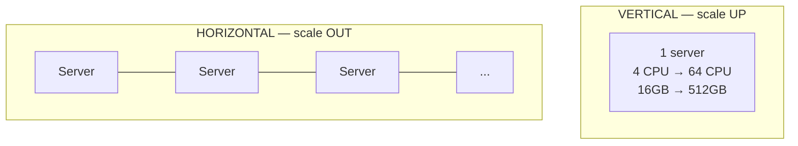
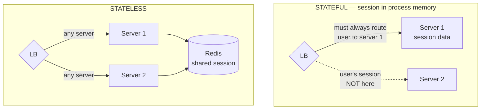
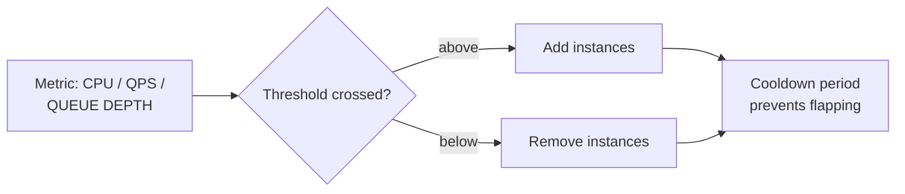
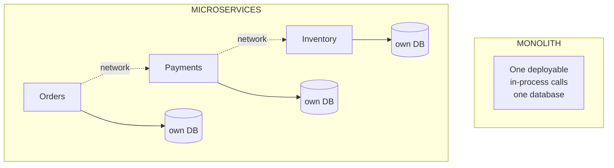

# Scaling — Vertical, Horizontal, Stateless

`Week 18` · System Design

---

## Vertical vs Horizontal Scaling

| | Vertical | Horizontal |
|---|---|---|
| Complexity | **trivial** — no code change | needs statelessness, LB, coordination |
| Ceiling | **hard hardware limit** | effectively unlimited |
| Failure | **single point of failure** | survives node loss |
| Cost curve | superlinear (big machines cost disproportionately) | roughly linear |
| Downtime to scale | usually requires a restart | add a node, no downtime |

### When to use which

| Vertical | Horizontal |
|---|---|
| Early stage — buy time, avoid complexity | Traffic exceeds one machine |
| **Databases** — much harder to scale out | Stateless app tiers |
| Workloads needing shared memory | You need fault tolerance |

> **The honest answer:** scale vertically first. It's cheaper in engineering time than premature distribution. Scale out when you hit a real ceiling — or when you need redundancy, which is often the *actual* reason.

---

## Stateless Services — the most important scaling decision

**What it is** — an instance holds no client-specific data between requests.

Session state moves **out** of the process — into a shared store (Redis) or into the client as a signed token (JWT).

### Advantages
- Any instance can serve any request → trivial horizontal scaling
- Any instance can die without user-visible impact
- Simple deploys and autoscaling
- No sticky sessions needed

### Disadvantages
- Every request may need a session lookup (latency)
- That store becomes a critical dependency
- Tokens can grow large and are sent on every request

> **Make services stateless unless you have a specific reason not to.** This is the single highest-leverage architectural decision, and it's the one interviewers check first.

---

## Autoscaling

### Advantages
- Cost tracks demand instead of peak
- Handles unexpected spikes without paging anyone

### Disadvantages
- **Scaling takes minutes** — too slow for a sudden spike. Pre-warm before known events (a sale, a launch).
- **Scaling on CPU is often the wrong signal.** Queue depth or request latency usually tracks real load better.
- A scaling loop can amplify a failure (more instances hammering a dying database)
- **Databases do not autoscale** like stateless tiers

### When to use / not use

| Use | Don't use |
|---|---|
| Stateless tiers with variable load | Stateful services — scaling them is a data migration |
| Queue-backed workers (scale on queue depth) | When your bottleneck is the DB — more app servers make it worse |

Always pair with a load test so you know your per-instance capacity, and keep headroom.

---

## Monolith vs Microservices

| | Monolith | Microservices |
|---|---|---|
| Deploy | all at once | independently |
| Transactions | **real ACID, trivial** | no distributed transactions → sagas |
| Failure mode | one bad deploy kills everything | partial failure, needs circuit breakers |
| Debugging | a stack trace | distributed tracing across services |
| Team scaling | contention on one codebase | team autonomy |
| Latency | in-process function call | network hop per call |

### When to use / not use

| Monolith | Microservices |
|---|---|
| **Start here. Almost always.** | 50+ engineers with real coordination pain |
| Small team, unclear domain boundaries | Components with genuinely divergent scaling needs |
| You need real transactions | You need independent deploy cadence |

> **"Distributed monolith"** — services that must be deployed together — is the worst of both worlds. If your services can't deploy independently, you've paid the cost and got none of the benefit.

Saying *"I'd start with a modular monolith and split when team size forces it"* signals judgement, not inexperience.

---

## Interview checklist

- [ ] Vertical vs horizontal, and why you start vertical
- [ ] Why stateless is the key enabler
- [ ] Autoscaling: why CPU is often the wrong metric
- [ ] Why scaling takes minutes and what to do about known spikes
- [ ] Monolith-first, and what a distributed monolith is
