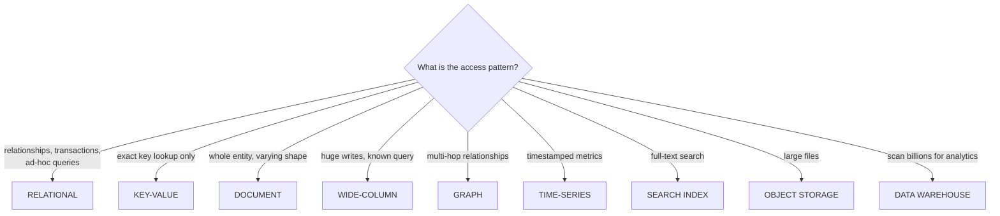
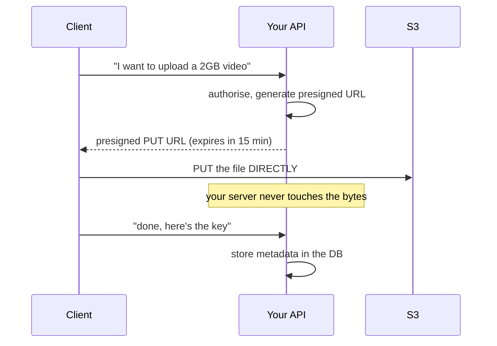
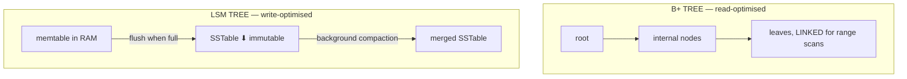

# Databases — Choosing the Right Store

`Week 20` · System Design

---

## The decision



---

## Relational (SQL)

**How it works** — rows in tables, foreign keys enforce integrity, B+ tree indexes give O(log n) lookups, a **write-ahead log** gives durability and crash recovery, **MVCC** lets readers and writers proceed without blocking each other.

### Advantages
- **Real ACID transactions** across multiple rows and tables
- Powerful ad-hoc queries and joins — you don't have to know the questions in advance
- Schema enforcement prevents bad data
- Decades of tooling, expertise and operational knowledge
- Strong consistency by default

### Disadvantages
- Vertical scaling has a ceiling
- Horizontal **write** scaling requires sharding, which is painful
- Schema migrations on huge tables are risky
- Cross-shard joins are effectively impossible

### When to use / not use

| Use | Don't use |
|---|---|
| **The default. Pick it unless you have a reason not to.** | Petabyte-scale write-heavy ingestion |
| Money, orders, inventory — anything where partial writes are unacceptable | Truly schemaless, wildly varying data |
| You don't yet know all the queries | You need >100k writes/sec on one logical table |

> *"Postgres until it hurts"* is a defensible, mature answer. Say it.

**Examples:** PostgreSQL, MySQL, Aurora

---

## Key-Value Store

**How it works** — a distributed hash table, usually partitioned by consistent hashing. Only `GET`, `PUT`, `DELETE` by key. Values are opaque blobs.

### Advantages
- Extremely fast, often sub-millisecond
- Scales horizontally almost linearly
- Simple to reason about and operate

### Disadvantages
- **You can ONLY query by exact key** — no range scans, no secondary lookups, no joins
- Relationships must be modelled in the application
- Often eventually consistent

### When to use / not use

| Use | Don't use |
|---|---|
| Sessions, caching, feature flags, rate-limit counters | You need to query by anything other than the key |
| User profiles by ID, shopping carts | Reporting or analytics |

**Examples:** Redis, DynamoDB, Riak

---

## Document Store

**How it works** — self-contained JSON documents in collections. Related data is **embedded** rather than joined, so one read fetches the whole entity. Any field can be indexed.

### Advantages
- Flexible schema — fast iteration when the shape is still changing
- Whole entity in one read, no joins
- Maps naturally to application objects
- Horizontal scaling built in

### Disadvantages
- **No schema enforcement** — bad data creeps in over time
- Joins are weak or absent
- Denormalisation means updating duplicated data in many places
- Cross-document transactions are limited

### When to use / not use

| Use | Don't use |
|---|---|
| Content management, product catalogues with varying attributes | Heavily relational data |
| User-generated content, event logging | Anything needing multi-entity transactions |

**Examples:** MongoDB, Couchbase, Firestore

---

## Wide-Column Store

**How it works** — data partitioned by **partition key**, sorted by **clustering key** within the partition. Writes land in a memtable, flush to immutable SSTables (**LSM tree**), compacted in the background. Tuneable consistency via quorum.

```
  PRIMARY KEY ((user_id), message_time)
               └── partition ──┘ └─ clustering ─┘
                      │                │
            decides WHICH NODE    decides SORT ORDER
                                  within that partition

  → you can efficiently query "last 50 messages for user X"
  → you CANNOT query "all messages containing 'hello'"
```

### Advantages
- **Exceptional write throughput** (append-only LSM)
- Linear horizontal scaling
- No single point of failure (peer-to-peer)
- Tuneable consistency per query
- Efficient range scans within a partition

### Disadvantages
- **You must design the table around the query** — ad-hoc queries are impossible
- No joins
- Data is duplicated across tables, one per access pattern
- Eventual consistency by default
- Operationally complex

### When to use / not use

| Use | Don't use |
|---|---|
| Chat messages, time-series metrics, activity feeds | You don't know the query patterns yet |
| Write-heavy with a **known** access pattern | You need joins or ad-hoc reporting |

**Examples:** Cassandra, ScyllaDB, HBase, Bigtable

---

## Graph Database

**How it works** — nodes and edges are first-class. Traversal follows direct pointers, so cost depends on the **subgraph explored**, not total dataset size.

### Advantages
- Multi-hop relationship queries are fast and natural to express
- "Friends of friends who like X" is one query, not a recursive join

### Disadvantages
- Niche technology, smaller ecosystem and talent pool
- Poor at aggregate analytics over the whole dataset
- **Horizontal scaling is hard** — graphs resist partitioning

### When to use / not use

| Use | Don't use |
|---|---|
| Social networks, fraud rings, permission hierarchies | Relationships are only 1–2 hops (SQL joins are fine) |
| Recommendation engines, knowledge graphs | It's not your primary access pattern |

**Examples:** Neo4j, Neptune, JanusGraph

---

## Search Index

**How it works** — documents are tokenised, normalised (lowercase, stem, remove stop words) and written into an **inverted index**: term → list of document IDs with positions. Queries score matches with BM25.

```
  documents:  D1 "the quick brown fox"
              D2 "quick brown dogs"

  INVERTED INDEX
    quick  → [D1, D2]
    brown  → [D1, D2]
    fox    → [D1]
    dogs   → [D2]

  query "quick fox" → intersect [D1,D2] ∩ [D1] = D1
```

### Advantages
- Fast full-text search over huge corpora
- Relevance ranking, fuzzy matching, autocomplete, faceting

### Disadvantages
- **It is a SECONDARY index, not a source of truth** — you must keep it in sync
- Near-real-time, not real-time (indexing lag)
- Memory hungry; reindexing is expensive
- Operationally demanding

> **Always keep authoritative data in your primary store** and feed the index via CDC or a queue. The correct answer to *"how do you keep the search index up to date"* is **change data capture**, not dual writes.

**Examples:** Elasticsearch, OpenSearch, Typesense

---

## Object / Blob Storage

**How it works** — files stored as objects in buckets with a key and metadata, replicated across AZs, accessed over HTTP. **Presigned URLs** let clients upload and download directly without proxying through your servers.



### Advantages
- Effectively unlimited capacity, very cheap per GB
- 11 nines durability
- Integrates directly with CDNs
- **Presigned URLs remove all that load from your servers**
- Storage tiers cut cost for cold data

### Disadvantages
- High latency vs a database or local disk
- No partial updates — objects are replaced wholly
- **No query capability** — you need a separate metadata store
- Per-request costs add up with many small objects

### When to use / not use

| Use | Don't use |
|---|---|
| Images, video, backups, user uploads, data lake | Anything you need to query by content |
| **Store the FILE here, its METADATA in a database** | Millions of tiny objects (request cost) |

**Examples:** S3, GCS, Azure Blob

---

## Data Warehouse

**How it works** — **columnar** storage: values for one column stored contiguously, so a query touching 3 of 200 columns reads only those 3 and compresses them extremely well. Massively parallel execution.

```
  ROW STORE (OLTP)            COLUMN STORE (OLAP)
  ┌──────────────────┐        ┌────┬────┬────┬────┐
  │ id name age city │        │ id │name│age │city│
  │ 1  alice 30 NYC  │        │ 1  │alic│ 30 │NYC │
  │ 2  bob   25 SF   │        │ 2  │bob │ 25 │SF  │
  └──────────────────┘        └────┴────┴────┴────┘
   reads a WHOLE ROW           SELECT avg(age) reads
   fast for "get user 1"       ONLY the age column
```

### Advantages
- Aggregations over billions of rows in seconds
- Excellent compression (similar values adjacent)
- **Isolates analytics from production traffic**

### Disadvantages
- Not for single-row lookups or transactional writes
- Data is minutes-to-hours stale
- Expensive at scale

> **OLTP vs OLAP.** Knowing when *not* to query production is a mark of seniority. Running heavy analytics on your production DB competes with user traffic and can take the site down.

**Examples:** Snowflake, BigQuery, Redshift, ClickHouse

---

## Indexing — B+ tree vs LSM tree



| | B+ tree | LSM tree |
|---|---|---|
| Writes | update in place — slower | **append-only — fast** |
| Reads | one path, O(log n) | may check several SSTables (bloom filters help) |
| Range scans | **excellent** — linked leaves | good within a partition |
| Space | some fragmentation | write amplification from compaction |
| Used by | Postgres, MySQL | Cassandra, RocksDB, LevelDB |

**Leftmost prefix rule** — an index on `(a, b, c)` serves `a`, `(a,b)`, `(a,b,c)` — but **not** `b` alone.

**Every index slows writes.** Over-indexing is a real production mistake.

---

## Interview checklist

- [ ] Walk the decision tree out loud for a given workload
- [ ] Relational is the default — justify moving away from it
- [ ] Wide-column: you design the table around the query
- [ ] Search index is not a source of truth → CDC
- [ ] File in blob storage, metadata in the DB; presigned URLs
- [ ] OLTP vs OLAP, and why analytics doesn't belong on production
- [ ] B+ tree vs LSM tree, and which workload each suits
