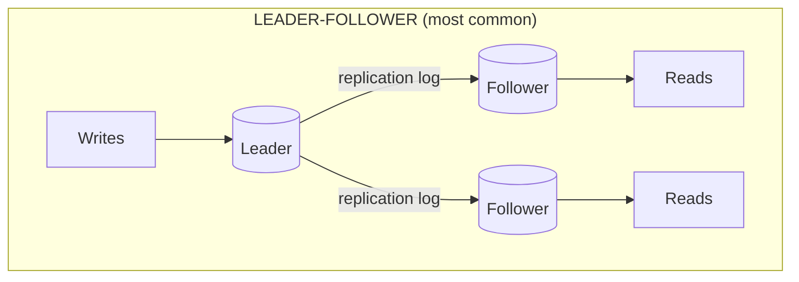
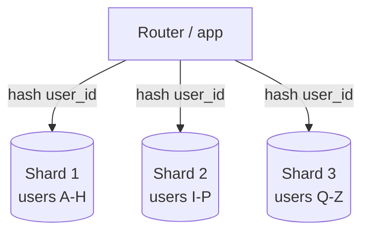
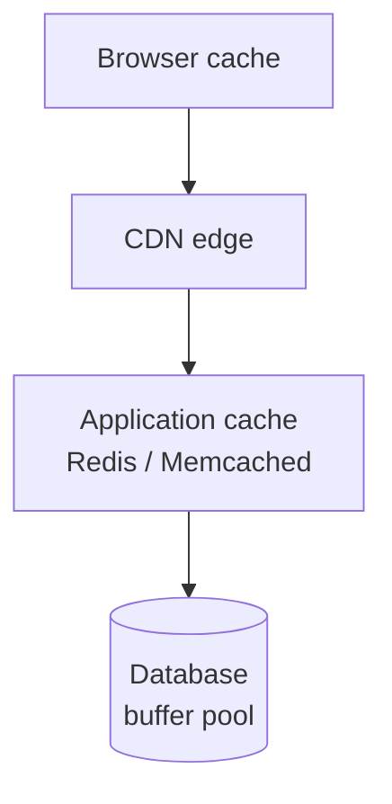
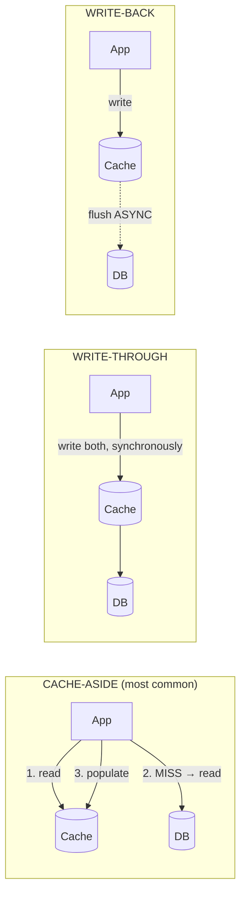
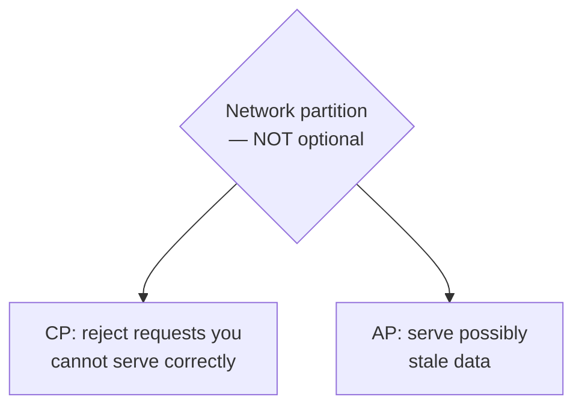

# Replication, Sharding & Caching

`Week 21` · System Design

---

## Replication

**What it is** — keeping copies of the same data on multiple machines.

**Problem it solves** — a single database is both a single point of failure and a read-throughput ceiling.



| Topology | Writes accepted by | Use for |
|---|---|---|
| **Leader-follower** | leader only | the default — read scaling + HA |
| Multi-leader | several nodes | multi-region writes; needs conflict resolution |
| Leaderless (quorum) | any node, W of N | Dynamo-style; R + W > N for strong-ish reads |

### Advantages
- Read scaling by adding followers
- High availability via failover
- Geographic distribution reduces read latency
- Followers can serve backups and analytics

### Disadvantages
- **Replication lag** — followers serve stale data
- Failover risks split brain and lost writes
- Multi-leader conflict resolution is genuinely hard
- **Does not scale writes at all** — every write still goes to the leader

### The replication-lag bug everyone hits

```
  t=0   user posts a comment        → written to LEADER
  t=1   page reloads, reads from a FOLLOWER
  t=2   follower hasn't caught up   → "my comment vanished!"
```

> **Fix: read-your-own-writes.** Route a user's reads to the **leader** for a few seconds after they write. Raising this unprompted is a strong signal.

---

## Sharding / Partitioning

**What it is** — splitting one logical dataset across multiple independent databases.

**Problem it solves** — replication scales reads but not writes. Eventually the dataset exceeds what one machine can hold or write to.



| Strategy | How | Problem |
|---|---|---|
| **Hash** | `hash(key) % N` | even distribution, but **destroys range queries** |
| **Range** | A–H, I–P, Q–Z | range queries work, but **hotspots** (everyone named S) |
| **Directory** | lookup service | flexible, but an extra hop and a SPOF |

### Advantages
- Scales writes and storage roughly linearly
- Smaller shards → faster indexes, backups, recovery
- Blast radius limited to one shard

### Disadvantages
- **Cross-shard joins and transactions are effectively impossible**
- A bad shard key creates **hot spots** — the celebrity problem
- Resharding is painful
- Every query must know or discover its shard
- Operational complexity multiplies

### When to use / not use

| Use | Don't use |
|---|---|
| **Only after** replication, caching and vertical scaling are exhausted | Before you have a measured write bottleneck |
| Write throughput or dataset size exceeds one machine | You still need cross-entity transactions |

> Say *"sharding is a last resort"* out loud. Candidates who reach for it immediately are designing for a problem they don't have.

**Choose a shard key with high cardinality and even access distribution.**

---

## Consistent Hashing

**Problem it solves** — with naive `hash(key) % N`, changing `N` remaps **almost every key**. Catastrophic for a cache or sharded store.

```
  naive:   10 nodes → 11 nodes   ≈ 90% of keys move

  RING:
                   0
              ┌────●────┐           a key belongs to the first
          N3 ●    key    ● N1       node CLOCKWISE from it
              │     ●    │
              └────●─────┘          adding N4 steals keys ONLY
                  N2                from its neighbour → ~K/N move
```

**Virtual nodes** — each physical node placed at many ring positions — even out the distribution and let you weight larger machines.

### Advantages
- Only ~K/N keys move when a node joins or leaves
- Scales incrementally, no central coordinator

### Disadvantages
- More complex than modulo
- **Without virtual nodes the distribution is uneven**
- Range queries still impossible

Worth being able to **implement** — it is occasionally asked as a coding question.

---

## Caching



### The patterns



| Pattern | Advantage | Disadvantage |
|---|---|---|
| **Cache-aside** | only caches what's asked for; cache failure isn't fatal | stale window; every miss costs 3 hops |
| Read-through | simpler app code | cache becomes a hard dependency |
| Write-through | cache always consistent | slower writes |
| Write-back | **fastest writes** | **can lose data** on cache failure |

### Eviction

| Policy | Evicts | Good for |
|---|---|---|
| **LRU** | least recently used | general purpose — the default |
| LFU | least frequently used | stable hot sets; clings to old hot keys unless aged |
| TTL | on expiry | data with a natural freshness bound |

> LRU here is **exactly LeetCode 146** — the hash map + doubly linked list. Same algorithm, same reason. Say that.

### Advantages
- Sub-millisecond reads; dramatically reduces DB load
- Cheap way to absorb read spikes
- Redis also gives you sorted sets (leaderboards), sets, streams

### Disadvantages
- **Cache invalidation is genuinely hard** — stale data is the classic bug
- Another moving part
- A cold cache after restart can stampede the database
- Memory is expensive
- Risks becoming a hidden source of truth

### Two failure modes to raise unprompted

```
  ╔══════════════════════════════════════════════════════════╗
  ║ THUNDERING HERD / CACHE STAMPEDE                         ║
  ║   popular key expires → 1000 concurrent misses → DB dies ║
  ║   fix: mutex so ONE caller recomputes,                   ║
  ║        probabilistic early expiry,                       ║
  ║        stale-while-revalidate                            ║
  ╠══════════════════════════════════════════════════════════╣
  ║ HOT KEY                                                  ║
  ║   one celebrity/trending item lands on ONE shard         ║
  ║   fix: per-key local cache in the app,                   ║
  ║        or split the key with a random suffix             ║
  ╚══════════════════════════════════════════════════════════╝
```

**Always set a TTL**, even when you also invalidate explicitly. It bounds the damage from a missed invalidation.

---

## CAP and consistency models



> **"Pick 2 of 3" is wrong.** Partitions happen whether you like it or not, so you are only ever choosing between **C** and **A**.

| Model | Guarantee |
|---|---|
| **Linearizable / strong** | every read sees the latest write |
| **Causal** | causally related ops seen in order (a reply never precedes its parent) |
| **Read-your-writes** | you always see your own changes |
| **Monotonic reads** | you never see time go backwards |
| **Eventual** | replicas converge, given no new writes |

**Choose per operation, not per system:** bank balance → strong. Like count → eventual. Own profile edit → read-your-writes.

---

## Interview checklist

- [ ] Replication topologies; replication lag → read-your-own-writes
- [ ] Why sharding is a last resort; hash vs range; the celebrity problem
- [ ] Consistent hashing and why virtual nodes exist
- [ ] Cache patterns and their trade-offs
- [ ] Thundering herd and hot key — with fixes
- [ ] CAP stated correctly, chosen per feature
