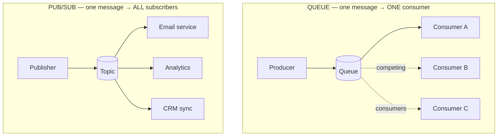
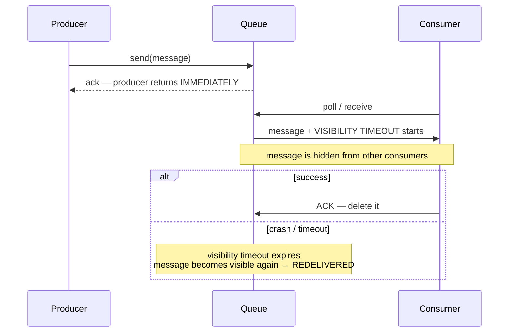
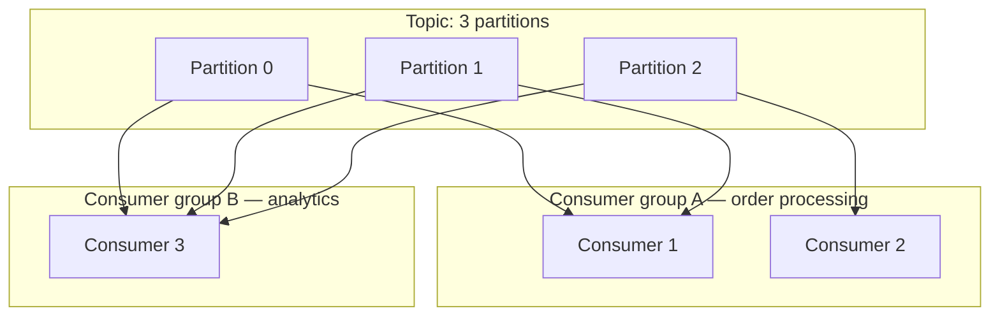
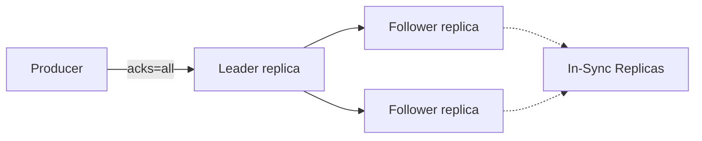
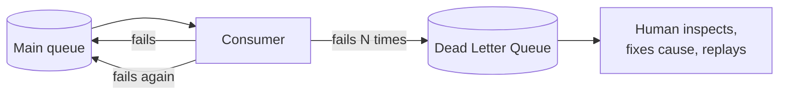
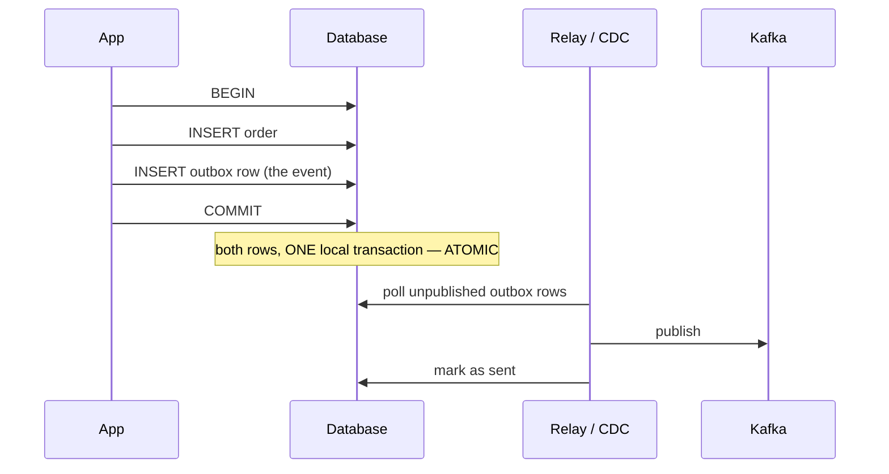
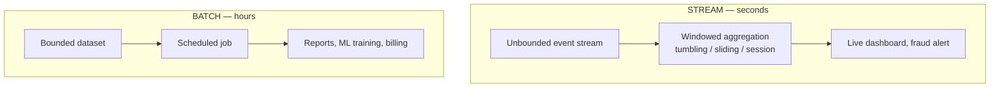

# Messaging — Queues, Pub/Sub & Kafka

`Week 22` · System Design

---

## Message Queue vs Pub/Sub — the distinction



| | Queue | Pub/Sub |
|---|---|---|
| Delivery | exactly one consumer in the group | **every** subscriber gets a copy |
| Use for | distributing **work** | broadcasting **events** |
| Adding a consumer | more throughput | a new reaction to the event |
| Example | image resize jobs | "user signed up" → email + analytics + CRM |

---

## Message Queue

**How it works**



### Advantages
- **Decouples** producer and consumer in time
- Absorbs traffic spikes — the queue is a shock absorber
- Consumers scale independently
- Automatic retries; producer latency stays low

### Disadvantages
- Eventual consistency — work isn't done when the API returns
- **Ordering is not guaranteed** by default
- **Duplicates happen** → consumers must be idempotent
- Queue depth needs monitoring
- A poison message can stall processing

### When to use / not use

| Use | Don't use |
|---|---|
| Anything slower than ~100ms the user needn't wait for | The user needs the result in the response |
| Emails, image processing, third-party API calls | You need strict global ordering (use Kafka partitions) |
| Smoothing bursty load | Sub-millisecond latency requirements |

**Examples:** RabbitMQ, Amazon SQS, Redis Streams

---

## Kafka — how it actually works

**What it is** — a durable, ordered, **replayable log** partitioned across a cluster. Not a queue: messages are **not deleted on consumption**.

### The core structure

```
  TOPIC "orders"  split into PARTITIONS

  Partition 0 │ msg0 │ msg1 │ msg2 │ msg3 │ ──► append only
              └──────┴──────┴──────┴──────┘
                0      1      2      3        ← OFFSET

  Partition 1 │ msg0 │ msg1 │ msg2 │
              └──────┴──────┴──────┘
                0      1      2

  Partition 2 │ msg0 │ msg1 │
              └──────┴──────┘
                0      1

  ╔═══════════════════════════════════════════════════════════╗
  ║ ORDERING IS GUARANTEED WITHIN A PARTITION, NEVER GLOBALLY ║
  ║                                                           ║
  ║ Messages with the SAME KEY always hash to the SAME        ║
  ║ partition → all events for user_42 stay in order.         ║
  ╚═══════════════════════════════════════════════════════════╝
```

### Consumer groups — how scaling works



- Within a group, **each partition goes to exactly one consumer** → work is split
- **Different groups each get the full stream** → independent pipelines from one source
- **More consumers than partitions = idle consumers.** Partition count caps your parallelism.

### Offsets and replay

```
  Partition 0 │ m0 │ m1 │ m2 │ m3 │ m4 │ m5 │
              └────┴────┴────┴────┴────┴────┘
                              ▲         ▲
                   group A committed    group B committed
                   offset 3             offset 5

  Consumers TRACK THEIR OWN POSITION.
  Rewind offset → REPLAY history. This is Kafka's superpower.
  Retention is TIME or SIZE based, not consumption based.
```

### Durability



| `acks` | Meaning | Risk |
|---|---|---|
| `0` | fire and forget | data loss on any failure |
| `1` | leader wrote it | loss if the leader dies before replicating |
| **`all`** | all in-sync replicas wrote it | slowest, **safest** |

### Delivery semantics

| | How | Cost |
|---|---|---|
| At-most-once | commit offset **before** processing | may lose messages |
| **At-least-once** | commit **after** processing | **duplicates** → need idempotency |
| Exactly-once | transactional producer + consumer | expensive, Kafka-to-Kafka only |

> **At-least-once + idempotent consumers** is what almost everyone actually runs. Saying that is more credible than claiming exactly-once.

### Advantages
- Enormous throughput (millions/sec)
- **Messages persist** → replay from any point, add consumers later
- Strict ordering within a partition
- One source feeds many independent pipelines (real-time *and* batch)

### Disadvantages
- **Ordering only within a partition**, never globally
- Operationally heavy (brokers, partitions, rebalancing, ZooKeeper/KRaft)
- **Consumer lag** needs monitoring — silent data staleness otherwise
- **Partition count is hard to change later** (it changes key→partition mapping)
- Overkill for a simple task queue

### When to use / not use

| Use Kafka | Use a plain queue |
|---|---|
| Event sourcing, CDC pipelines, activity streams | Simple background jobs |
| High-volume ingestion (ad clicks, metrics, logs) | You don't need replay |
| Several teams need the same stream | You don't want to operate a cluster |
| You need to replay history | |

**Examples:** Apache Kafka, AWS Kinesis, Redpanda, Pulsar

---

## Dead Letter Queue



**Problem it solves** — a message that always fails is retried forever, blocking the queue and burning resources. The **poison message** problem.

### Advantages
- Keeps the main queue flowing
- Preserves failed messages for debugging instead of losing them
- **DLQ depth is an excellent alerting signal**

### Disadvantages
- Needs a human process — an unmonitored DLQ silently swallows data
- Replaying needs care to avoid duplicates

> Every production queue should have one. Mentioning it unprompted signals real operational experience.

---

## Transactional Outbox — the dual-write problem

```
  ✗ THE BUG
      1. write order to DB          ✓ succeeds
      2. publish "OrderCreated"     ✗ Kafka is down
      → order exists, no event ever fires, permanent drift

      Reversing the order is no better: publish succeeds,
      DB write fails → phantom event for an order that doesn't exist.

      There is NO distributed transaction across DB and Kafka.
```



### Advantages
- Atomicity **without** distributed transactions
- No lost or phantom events
- Uses only the local ACID guarantees you already have

### Disadvantages
- Adds a table and a relay process
- Events published with a small delay
- **Consumers must be idempotent** — the relay may publish twice on crash-recovery

> This is the correct answer to *"how do you make sure the DB write and the Kafka message both happen?"*

---

## Stream vs Batch Processing



**Windows:**

```
  TUMBLING (fixed, no overlap)    SLIDING (overlapping)
  │──10s──│──10s──│──10s──│       │──10s──│
                                      │──10s──│
                                          │──10s──│

  SESSION (gap-based)
  │─ events ─│  ...gap...  │─ events ─│
```

| | Stream | Batch |
|---|---|---|
| Latency | seconds | hours |
| Complexity | **high** — state, late events, recovery | low — rerun on failure |
| Backfill | hard | trivial |
| Use for | fraud, live metrics, trending | reports, ETL, ML training, billing |

**Late events** are the hard part of streaming — **watermarks** define how long you wait before closing a window.

A common production pattern: **stream for the live number, batch overnight to reconcile.**

---

## Interview checklist

- [ ] Queue vs pub/sub — one consumer vs all subscribers
- [ ] Kafka partitions: ordering within, never globally; same key → same partition
- [ ] Consumer groups: partitions cap parallelism
- [ ] Offsets enable replay; retention is time-based not consumption-based
- [ ] `acks=all` and the delivery-semantics table
- [ ] At-least-once + idempotency is what people actually run
- [ ] DLQ and the poison message
- [ ] The dual-write problem → transactional outbox
- [ ] Stream vs batch, and window types
