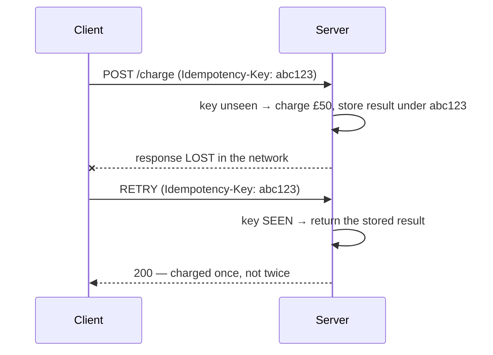
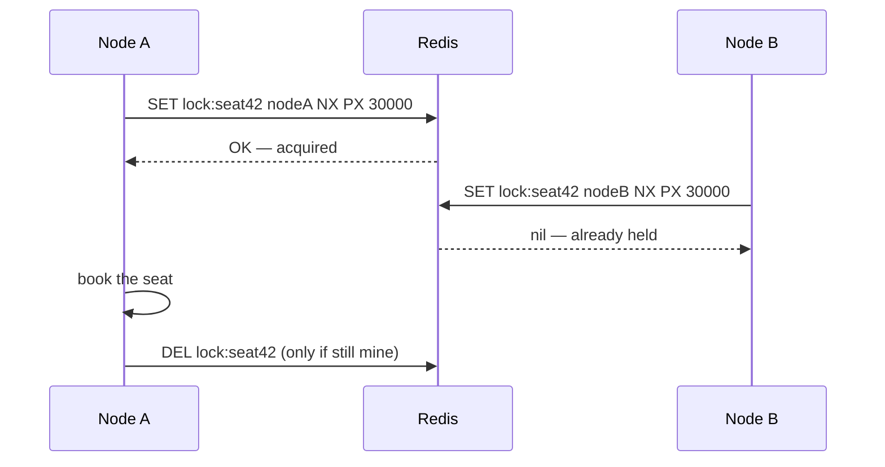
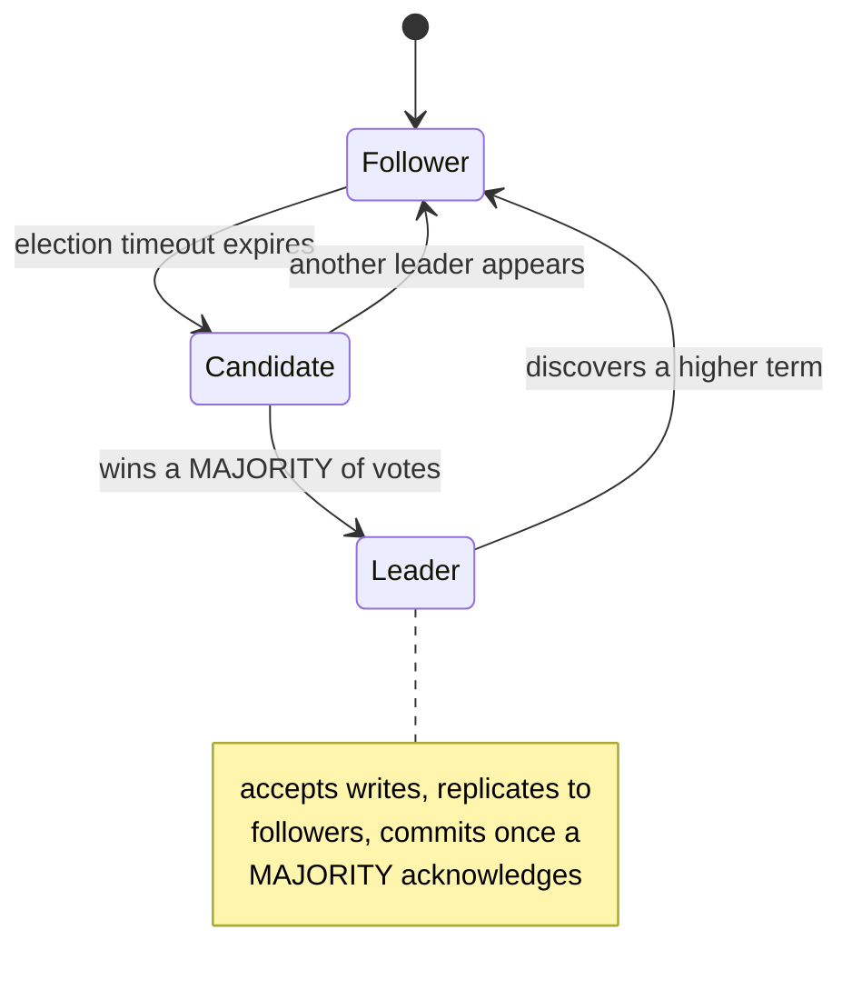
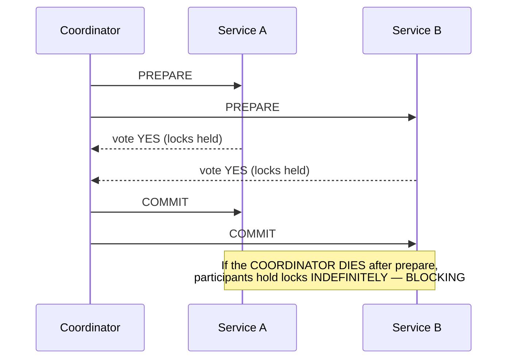

# Coordination — Consensus, Locks, Transactions, IDs

`Weeks 23–24` · System Design

---

## Idempotency — the most valuable concept here

**Problem it solves** — networks fail **ambiguously**. A client times out not knowing whether the request succeeded, retries, and without idempotency the user is charged twice.



### How to implement

```sql
-- the simplest correct version: let the DB enforce it
CREATE TABLE idempotency (
    key         TEXT PRIMARY KEY,   -- unique constraint does the work
    response    JSONB,
    created_at  TIMESTAMPTZ DEFAULT now()
);
```

Concurrent identical requests race — the unique constraint makes exactly one win.

### Advantages
- Makes retries safe, which makes the whole system resilient
- Prevents duplicate charges, orders, emails
- **Prerequisite for at-least-once messaging**

### Disadvantages
- Storage + lookup per request (needs a TTL)
- The client must generate the key correctly
- Concurrent duplicates need a unique constraint or a lock

### When to use
**Every mutating API**, especially payments. Every at-least-once queue consumer.

> One of the highest-value things to raise unprompted in a design interview.

---

## Distributed Lock

**What it is** — mutual exclusion across a cluster.



`NX` = only if not exists. `PX` = auto-expire, so a crashed holder doesn't lock forever.

### Advantages
- Prevents duplicate work and double-booking
- TTL gives automatic crash recovery

### Disadvantages

```
  ╔═══════════════════════════════════════════════════════════╗
  ║ GENUINELY DANGEROUS                                       ║
  ║                                                           ║
  ║   Node A acquires the lock (TTL 30s)                      ║
  ║   Node A pauses — GC, network partition — for 35s         ║
  ║   TTL expires → Node B acquires the SAME lock             ║
  ║   Node A wakes up, believes it still holds it             ║
  ║   → TWO nodes in the critical section                     ║
  ║                                                           ║
  ║ Mitigate with FENCING TOKENS: a monotonic number issued   ║
  ║ with the lock; the resource rejects any write carrying    ║
  ║ a token lower than the highest it has seen.               ║
  ╚═══════════════════════════════════════════════════════════╝
```

- Redlock is contested and not safe under all failure models
- Locks hurt throughput and can deadlock

### When to use / not use

| Use | Prefer instead |
|---|---|
| Seat booking, single-instance cron | **Optimistic concurrency** (version column + compare-and-set) |
| Leader election (via ZooKeeper/etcd) | **Unique constraints** — let the DB reject the duplicate |
| | **Partition the work** so only one node owns each key |

> The mature answer: *design to avoid distributed locks*. They're a last resort, not a first tool.

---

## Consensus & Leader Election (Raft)

**Problem it solves** — some work must happen exactly once (scheduling, accepting writes). Nodes must agree who is in charge despite failures.



```
  QUORUM MATHS — why cluster sizes are odd

    3 nodes → majority 2 → tolerates 1 failure
    5 nodes → majority 3 → tolerates 2 failures
    4 nodes → majority 3 → tolerates 1  ← no better than 3, costs more
```

### Advantages
- Guarantees a single leader and a consistent replicated log
- Tolerates a minority of node failures
- Far more understandable than Paxos

### Disadvantages
- **Needs a majority quorum** — lose it and you're unavailable
- Writes cost a round trip to a majority → latency
- Unavailable during elections (seconds)
- **Does not scale writes** — everything goes through the leader

### When to use
Coordination services, DB leader failover, distributed schedulers.

> **In an interview, cite ZooKeeper/etcd rather than proposing you implement Raft yourself.**

---

## Two-Phase Commit (2PC) — know it to reject it



### Disadvantages
- **Blocking** — a dead coordinator freezes participants
- Coordinator is a single point of failure
- Locks held across network round trips → throughput collapses
- Does not scale

**Rarely the right answer today.** Know it so you can explain why you'd use a saga instead.

---

## Saga Pattern

**What it is** — a long business transaction split into local transactions, each with a **compensating action** to undo it.


| Style | How | Trade-off |
|---|---|---|
| **Choreography** | services react to each other's events | decoupled, but flow is implicit and hard to trace |
| **Orchestration** | a central coordinator drives the steps | explicit and traceable, but the orchestrator is a component |

### Advantages
- **No distributed locks** → it scales
- Each service keeps autonomy
- Works naturally with event-driven systems

### Disadvantages
- **NOT atomic** — intermediate states are visible to users
- Compensating actions are business logic you must design (you cannot un-send an email — you send an apology)
- Choreography makes flow hard to trace
- Requires idempotency throughout

### When to use
Multi-service business workflows: order processing, travel booking, payment + fulfilment. **The standard modern answer to distributed transactions.**

---

## Unique ID Generation

**Problem it solves** — database auto-increment breaks once you shard: two shards would generate the same ID.

```
  UUID v4         122 random bits
                  ✓ no coordination
                  ✗ NOT sortable
                  ✗ 16 bytes, RANDOM → fragments B-tree indexes badly

  SNOWFLAKE       64 bits total
  ┌────────────────────────┬──────────┬────────────┐
  │  timestamp (41 bits)   │ machine  │  sequence  │
  │  ms since epoch        │ (10 bits)│  (12 bits) │
  └────────────────────────┴──────────┴────────────┘
                  ✓ compact (fits a bigint)
                  ✓ roughly TIME-SORTABLE → index-friendly
                  ✓ 4096 IDs per ms per machine
                  ✗ depends on synchronised clocks

  ULID / UUIDv7   random but TIME-PREFIXED → index-friendly, no machine ID
```

### Disadvantages
- Snowflake depends on clock sync — **NTP going backwards causes duplicates**
- Machine IDs must be assigned uniquely
- **UUIDv4 as a clustered primary key is a classic performance mistake** — random inserts fragment the index and double the key size vs a bigint

### When to use
Any sharded system. **Prefer Snowflake or UUIDv7 over UUIDv4** for anything that becomes a primary key.

---

## Interview checklist

- [ ] Idempotency keys — and why retries are unsafe without them
- [ ] Distributed lock failure mode (GC pause) + fencing tokens
- [ ] Why you'd avoid distributed locks: optimistic concurrency, unique constraints
- [ ] Raft: majority quorum, why cluster sizes are odd
- [ ] Why 2PC blocks, and why saga replaced it
- [ ] Saga: choreography vs orchestration, compensating actions
- [ ] Snowflake structure; why UUIDv4 hurts as a primary key
