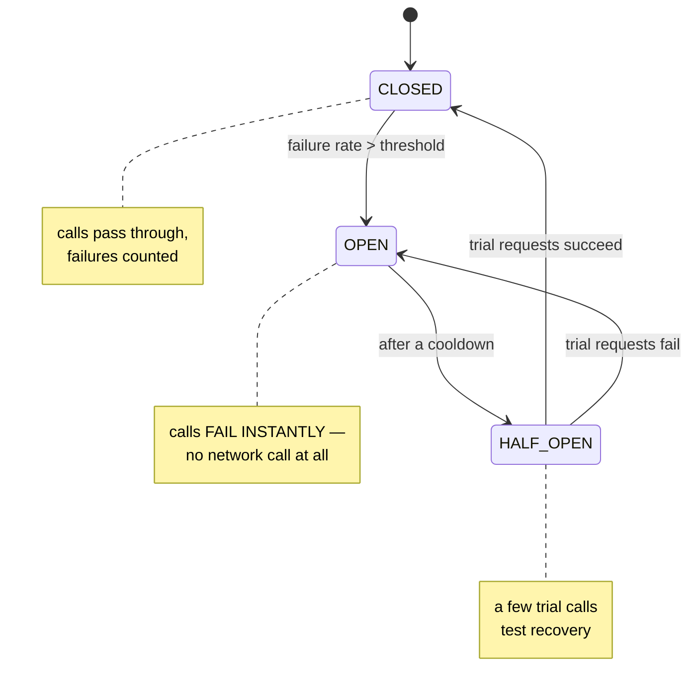
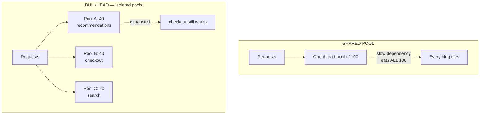
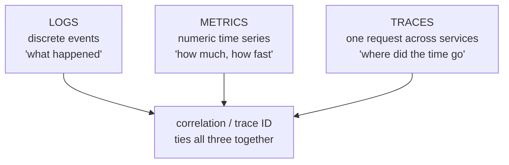

# Reliability & Observability

`Week 25` · System Design

---

## Circuit Breaker

**Problem it solves** — when a dependency is dying, continuing to hammer it makes things worse *and* ties up your own threads until you fail too. That is how one failure cascades into a full outage.



### Advantages
- Prevents cascading failure
- **Fails fast** instead of hanging
- Gives the struggling dependency room to recover
- Frees your own threads and connections

### Disadvantages
- Threshold tuning is delicate — too sensitive breaks working traffic
- You must define fallback behaviour
- Adds complexity at every call site

**Use for** any synchronous call to a dependency you don't control, especially third parties. Pair with **timeouts**, **retries with backoff**, and a sensible fallback.

---

## Retries with Exponential Backoff + Jitter

```
  ✗ NAIVE RETRY               ✓ BACKOFF + JITTER
  ────────────────            ────────────────────
  retry immediately           wait base × 2^attempt, capped
  all clients retry           PLUS random jitter
  in lockstep
                              attempt 1: ~1s  ± random
  → THUNDERING HERD           attempt 2: ~2s  ± random
    prevents recovery         attempt 3: ~4s  ± random
```

```
  ╔═══════════════════════════════════════════════════════════╗
  ║ JITTER IS THE PART PEOPLE FORGET.                         ║
  ║                                                           ║
  ║ Without it, 1000 clients that failed at the same moment   ║
  ║ all retry at the same moment. The backoff is useless —    ║
  ║ you've just moved the stampede 2 seconds later.           ║
  ╚═══════════════════════════════════════════════════════════╝
```

**Only retry idempotent operations and retryable errors** (5xx, timeouts). Never retry a 400 — it will fail again.

### Disadvantages
- Retries multiply load exactly when the system is weakest
- **Retry storms compound across a call chain** — 3 retries at each of 3 layers = 27 requests
- Increases tail latency

---

## Bulkhead & Graceful Degradation



**Graceful degradation** — when a dependency fails, return a cached, default or partial response. Netflix hides a recommendations row rather than failing the whole page.

### When to use
Any page that aggregates several services. **Explicitly classifying features as critical vs optional is a very senior move** in a design interview.

### Disadvantages
- More pools = more resource overhead and tuning
- Degraded modes are rarely tested, so they're often broken when finally needed

---

## Health Checks

| Type | Question | Failure means |
|---|---|---|
| **Liveness** | is the process alive? | **restart it** |
| **Readiness** | can it serve traffic *right now*? | **remove from LB**, don't restart |

```
  ╔═══════════════════════════════════════════════════════════╗
  ║ KEEP LIVENESS SHALLOW.                                    ║
  ║                                                           ║
  ║ A DEEP liveness check that pings the database means:      ║
  ║   database hiccups → EVERY instance fails liveness        ║
  ║   → orchestrator restarts the ENTIRE FLEET                ║
  ║   → you turned a 5s DB blip into a full outage.           ║
  ╚═══════════════════════════════════════════════════════════╝
```

The liveness/readiness distinction is a strong signal in interviews.

---

## Observability — logs, metrics, traces



| | Good for | Cost |
|---|---|---|
| Logs | root cause, exact detail | expensive at volume |
| Metrics | alerting, dashboards, trends | high-cardinality labels explode storage |
| Traces | latency bottlenecks across services | needs instrumentation everywhere + sampling |

**The four golden signals:** latency · traffic · errors · saturation.

> **Always report latency as p50 / p95 / p99, never as an average.** An average hides exactly the users who are suffering. If p99 is 4s and the average is 200ms, 1% of your users are having a terrible time and the average will never tell you.

---

## SLI, SLO, SLA & Error Budgets

```
  SLI  the MEASUREMENT      "99.3% of requests returned 200 within 300ms"
  SLO  the internal TARGET  "99.9% over 30 days"
  SLA  the CONTRACT         looser than the SLO, with financial penalties

  ERROR BUDGET = 100% − SLO
      99.9% SLO → 0.1% budget → 43 minutes of failure per month

  Budget spent?  → FREEZE FEATURES, work on reliability
  Budget intact? → ship faster
```

| Availability | Downtime / month | Downtime / year |
|---|---|---|
| 99% | 7.2 hours | 3.65 days |
| 99.9% | **43 minutes** | 8.76 hours |
| 99.99% | **4.3 minutes** | 52.6 minutes |
| 99.999% | 26 seconds | 5.26 minutes |

**Each extra nine costs roughly 10× more.** Chasing unnecessary nines is a real and expensive mistake.

> Error budgets resolve the features-vs-stability argument **objectively**, which is their real value.

---

## Interview checklist

- [ ] Circuit breaker: all three states and the transitions
- [ ] Retries need backoff **and jitter** — say jitter unprompted
- [ ] Bulkhead; classify features as critical vs optional
- [ ] Liveness vs readiness, and why deep liveness checks are dangerous
- [ ] Logs vs metrics vs traces, tied by correlation ID
- [ ] p99 not average — and why
- [ ] The availability table; error budgets
