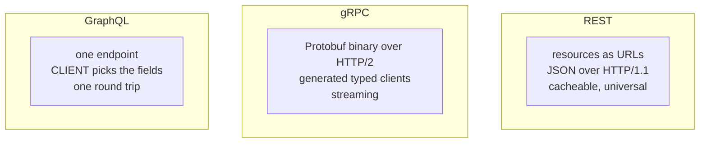
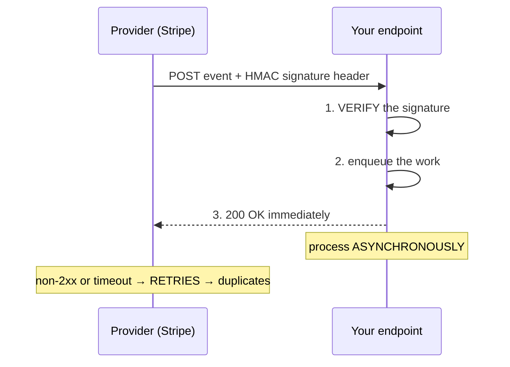
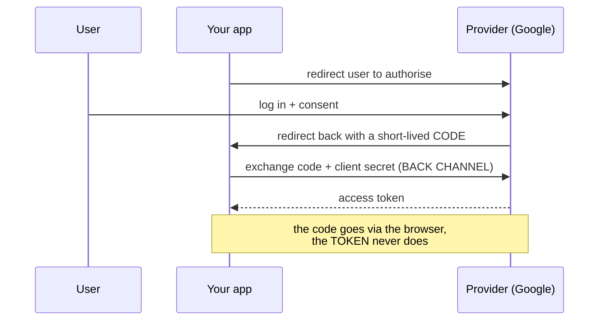
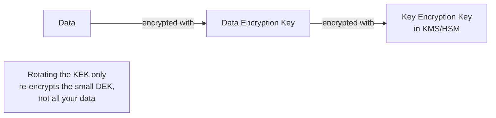

# APIs, Protocols & Security

`Week 26` · System Design

---

## REST vs gRPC vs GraphQL



| | REST | gRPC | GraphQL |
|---|---|---|---|
| Payload | JSON (verbose) | **binary, 3–10× smaller** | JSON |
| Speed | baseline | **fastest** | baseline |
| Browser | ✅ native | ❌ needs a proxy | ✅ |
| HTTP caching | ✅ **free** | ❌ | ❌ (all POSTs to one URL) |
| Debuggable with curl | ✅ | ❌ binary | ✅ |
| Over/under-fetching | ❌ suffers both | ❌ | ✅ **solves both** |
| Contract | informal | **strict schema** | strict schema |

### When to use which

| | |
|---|---|
| **REST** | public APIs, anything third parties consume |
| **gRPC** | internal service-to-service, high volume, streaming |
| **GraphQL** | mobile and rich clients with varied data needs |

> *"gRPC internally, REST at the public edge"* is the common real architecture. Many systems use all three in different layers.

### GraphQL's specific dangers — raise these unprompted

```
  ✗ N+1 PROBLEM
      query { users { posts { comments } } }
      → 1 query for users, N for posts, N×M for comments
      FIX: DataLoader-style batching

  ✗ EXPENSIVE NESTED QUERIES
      a malicious client can request 10 levels deep
      FIX: depth limiting + query COST ANALYSIS
      (rate limiting by request COUNT is meaningless here)

  ✗ CACHING
      everything is a POST to /graphql → HTTP caching does not apply
      FIX: persisted queries
```

---

## REST API design

**Nouns not verbs.** `/users/123/orders`, never `/getUserOrders`.

| Method | Safe | Idempotent |
|---|---|---|
| GET, HEAD | ✅ | ✅ |
| PUT, DELETE | ❌ | ✅ |
| **POST** | ❌ | **❌** ← why payments need idempotency keys |

**Status codes that get asked:**

| | |
|---|---|
| 301 vs 302 | permanent (**cached forever**) vs temporary |
| 401 vs 403 | unauthenticated vs forbidden |
| 400 vs 422 | malformed syntax vs valid syntax, invalid semantics |
| 429 | rate limited — send `Retry-After` |
| 502 / 503 / 504 | bad upstream / overloaded / upstream timeout |

### Pagination

```
  OFFSET / LIMIT                    CURSOR (keyset)
  ─────────────────────────         ──────────────────────────────
  SELECT ... LIMIT 20 OFFSET 10000  WHERE id > :cursor ORDER BY id LIMIT 20

  ✓ jump to any page                ✓ CONSTANT TIME at any depth
  ✗ DB scans and DISCARDS 10000     ✓ stable when rows are inserted
    rows → page 10000 takes seconds ✗ no arbitrary page jumps
  ✗ items SHIFT between pages       ✗ needs a stable unique sort key
    when data changes mid-scroll
```

**Offset for a small admin table. Cursor for an infinite feed.** Give the reason — deep-scan cost and result instability.

### Versioning

Prefer **additive, backwards-compatible** change so you rarely need to version at all: only add optional fields, never remove or repurpose existing ones.

When a break is unavoidable: `/v1` in the path, run both in parallel, **instrument usage** so deprecation is data-driven rather than hopeful.

---

## Webhooks



**Three things to say:**
1. **Verify the signature** — an unverified webhook endpoint is a serious vulnerability; anyone can forge events
2. **Respond 200 fast, process async** — slow processing causes provider timeouts and needless retries
3. **Make the handler idempotent** using the event ID — retries mean duplicates, and ordering is not guaranteed

---

## Authentication vs Authorisation

> **AuthN proves WHO you are. AuthZ decides WHAT you may do.** They are different problems and are constantly conflated.

### Session vs JWT

```
  SESSION                          JWT
  ──────────────────────────       ──────────────────────────────
  server stores state              token CARRIES the claims
  cookie = opaque ID               server verifies a SIGNATURE
  lookup every request             no lookup → scales statelessly
  ✓ REVOKE INSTANTLY               ✗ CANNOT revoke before expiry
  ✗ needs a shared store             (a blocklist reinstates the state
                                      you were avoiding)
```

```
  ╔═══════════════════════════════════════════════════════════╗
  ║ A JWT IS SIGNED, NOT ENCRYPTED.                           ║
  ║ Anyone can base64-decode and read the payload.            ║
  ║ NEVER put secrets in one.                                 ║
  ╚═══════════════════════════════════════════════════════════╝
```

**The modern pattern:** short-lived access JWT (5–15 min) + a long-lived, revocable refresh token stored server-side. Store tokens in **HttpOnly cookies**, not localStorage, so XSS cannot read them.

### OAuth 2.0 — authorization code flow with PKCE



Say **"authorization code flow with PKCE"** — that is the current correct answer and signals you're up to date. The **implicit flow is deprecated** (tokens end up in URLs and browser history).

**OIDC** adds an **ID token** (a JWT describing the user) on top — OAuth is authorisation, OIDC is authentication.

---

## Authorisation models

| Model | How | Problem |
|---|---|---|
| **RBAC** | permissions attach to roles | **role explosion** as exceptions accumulate |
| **ABAC** | evaluate attributes of user/resource/action/context | hard to reason about and test |
| ReBAC | permissions as a graph ("X is editor of doc Y") | complex (Google Zanzibar) |

```
  ╔═══════════════════════════════════════════════════════════╗
  ║ CHECK OWNERSHIP, NOT JUST ROLE.                           ║
  ║                                                           ║
  ║ IDOR — changing /orders/123 to /orders/124 and reading    ║
  ║ someone else's order — is one of the most common real     ║
  ║ vulnerabilities. Role checks alone do not prevent it.     ║
  ║                                                           ║
  ║ ALWAYS enforce server-side AT THE RESOURCE. Never in UI.  ║
  ╚═══════════════════════════════════════════════════════════╝
```

---

## Password storage

**Never plaintext. Never a plain hash.** Use a **slow, salted, adaptive** hash: **Argon2id** or **bcrypt**.

```
  ✗ MD5, SHA-1, SHA-256    designed to be FAST
                           → billions of guesses/sec on a GPU

  ✓ bcrypt / Argon2id      deliberately SLOW, tunable work factor
                           → raise the cost as hardware improves

  SALT (unique per user)   defeats rainbow tables, and stops identical
                           passwords producing identical hashes
```

Explaining **why a fast hash is wrong** is what's actually being tested.

Add rate limiting and lockout against brute force; check submitted passwords against known-breached lists.

---

## Encryption at rest & secrets



```
  ╔═══════════════════════════════════════════════════════════╗
  ║ BE PRECISE ABOUT THE THREAT MODEL.                        ║
  ║                                                           ║
  ║ Encryption at rest defeats: stolen disks, leaked backups, ║
  ║                             shared cloud snapshots.       ║
  ║ It does NOT defeat: a compromised application.            ║
  ║                                                           ║
  ║ Candidates routinely overstate this.                      ║
  ╚═══════════════════════════════════════════════════════════╝
```

**Secrets:** never in the repo, never in the image. Fetch at runtime from a secrets manager using the instance identity, with automatic rotation. A leaked secret must be **rotated**, not just deleted from git — git history is forever.

---

## OWASP — mechanism and the *correct* fix

| Attack | Mechanism | The RIGHT fix |
|---|---|---|
| **SQL injection** | input concatenated into a query changes its meaning | **parameterised queries** — not escaping, not blocklists |
| **XSS** | attacker script runs in another user's browser | **contextual output encoding** + CSP + HttpOnly cookies |
| **CSRF** | malicious site triggers an authenticated request | anti-CSRF tokens + `SameSite` cookies |
| **IDOR** | changing an ID in a URL | **ownership checks** server-side |

> Saying *"parameterised queries, not escaping"* and *"output encoding, not input sanitisation"* shows you understand **why** the naive fix fails and gets bypassed.

---

## Multi-tenancy

| Model | Isolation | Cost | Risk |
|---|---|---|---|
| **Silo** — DB per tenant | strongest | highest | doesn't scale to thousands of tenants |
| **Bridge** — schema per tenant | good | medium | middle ground |
| **Pooled** — shared tables + `tenant_id` | weakest | **cheapest** | **one missing filter leaks across customers** |

> **Enforce isolation BELOW the application** — database row-level security or a mandatory scoping layer — so a forgotten `WHERE tenant_id = ?` **fails closed** instead of leaking. That defence-in-depth reasoning is exactly what's being probed.

---

## Interview checklist

- [ ] REST vs gRPC vs GraphQL, and when each fits
- [ ] GraphQL: N+1, depth limiting, cost analysis
- [ ] Safe vs idempotent; 401 vs 403; 301 vs 302
- [ ] Cursor vs offset pagination, with the reason
- [ ] Webhooks: verify signature, 200 fast, idempotent
- [ ] Session vs JWT; JWT is signed not encrypted; the revocation problem
- [ ] "Authorization code flow with PKCE"
- [ ] Check ownership not just role (IDOR)
- [ ] Why a fast hash is wrong for passwords
- [ ] Encryption at rest — the precise threat model
- [ ] Parameterised queries, not escaping
- [ ] Multi-tenancy: enforce isolation below the app
