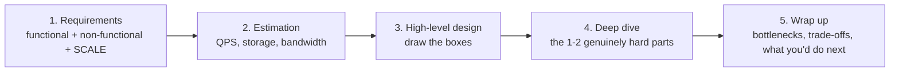

# System Design

`Weeks 18–26` of the prep plan.

Every component follows the same shape: **what it is → the problem it solves → how it works (with a diagram) → advantages → disadvantages → when to use and when NOT to**.

| # | File | Components |
|---|---|---|
| 01 | [Building Blocks](01-building-blocks.md) | the request path, the interview framework, estimation |
| 02 | [Edge & Load Balancing](02-edge-and-load-balancing.md) | load balancer (L4/L7), reverse proxy, API gateway, CDN, rate limiter, WAF |
| 03 | [Scaling](03-scaling.md) | vertical vs horizontal, stateless services, autoscaling, monolith vs microservices |
| 04 | [Databases](04-databases.md) | SQL, key-value, document, wide-column, graph, search, object storage, warehouse, B+ vs LSM |
| 05 | [Replication, Sharding & Caching](05-replication-sharding-caching.md) | replication topologies, shard keys, consistent hashing, cache patterns, CAP |
| 06 | [Messaging & Kafka](06-messaging-and-kafka.md) | queues, pub/sub, **Kafka internals**, DLQ, outbox, stream vs batch |
| 07 | [Coordination](07-coordination-and-consistency.md) | idempotency, distributed locks, Raft, 2PC, saga, ID generation |
| 08 | [Reliability & Observability](08-reliability-and-observability.md) | circuit breaker, backoff+jitter, bulkhead, health checks, logs/metrics/traces, SLO |
| 09 | [APIs & Security](09-apis-and-security.md) | REST/gRPC/GraphQL, pagination, webhooks, OAuth, JWT, OWASP, multi-tenancy |

## The interview framework

**Spend the first 5 minutes on requirements.** Candidates who start drawing immediately design the wrong system.

## Things to say unprompted — they carry disproportionate weight

- *"Sharding is a last resort"* — after replication, caching and vertical scaling
- *"Read-your-own-writes"* — route to the leader briefly after a write
- *"Thundering herd"* and *"hot key"* — with their fixes
- *"At-least-once plus idempotent consumers"* — what people actually run
- *"Jitter"* — the half of exponential backoff everyone forgets
- *"p99, not average"*
- *"Most of what people call agents should be workflows"* (AI rounds)
- *"The first thing I'd build is the eval set"* (AI rounds)
